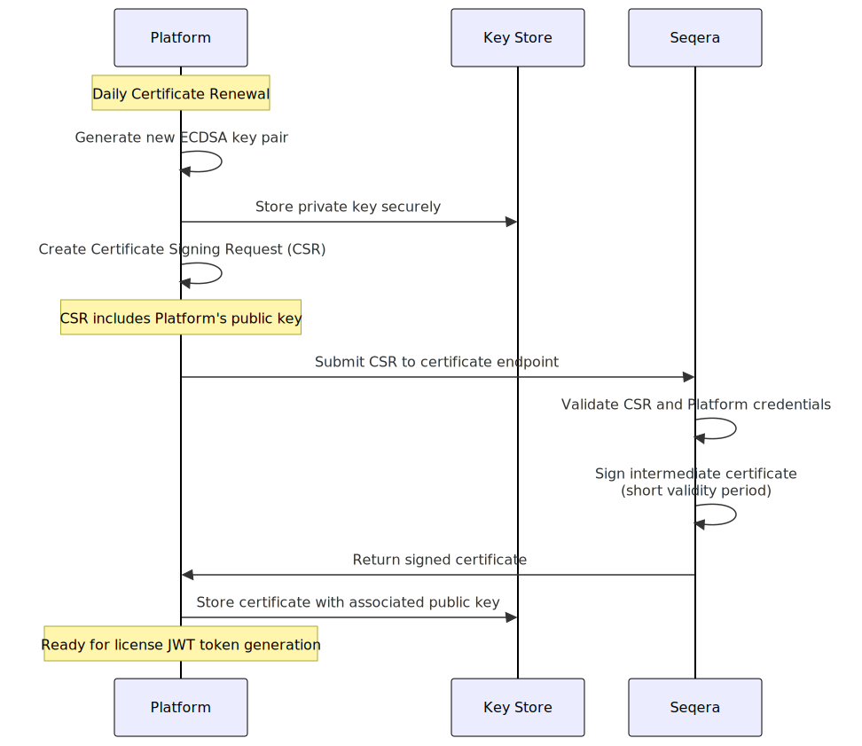
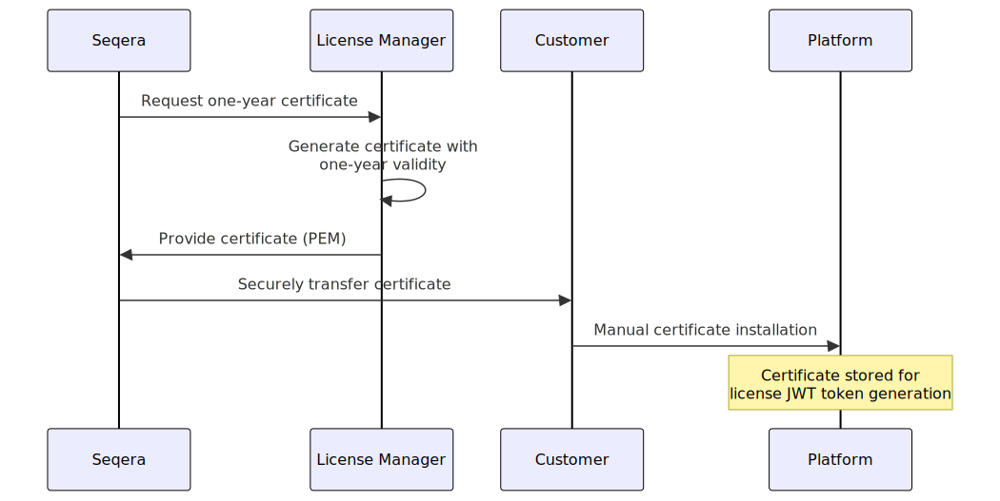

You need a license to use the Fusion file system and the license is bundled with your Seqera Enterprise license. Additionally, if you have a Studios license, you don't need a Fusion license to use Fusion with your studios. All Studios templates include Fusion.

From Fusion 2.4.7 license enforcement is applied.

## Usage limits

Cloud free-tier customers are limited to:

- Maximum 5,000 tasks per month
- Maximum of 1 TB of read bandwidth per month

## Seqera Cloud

If you are a Cloud customer, your license entitlement for Fusion is managed by Seqera.

## Seqera Enterprise

If you are an Enterprise customer, you can use Fusion in both networked and air-gapped environments.

## Nextflow integration

For Nextflow pipeline runs with Fusion enabled, Nextflow requests from Platform Enterprise a short-lived JWT containing the license key for Fusion. By using a short-lived token, pipeline runs do not need to initiate any outbound network connections to Seqera. The JWT is contained in the `FUSION_LICENSE_TOKEN` in the executing pipeline environment.

License checks occur when a pipeline run starts, and execution is never interrupted if license expiration happens during a run.

If Fusion is unable to validate the license provided by Nextflow, the pipeline will exit with an error message. If the license is valid but expires between retrieval and validation by Fusion, Nextflow will stop and an error code will be displayed.

For more information on using Fusion with Nextflow, see [Get started][get-started].

## License renewal

If your Platform installation has network access, license renewal occurs daily automatically. The following diagram illustrates the license renewal workflow.

If your Platform installation is air-gapped, Seqera renews your license on an annual basis and provides a license certificate. The following diagram illustrates the license renewal workflow.

[get-started]: ./get-started.mdx
