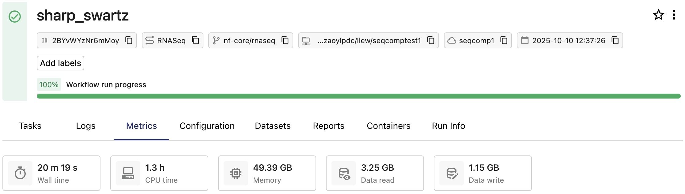

Seqera Compute environments consume credits when running pipelines or Studio sessions. Credits are deducted in real time at task completion to provide visibility into compute spend and prevent credit overuse.

One Seqera Compute credit equals $1 USD. Resources are charged at AWS on-demand rates for the selected region, with transparent pass-through pricing.

## How billing works

### Real-time credit deduction

- **Task-level billing**: Credits are deducted as each pipeline task completes, providing real-time visibility into run costs. Credit spend for running Studio sessions updates at regular intervals.
- **Cost aggregation**: The [usage report](#usage-report) shows aggregated compute and memory costs per workflow or Studio session.

### What is billed

Seqera Compute bills for four resource types:

| Resource | Rate (credits) | Billing unit | Based on | Billing frequency | Details |
|----------|---------------|--------------|----------|-------------------|---------|
| **CPU time** | 0.1 | CPU-hour | Requested vCPUs × runtime | At task completion | Charged based on requested vCPUs |
| **Memory** | 0.025 | GB-hour | Requested memory × runtime | At task completion | Charged based on requested memory. If tasks request no memory, peak memory at task completion is charged (minimum 2 GB per task). |
| **Storage** | 0.025 | GB-month | Actual usage | Daily reconciliation | S3 storage costs at AWS rates, varies by region |
| **Network transfer** | Varies by region | GB | Actual data transfer | Daily reconciliation | Data egress charges at AWS rates. Network charges reflect in billing reports after 48 hours. |

:::info
CPU and memory are billed based on **requested** resources in your pipeline configuration, not actual usage. Storage and network costs are billed based on actual consumption.
:::

#### Billing example: pipeline run

The [nf-core/rnaseq](https://nf-co.re/rnaseq/3.21.0) pipeline is run on a Seqera Compute environment with a test dataset as input. The following run metrics are recorded at workflow completion:

To calculate the credit spend for this run, the vCPUs and memory **requested** for each task are multiplied by task runtime:

| Task | Duration | CPUs | Memory |
|-----------|----------|------|--------|
| PREPARE_GENOME:GUNZIP_ADDITIONAL_FASTA (gfp.fa.gz) | 3 m 28 s | 1 | 6.0 GB |
| PREPARE_GENOME:UNTAR_SALMON_INDEX (salmon.tar.gz) | 3 m 28 s | 1 | 6.0 GB |
| PREPARE_GENOME:GUNZIP_GTF (genes_with_empty_tid.gtf.gz) | 3 m 28 s | 1 | 6.0 GB |
| RNASEQ:FASTQ_QC_TRIM_FILTER_SETSTRANDEDNESS:CAT_FASTQ (WT_REP1) | 3 m 29 s | 1 | 6.0 GB |
| RNASEQ:FASTQ_QC_TRIM_FILTER_SETSTRANDEDNESS:FQ_LINT (WT_REP2) | 3 m 29 s | 2 | 12.0 GB |
| RNASEQ:FASTQ_QC_TRIM_FILTER_SETSTRANDEDNESS:FQ_LINT (RAP1_UNINDUCED_REP1) | 3 m 29 s | 2 | 12.0 GB |
| RNASEQ:FASTQ_QC_TRIM_FILTER_SETSTRANDEDNESS:CAT_FASTQ (RAP1_UNINDUCED_REP2) | 3 m 29 s | 1 | 6.0 GB |
| RNASEQ:FASTQ_QC_TRIM_FILTER_SETSTRANDEDNESS:FQ_LINT (RAP1_IAA_30M_REP1) | 3 m 29 s | 2 | 12.0 GB |
| PREPARE_GENOME:GTF_FILTER (genome.fasta) | 47 s | 1 | 6.0 GB |
| FASTQ_FASTQC_UMITOOLS_TRIMGALORE:FASTQC (WT_REP2) | 46 s | 4 | 15.0 GB |

:::info
The **Tasks** tab of the [run details](../monitoring/run-details.mdx) page lists the processes and tasks executed during the run. Select a task from the list to view the task's details, including metrics for **Execution time** and **Resources requested**.
:::

The usage report for this run shows the CPU and memory cost as separate line items:

| Date | WorkflowId | WorkspaceId | Region | ProductName | UnitPrice(USD) | Quantity | Total(USD) |
|------|------------|-------------|--------|-------------|----------------|----------|------------|
| 2025-10-10 | 2BYxxxxxxxMoy | 1884xxxxxxx2036 | us-east-2 | Cpu Hours | 0.1 | 1.3255897223 | 0.13255897223 |
| 2025-10-10 | 2BYxxxxxxxMoy | 1884xxxxxxx2036 | us-east-2 | Memory Gb | 0.025 | 5.514970833333334 | 0.13787427083333334 |

This run consumed approximately 0.27 credits, for a total cost of $ 0.27 (USD). 

## Credit management

### Credit balance and spend overview

- Navigate to your organization or workspace **Settings** tab to view credit balance and spend information, request more credits, and download usage reports. 
- Select **Usage overview** in the top navigation bar to view real-time run, Studio, user, and credit usage information for your workspace. Select **Details** to navigate to workspace **Settings**.

### Usage report

From your organization or workspace **Settings** tab, select **Download report** in the **Credits** section to download a usage report in CSV format. The report is structured as follows:

| Date | WorkflowId | WorkspaceId | Region | ProductName | UnitPrice(USD) | Quantity | Total(USD) |
|------|------------|-------------|--------|-------------|----------------|----------|------------|
| 2025-10-10 | 2BYxxxxxxxMoy | 1884xxxxxxx2036 | us-east-2 | Cpu Hours | 0.1 | 1.3255897223 | 0.13255897223 |
| 2025-10-10 | 2BYxxxxxxxMoy | 1884xxxxxxx2036 | us-east-2 | Memory Gb | 0.025 | 5.514970833333334 | 0.13787427083333334 |

The report includes:
  - Separate line items for compute and memory per workflow or Studio session
  - Aggregated costs (not individual task breakdowns)

### Request additional credits

To request more credits:
1. Select **Request more credits** in the organization or workspace settings **Credits** view.
1. Complete the form with your contact, organization, and credit request details.
1. Credits are typically allocated within one business day.

:::info
[**Request credits**](https://seqera.io/platform/compute/request-credits/) online or contact your Seqera account manager for assistance.
:::

### Credit limits and run and Studio suspension

When your organization or workspace credit balance is exhausted:

1. **Running pipelines paused**: All active pipeline runs and Studio sessions are automatically suspended.
1. **New launches blocked**: No new pipeline runs or Studios can be started using Seqera Compute environments.
1. **Resume runs manually**: After purchasing additional credits, manually [resume](../launch/cache-resume.mdx) paused pipelines.

:::warning
Long-running tasks are periodically monitored. If a single task's estimated cost would exceed remaining credits, the workflow is preemptively paused.
:::