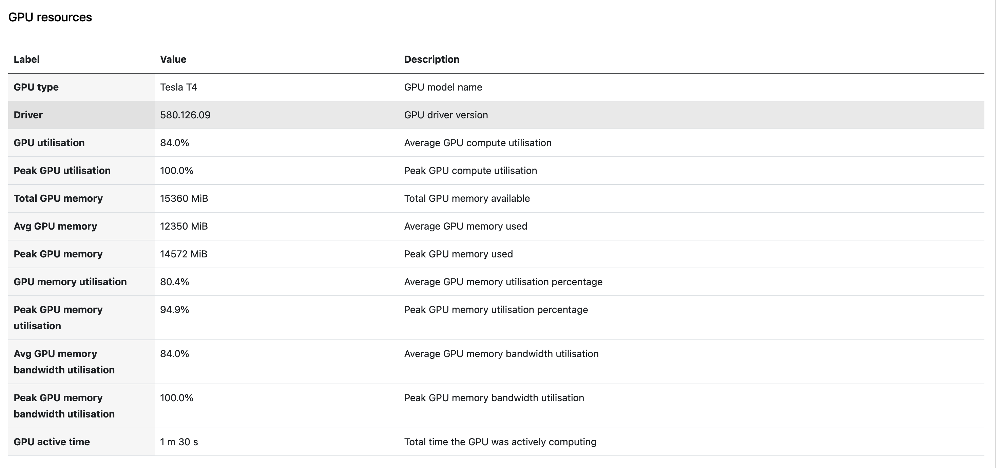
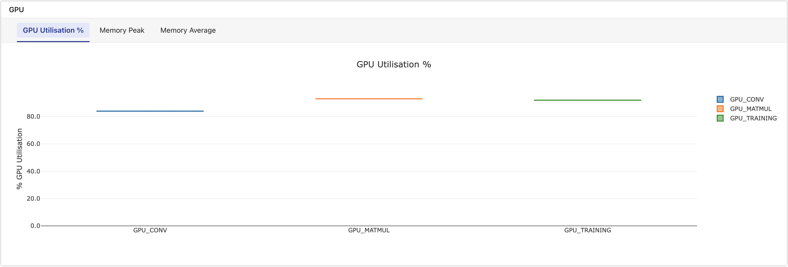
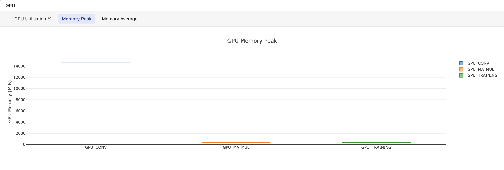
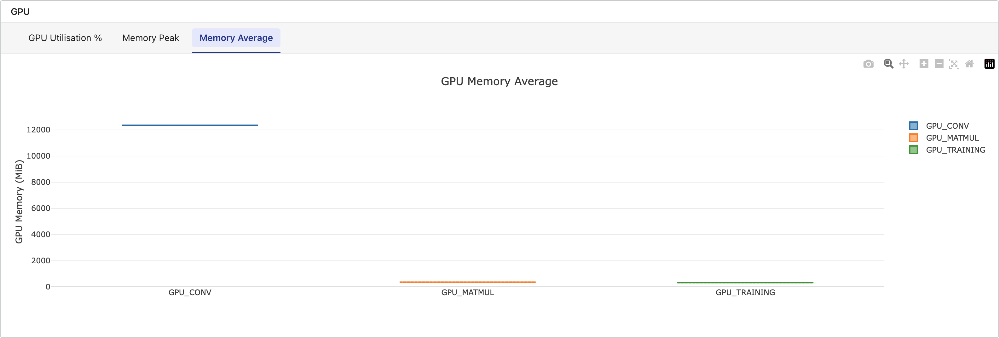

Seqera Platform **compute environments** define the execution platform where a pipeline will run. Compute environments enable users to launch pipelines on a growing number of **cloud** and **on-premises** platforms.

Each compute environment must be configured to enable Seqera to submit tasks. See the individual compute environment pages below for platform-specific configuration steps.

## Platforms

- [Seqera Compute](./seqera-compute)
- [AWS Batch](./aws-batch)
- [AWS Cloud](./aws-cloud)
- [Azure Batch](./azure-batch)
- [Azure Cloud](./azure-cloud)
- [Google Batch](./google-cloud-batch)
- [Google Cloud](./google-cloud)
- [Grid Engine](./hpc)
- [Altair PBS Pro](./hpc)
- [IBM LSF](./hpc)
- [Moab](./hpc)
- [Slurm](./hpc)
- [Kubernetes](./k8s)
- [Amazon EKS](./eks)
- [Google Kubernetes Engine](./gke)

## Select default compute environment

If you have more than one compute environment, you can select a workspace primary compute environment to be used as the default when launching pipelines in that workspace. In a workspace, select **Compute Environments**. Then select **Make primary** from the options menu next to the compute environment you wish to use as default.

## Rename compute environment

You can edit the names of compute environments in private and organization workspaces. Select **Rename** from the options menu next to the compute environment you wish to edit.

Select **Update** on the edit page to save your changes after you have updated the compute environment name.

## Disable compute environment

Users with **Admin** or **Owner** [workspace permissions](../orgs-and-teams/roles#workspace-participant-roles) can disable and enable compute environments.

When you disable a compute environment:
- Actions that use this compute environment will fail to run. **Update actions to use a new compute environment**.
- New pipelines and Studio sessions will not run on the disabled compute environment. **Update pipelines and Studios to use a new compute environment**.
- **Running pipelines and Studio sessions are not terminated**. Ongoing runs and Studio sessions will finish gracefully.
- If the compute environment was set as primary, it will be unset. Until you select a new primary compute environment, new runs will default to the next available compute environment.

To disable a compute environment, select **Disable** from the options menu next to the compute environment in your workspace **Compute Environments** page.

To re-enable a disabled compute environment, select **Enable** from the options menu. Enabled compute environments can run new pipelines and Studio sessions.

## Delete compute environment

Compute environments can be deleted when they are no longer required. You must delete the compute environment before deleting its associated credentials. If the credentials are deleted first, the compute environment deletion will fail with an error. If this happens, raise a ticket with Support.

## GPU usage

The process for provisioning GPU instances in your compute environment differs for each cloud provider.

### AWS Batch

The AWS Batch compute environment creation form in Seqera includes an **Enable GPUs** option. This enables you to run GPU-dependent workflows in the compute environment.

Some important considerations:

- Seqera only supports NVIDIA GPUs. Select instances with NVIDIA GPUs for your GPU-dependent processes.
- The **Enable GPUs** setting causes Batch Forge to specify the most current [AWS-recommended GPU-optimized ECS AMI](https://docs.aws.amazon.com/AmazonECS/latest/developerguide/ecs-optimized_AMI.html) as the EC2 fleet AMI when creating the compute environment. This setting can be overridden by **AMI ID** in the advanced options.
- The **Enable GPUs** setting alone does not deploy GPU instances in your compute environment. You must still specify GPU-enabled instance types in the **Advanced options > Instance types** field.
- Your Nextflow script must include [accelerator directives](https://docs.seqera.io/nextflow/process.html?highlight=accelerator#accelerator) to use the provisioned GPUs.
- The NVIDIA Container Runtime uses [environment variables](https://github.com/NVIDIA/nvidia-container-runtime#environment-variables-oci-spec) in container images to specify a GPU accelerated container. These variables should be included in the [`containerOptions`](https://docs.seqera.io/nextflow/process#process-containeroptions) directive for each GPU-dependent process in your Nextflow script. The `containerOptions` directive can be set inline in your process definition or via configuration. For example, to add the directive to a process named `UseGPU` via configuration:

```groovy
process {
  withName: UseGPU {
    containerOptions '-e NVIDIA_DRIVER_CAPABILITIES=compute,utility -e NVIDIA_VISIBLE_DEVICES=all'
  }
}
```

### GPU metrics

:::note
Detailed GPU metrics are only available for tasks that run with Fusion version 2.5.10 onwards and using Nextflow version 26.03.3-edge onwards
:::

When [Fusion](https://docs.seqera.io/fusion) is enabled, Seqera Platform automatically collects GPU metrics for tasks that run on NVIDIA GPU instances. No additional configuration is required beyond enabling Fusion and provisioning GPU instances in your compute environment.

The following metrics are collected per task:

- **GPU type**: The GPU model (e.g., NVIDIA A10G, A100).
- **Driver version**: The NVIDIA driver version in use.
- **GPU utilization %**: The percentage of GPU compute capacity used.
- **GPU memory peak**: The maximum GPU memory used during execution.
- **GPU memory average**: The average GPU memory used during execution.

For tasks that use multiple GPUs, metrics are aggregated (average or peak across all GPUs assigned to the task) and displayed as a single combined value per task.

#### Where GPU metrics appear

- **Task detail view**: Select a GPU task in the task table to view GPU type, driver version, utilization, and memory metrics alongside existing CPU metrics.

  

- **Metrics tab**: A dedicated **GPU** section displays box-and-whisker plots grouped by task name, with tabs for **GPU Utilization %**, **Memory Peak**, and **Memory Average**. This section appears only when the workflow includes tasks with GPU data.

  

  

  
- **Platform API**: GPU metrics are included in [task](https://docs.seqera.io/platform-api/describe-workflow-task) and [workflow](https://docs.seqera.io/platform-api/list-workflow-tasks) API responses for programmatic access.

:::note
GPU metrics are only available for tasks that run with Fusion enabled on NVIDIA GPU instances. Non-GPU tasks do not display a GPU metrics section. For tasks that fail mid-execution, partial metrics collected up to the point of failure are shown.
:::
