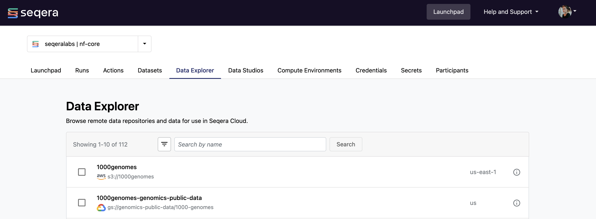

With Data Explorer, you can browse and interact with remote data repositories from organization workspaces in Seqera Platform. It supports AWS S3, Azure Blob Storage, Google Cloud Storage, and Amazon S3-compatible API storage (for example, Cloudflare R2, MinIO, Nebius, and Oracle Cloud).

Access the **Data Explorer** tab from any workspace to view and manage all available data repositories. Data Explorer is also integrated with the pipeline launch form, run detail pages, and Studios. Use these integrations to select input data files and output directories, view the output files of a run, or use files in object storage directly for interactive analysis.

If you use Seqera Cloud and want to disable Data Explorer, [contact](https://seqera.io/contact-us/) your Seqera account executive.

## Participant roles

The role assigned to a workspace user affects what functionality is available in Data Explorer. These permissions are listed in the [Participant roles][roles].

## Access control

Two mechanisms control Data Explorer access:

- **Participant roles** determine which Data Explorer actions a workspace user can perform, such as browsing, previewing, downloading, and uploading. See [Participant roles][roles].
- **Credentials** determine which objects those actions can reach. Each data-link uses the credentials you select when you add the data repository to the workspace. The cloud provider permissions attached to those credentials define the scope of Data Explorer access to that repository. To narrow what Data Explorer can do in a bucket, assign that data-link a dedicated credential with a more restrictive cloud provider policy. Sharing one broad credential across compute environments and data repositories gives Data Explorer the full scope of that credential.

Data Explorer has no per-bucket or per-workspace setting that disables downloads or uploads while leaving browsing available. To remove download and upload access completely, disable Data Explorer for your entire Seqera Cloud account.

:::warning
Cross-origin resource sharing (CORS) is not an access-control mechanism. Browsers enforce CORS, and it covers only the upload, multi-file download, and genome preview paths described in [CORS configurations for cloud providers](#cors-configurations-for-cloud-providers). Leaving a bucket's CORS configuration unset does not prevent Data Explorer users from reaching the objects in that bucket. CORS has no effect on access through the Seqera Platform API, the Seqera Platform CLI (`tw`), or your cloud provider's tools. Use credentials and cloud provider access policies to control access to your data.
:::

## Add data repository links

Data Explorer lists public and private data repositories. Repositories accessible to your workspace credentials are retrieved automatically. Workspace maintainers can also configure repositories manually.

- **Retrieve data repositories with workspace credentials**

  Private data repositories accessible to the credentials defined in your workspace are listed in Data Explorer automatically. The permissions required for your [AWS](../compute-envs/aws-batch#required-platform-iam-permissions), [Google Cloud](../compute-envs/google-cloud-batch#iam), [Azure Batch](../compute-envs/azure-batch#storage-account), or Amazon S3-compatible API storage credentials allow full Data Explorer functionality.

  For AWS S3, Data Explorer requires the following minimum IAM permissions:

  - `s3:ListAllMyBuckets` (on `*`) to auto-discover the buckets accessible to your workspace credentials.
  - `s3:ListBucket`, `s3:GetBucketLocation`, `s3:GetBucketPolicy`, and `s3:GetBucketAcl` on each bucket you want to browse, to resolve its region and access configuration.
  - `s3:GetObject` and `s3:PutObject` on the objects in each bucket, to download and upload files.

  These are a subset of the S3 permissions documented for the [AWS Batch](../compute-envs/aws-batch#required-platform-iam-permissions), [AWS Cloud](../compute-envs/aws-cloud#required-platform-iam-permissions), and [Amazon EKS](../compute-envs/eks#required-platform-iam-permissions) compute environments. For Azure Blob Storage, see the [Azure Cloud data-links permissions](../compute-envs/azure-cloud#data-links).

- **Configure individual data repositories manually**

  Select **Add data repository** from the Data Explorer tab to add a link to an individual repository (or prefix within a cloud bucket). Specify the **Provider**, **Path**, **Name**, **Credentials**, and **Description**, then select **Add**. For public cloud buckets, select **Public** from the **Credentials** drop-down.

:::note
Add a data-link at the root of any bucket or container used as a pipeline work directory, such as `s3://my-bucket`. Seqera Platform matches a run's work directory only against bucket-root data-links. A data-link scoped to a prefix such as `s3://my-bucket/work` does not open the work directory in Data Explorer. See [Isolate view, read, and write permissions to specific data repository paths](#isolate-view-read-and-write-permissions-to-specific-data-repository-paths).
:::

## Remove data repository links

A workspace maintainer can remove a manually created data-link to a repository.

From the **Data Explorer** tab, find the data repository that you want to remove. Select the options menu for the repository, and select **Remove**. When prompted, select **Remove** from the confirmation modal that appears.

If you remove a data-link associated with a repository, the repository is automatically removed from the relevant Studio configuration.

## Browse data repositories



- **View data repository details**

  To view details such as the cloud provider, address, and credentials, select the information icon next to a data-link in the Data Explorer list.

- **Search and filter data repositories**

  Search for repositories by name and region (for example, `region:eu-west-2`) in the search field, and filter by provider.

- **Hide data repositories from list view**

  Using checkboxes, choose one or more data repositories, then select the **Hide** icon in the Data Explorer toolbar. To hide repositories individually, select **Hide** from the three dots options menu of a repository in the list.

  The Data Explorer list filter defaults to **Only visible**. Select **Only hidden** or **All** from the filtering menu to view hidden data repositories in the list. You can unhide a data repository by selecting **Show** from the three dots options menu in the list view.

- **View data repository contents**

  Select a data-link from the Data Explorer list to view the contents of that data repository. From the **View data repository** page, you can browse directories and search for objects by name in a particular directory. The size and last-modified timestamp appear in columns to the right of the object name. Additional actions include copying the path to the object to the clipboard or creating a custom data-link (if the target is a directory) and downloading or deleting the object (if the user has Maintain role or above). On the Data Explorer landing page you can view data repository details such as the provider, address, and credentials by selecting the information icon. You may also choose to show or hide the data repository or delete a custom created data link.

- **Preview and download files**

  From the **View data repository** page, you can preview and download files. Select the download icon in the **Actions** column to download a file directly from the list view. Select a file to open a preview window that includes a **Download** button.

  File preview is supported for these object types:

  - Nextflow output files (`.command.*`, `.fusion.*`, and `.exitcode`)
  - Molecular data using the [Mol* library][molstar]
  - Genome tracks using the [igv.js library][igv] (annotations, wigs, alignments, and variants)
  - Text
  - CSV and TSV
  - PDF
  - HTML
  - Images (JPG, PNG, and SVG)

  :::note
  Except for genome tracks, the preview file size limit is 10 MB. You can still download files of 10-25 MB directly.

  Seqera Enterprise users can increase the default 25 MB download limit with `tower.content.max-file-size` in the `tower.yml` [configuration](https://docs.seqera.io/platform-enterprise/enterprise/configuration/overview#data-features) file. Increasing this value can degrade Platform performance.
  :::

  :::note
  Data Explorer previews an HTML file in isolation, using a pre-signed URL scoped to that file only. Relative references to other files, such as hyperlinks to sibling report pages, images, stylesheets, and scripts, fail with an access denied error. To preview a multi-page report, generate it as a single self-contained HTML file that inlines its assets and uses JavaScript to show and hide sections.
  :::

- **Copy object paths**

  Select the **Path** of an object on the **View data repository** page to copy its absolute path to the clipboard. Use these object paths to specify input data locations during [pipeline launch](../launch/launchpad), add them to a [dataset](../data/datasets) for pipeline input, or when mounting data during Studio creation.

### Preview genome files with IGV

Data Explorer renders genome tracks in the browser using the [igv.js library][igv]. Select a supported file, such as a BAM or BED file, from the **View data repository** page to open the viewer. You do not need to download the file or start a Studio.

The viewer requests file data directly from your bucket. Apply a [CORS configuration](#cors-configurations-for-cloud-providers) to each bucket or storage account that holds genome files you want to preview.

For the full IGV desktop application, create an [Xpra Studio with IGV](../getting-started/studios#xpra-visualize-genetic-variants-with-igv) instead.

### View lineage data for objects

:::note
Data lineage is available on request. Contact your Seqera account manager.
:::

When an object in Data Explorer was produced by a Nextflow run with [data lineage tracking enabled][workspace-lineage-settings], the object preview displays the object's lineage data alongside its file metadata.

Select an object to preview. When lineage data is available, this displays:

| Field | Source | Description |
|-------|--------|-------------|
| **Lineage Labels** | `labels` | Lineage labels assigned to the output. Each label is a clickable link to the lineage record for that label. See the Nextflow [`label` directive][nextflow-label-directive] for assignment details. |
| **Produced by** | `pipeline-run` | Workflow run ID that created this object. Select the run ID to navigate to the workflow run. |
| **Source for** | `pipeline-run` | Workflow run ID that used this file as an input. Select the run ID to navigate to the workflow run. |

If the object was not produced by a lineage-enabled run, no lineage fields appear in the preview.

:::tip
Each lineage ID, lineage label, produced by, and source for in the preview is a navigable link. Use these links to retrace the run, task, inputs that produced an object, or outputs created by the object without leaving Seqera Platform.

To capture lineage data, lineage must be enabled for the run that produced the object. Enable lineage from [**Workspace settings → Lineage**][workspace-lineage-settings] or the launch form lineage toggle. See [Getting started with data lineage][nextflow-lineage-tutorial] for the underlying lineage data model.
:::

## Isolate view, read, and write permissions to specific data repository paths

To isolate pipeline or Studios view, read, and write permissions to a specific **data repository path**, workspace maintainers can create **custom data-links** by manually configuring an individual data repository plus path to a specific folder/directory. This is supported to any level of the data repository path hierarchy, provided it is a folder (also known as a **prefix**). You can **Hide** or **Show** either the base data repository or any related custom data-links on demand in Data Explorer using the **Show/Hide** toggle and the **Show data repositories** filter options:

- Only visible (default)
- Only hidden
- All

:::note
This customized Data Explorer view displays by default for all workspace users until a workspace maintainer updates or removes the filter.
:::

Custom data-links scoped to a prefix do not resolve run work directories. Seqera Platform matches a run's work directory to a data-link whose path is the root of the bucket or container, such as `s3://my-bucket` rather than `s3://my-bucket/work`. It strips the path below the root before matching, searches visible data-links only, and reapplies the path once a data-link matches.

You can still browse a data-link registered at `s3://my-bucket/work`, but it never matches a run whose work directory is `s3://my-bucket/work/a1/b2c3d4`. A hidden bucket-root data-link has the same effect as no bucket-root data-link.

To keep the work directory view, add a visible data-link at the root of each bucket or container used as a pipeline work directory. Your existing prefix-scoped data-links continue to work unchanged. For the symptoms and resolution, see [Work directory cannot be viewed in Data Explorer](../troubleshooting_and_faqs/data_explorer_troubleshooting#work-directory-cannot-be-viewed-in-data-explorer).

:::warning
A visible bucket-root data-link lets every workspace member, including participants with the View role, browse and download the whole bucket. This removes the path isolation that your prefix-scoped data-links provide. Hiding the bucket-root data-link does not narrow this access, because hidden data-links remain reachable. The credentials attached to a data-link define what Data Explorer reaches through it. See [Access control](#access-control).
:::

## Upload files to private data repositories

Data Explorer supports single or bulk file uploads to your private data repositories. From the **View data repositories** page, select **Upload** and choose either the **Upload files** or **Upload folder** option. You can also drag and drop files and folders directly into Data Explorer. You can upload up to 300 files at a time via the Platform interface. The file size upload limits reflect the size limitations of the relevant cloud storage provider or data repository integration.

These limits apply to cloud providers:

- [AWS](https://docs.aws.amazon.com/AmazonS3/latest/userguide/qfacts.html)
  - Single `PUT` upload: 5 GiB
  - Multi-part upload: 5 TiB

- [Azure](https://learn.microsoft.com/en-us/rest/api/storageservices/put-blob?tabs=microsoft-entra-id#remarks)
  - Single `PUT` upload: 5 GiB
  - Multi-part upload: 4.77 TiB

- [Cloudflare R2](https://developers.cloudflare.com/r2/platform/limits/)
  - Single `PUT` upload: 4.995 GiB
  - Multi-part upload: 50 TiB

- [GCP](https://cloud.google.com/storage/quotas#objects):
  - Single `PUT` upload: 5 TiB
  - Multi-part upload: 5 TiB

- [MinIO](https://docs.min.io/enterprise/aistor-object-store/reference/aistor-server/thresholds/)
  - Single `PUT` upload: 5 TiB
  - Multi-part upload: 50 TiB

- [Oracle Cloud](https://docs.oracle.com/en-us/iaas/Content/Object/Tasks/managingobjects_topic-To_upload_objects_to_a_bucket.htm)
  - Single `PUT` upload: 64 MiB
  - Multi-part upload: 50 GiB

To cancel an upload, select **X** in the upload window. Any files not uploaded display as **Failed**. Files that uploaded successfully are not removed.

:::note
You must configure cross-origin resource sharing (CORS) for your data repository provider to allow file uploads from Platform. CORS configuration differs for each provider.
:::

## Download multiple files

You can download up to 1,000 files using the browser interface, or an unlimited number of files with the auto-generated download script that uses your data repository provider's CLI and credentials.

:::note
If you use a non-Chromium based browser, such as Safari or Firefox, file paths are concatenated with an underscore (`_`) character and the data repository directory structure is not reproduced locally. For example, the file `s3://example-us-east-1/path/to/files/my-file-1.txt` is saved as `path_to_files_my-file-1.txt`.
:::

Open the data repository and navigate to the folder that you want to download files and folders from. By default, you can download the contents of the current directory by choosing **Download current directory**. Alternatively, use checkboxes to select specific files and folders, and select the **Download** button. You can **Download files** via the browser or **Download using code**.

The code snippet is specific to the data repository provider you configured. Only the three major cloud providers are supported. You may be prompted to authenticate during the download process. Refer to your data repository provider's documentation for troubleshooting credential-related issues:

- [AWS](https://docs.aws.amazon.com/cli/latest/reference/s3/)
- [Azure](https://learn.microsoft.com/en-us/cli/azure/storage?view=azure-cli-latest)
- [GCP](https://cloud.google.com/sdk/gcloud/reference/storage)

## CORS configurations for cloud providers

Each cloud provider has a specific way to allow Cross-Origin Resource Sharing (CORS) for uploads, multi-file downloads, and genome file previews (IGV). CORS enables these browser-based paths, but it is not an access-control mechanism. See [Access control](#access-control) for the mechanisms that restrict access to your data.

### Amazon S3 CORS configuration

Apply a [CORS configuration](https://docs.aws.amazon.com/AmazonS3/latest/userguide/ManageCorsUsing.html) to enable file uploads, folder downloads, and genome file previews (IGV) from the Seqera Platform to and from specific S3 buckets. The CORS configuration is a JSON file that defines the origins, headers, and methods allowed for resource sharing requests to a bucket. Follow [these AWS instructions](https://docs.aws.amazon.com/AmazonS3/latest/userguide/enabling-cors-examples.html) to apply the CORS configuration below to each bucket you wish to enable file uploads, folder downloads, and genome file previews for:

**Seqera Cloud S3 CORS configuration**

```json
[
  {
    "AllowedHeaders": ["*"],
    "AllowedMethods": ["PUT", "POST", "DELETE", "GET"],
    "AllowedOrigins": ["https://cloud.seqera.io"],
    "ExposeHeaders": ["ETag"]
  }
]
```

**Seqera Enterprise S3 CORS configuration**

Replace `<your-seqera-instance.url>` with your Seqera Enterprise server URL:

```json
[
  {
    "AllowedHeaders": ["*"],
    "AllowedMethods": ["PUT", "POST", "DELETE", "GET"],
    "AllowedOrigins": ["https://<your-seqera-instance.url>"],
    "ExposeHeaders": ["ETag"]
  }
]
```

### Azure Blob Storage CORS configuration

:::note
CORS configuration in Azure Blob Storage is set at the account level. This means that CORS rules for your account apply to every blob in the account.
:::

Apply a [CORS configuration](https://learn.microsoft.com/en-us/rest/api/storageservices/cross-origin-resource-sharing--cors--support-for-the-azure-storage-services#enabling-cors-for-azure-storage) to enable file uploads, folder downloads, and genome file previews (IGV) from the Seqera Platform to and from your Azure Blob Storage account.

**Seqera Cloud Azure CORS configuration**

1. From the [Azure portal](https://portal.azure.com), go to the **Storage account** you want to configure.
2. Under **Settings** in the left navigation menu, select **Resource sharing (CORS)**.
3. Add a new entry under **Blob service**:

   - **Allowed origins**: `https://cloud.seqera.io`
   - **Allowed methods**: `GET,POST,PUT,DELETE,HEAD`
   - **Allowed headers**: `x-ms-blob-type,content-type`
   - **Exposed headers**: `x-ms-blob-type`

4. Select **Save** to apply the CORS configuration.

**Seqera Enterprise Azure CORS configuration**

1. From the [Azure portal](https://portal.azure.com), go to the Storage account you want to configure.
2. Under **Settings** in the left navigation menu, select **Resource sharing (CORS)**.
3. Add a new entry under **Blob service**:

   - **Allowed origins**: `https://<your_seqera_instance_url>`
   - **Allowed methods**: `GET,POST,PUT,DELETE,HEAD`
   - **Allowed headers**: `x-ms-blob-type,content-type`
   - **Exposed headers**: `x-ms-blob-type`

4. Select **Save** to apply the CORS configuration.

### Google Cloud Storage CORS configuration

Apply a [CORS configuration](https://cloud.google.com/storage/docs/cross-origin#cors-components) to enable file uploads, folder downloads, and genome file previews (IGV) from Seqera to specific GCS buckets. The CORS configuration is a JSON file that defines the origins, headers, and methods allowed for resource sharing requests to a bucket. Follow [these Google instructions](https://cloud.google.com/storage/docs/using-cors#command-line) to apply the CORS configuration below to each bucket you wish to enable file uploads, folder downloads, and genome file previews for.

:::note
Google Cloud Storage only supports CORS configuration via gcloud CLI.
:::

**Seqera Cloud GCS CORS configuration**

```json
{
  "origin": ["https://cloud.seqera.io"],
  "method": ["GET", "POST", "PUT", "DELETE", "HEAD"],
  "responseHeader": ["Content-Type", "Content-Range"],
  "maxAgeSeconds": 3600
}
```

**Seqera Enterprise GCS CORS configuration**

```json
{
  "origin": ["https://<your_seqera_instance_url>"],
  "method": ["GET", "POST", "PUT", "DELETE", "HEAD"],
  "responseHeader": ["Content-Type", "Content-Range"],
  "maxAgeSeconds": 3600
}
```

## Limitations

Using remote data repositories as inputs for pipelines or Studios requires the same credentials as the underlying Seqera Platform compute environment. You **cannot** use data from S3-compatible object storage providers (for example, MinIO and Nebius) as inputs for pipelines or Studios, because they do not offer configurable compute environments.

:::note
Multi-credential support for compute environments and Fusion is under active development and will resolve this limitation.
:::

A run's work directory opens in Data Explorer only when the workspace has a visible data-link at the root of the bucket or container that holds the work directory. Data-links scoped to a prefix below the root do not resolve work directories. See [Isolate view, read, and write permissions to specific data repository paths](#isolate-view-read-and-write-permissions-to-specific-data-repository-paths).

{/* links */}
[roles]: ../orgs-and-teams/roles
[molstar]: https://molstar.org/
[igv]: https://igv.org/doc/igvjs/
[nextflow-lineage-tutorial]: https://docs.seqera.io/nextflow/tutorials/data-lineage
[nextflow-label-directive]: https://docs.seqera.io/nextflow/reference/process#label
[workspace-lineage-settings]: ../orgs-and-teams/workspace-management#lineage
