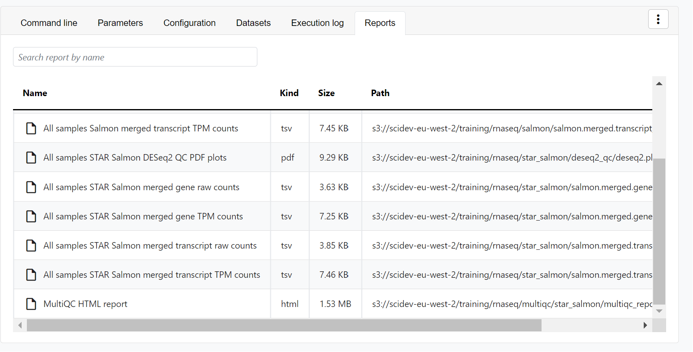
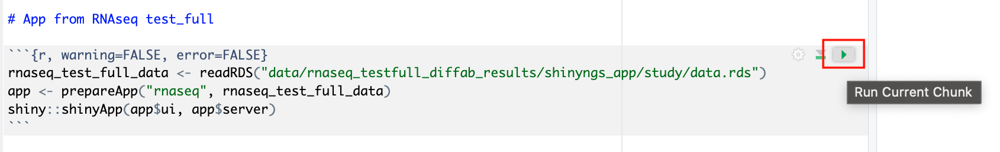
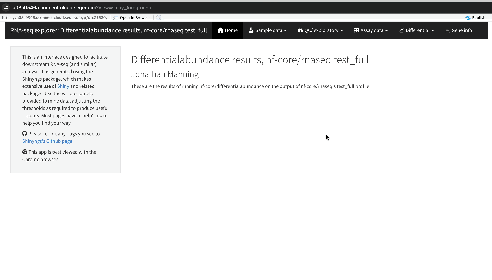

:::info
This demo tutorial provides an introduction to Seqera Platform, including instructions to:

- Launch, monitor, and optimize the [nf-core/rnaseq](https://github.com/nf-core/rnaseq) pipeline
- Select pipeline input data with [Data Explorer](../../data/data-explorer) and Platform [datasets](../../data/datasets)
- Perform interactive analysis of pipeline results with [Studios](../../studios/overview)

The Platform Community Showcase is a Seqera-managed demonstration workspace with all the resources needed to follow along with this tutorial. All [Seqera Cloud](https://cloud.seqera.io) users have access to this example workspace by default.
:::

The Launchpad in every Platform workspace allows users to easily create and share Nextflow pipelines that can be executed on any supported infrastructure, including all public clouds and most HPC schedulers. A Launchpad pipeline consists of a pre-configured workflow repository, [compute environment](../../compute-envs/overview), and launch parameters.

The Community Showcase contains 15 preconfigured pipelines, including [nf-core/rnaseq](https://github.com/nf-core/rnaseq), a bioinformatics pipeline used to analyze RNA sequencing data.

The workspace also includes three preconfigured AWS Batch compute environments to run Showcase pipelines, and various Platform datasets and public data sources (accessed via Data Explorer) to use as pipeline input.

:::note
To skip this Community Showcase demo and start running pipelines on your own infrastructure:

1. Set up an [organization workspace](../workspace-setup).
1. Create a workspace [compute environment](../../compute-envs/overview) for your cloud or HPC compute infrastructure.
1. [Add pipelines](./add-pipelines) to your workspace.
   :::

## Launch the nf-core/rnaseq pipeline

:::note
This guide is based on version 3.14.0 of the nf-core/rnaseq pipeline. Launch form parameters may differ in other versions.
:::

Navigate to the Launchpad in the `community/showcase` workspace and select **Launch** next to the `nf-core-rnaseq` pipeline to open the launch form.


The launch form consists of **General config**, **Run parameters**, and **Advanced options** sections to specify your run parameters before execution, and an execution summary. Use section headings or select the **Previous** and **Next** buttons at the bottom of the page to navigate between sections.

<details>
  <summary>Nextflow parameter schema</summary>

The launch form lets you configure the pipeline execution. The pipeline parameters in this form are rendered from a [pipeline schema](../../pipeline-schema/overview) file in the root of the pipeline Git repository. `nextflow_schema.json` is a simple JSON-based schema describing pipeline parameters for pipeline developers to easily adapt their in-house Nextflow pipelines to be executed in Platform.

:::tip
See [Best Practices for Deploying Pipelines with the Seqera Platform](https://seqera.io/blog/best-practices-for-deploying-pipelines-with-seqera-platform/) to learn how to build the parameter schema for any Nextflow pipeline automatically with tooling maintained by the nf-core community.
:::

</details>

### General config

Most Showcase pipeline parameters are prefilled. Specify the following fields to identify your run amongst other workspace runs:

- **Workflow run name**: A unique identifier for the run, pre-filled with a random name. This can be customized.
- **Labels**: Assign new or existing labels to the run. For example, a project ID or genome version.

### Run parameters

There are three ways to enter **Run parameters** prior to launch:

- The **Input form view** displays form fields to enter text, select attributes from dropdowns, and browse input and output locations with [Data Explorer](../../data/data-explorer).
- The **Config view** displays a raw schema that you can edit directly. Select JSON or YAML format from the **View as** dropdown.
- **Upload params file** allows you to upload a JSON or YAML file with run parameters.

#### input

Most nf-core pipelines use the `input` parameter in a standardized way to specify an input samplesheet that contains paths to input files (such as FASTQ files) and any additional metadata needed to run the pipeline. Use **Browse** to select either a file path in cloud storage via **Data Explorer**, or a pre-loaded **Dataset**:

- In the **Data Explorer** tab, select the `nf-tower-data` bucket, then search for and select the `rnaseq_sample_data.csv` file.
- In the **Datasets** tab, search for and select `rnaseq_sample_data`.


:::tip
See [Add data](./add-data) to learn how to add datasets and Data Explorer cloud buckets to your own workspaces.
:::

#### output

Most nf-core pipelines use the `outdir` parameter in a standardized way to specify where the final results created by the pipeline are published. `outdir` must be unique for each pipeline run. Otherwise, your results will be overwritten.

For this tutorial test run, keep the default `outdir` value (`./results`).

:::tip
For the `outdir` parameter in pipeline runs in your own workspace, select **Browse** to specify a cloud storage directory using Data Explorer, or enter a cloud storage directory path to publish pipeline results to manually.
:::

#### Pipeline-specific parameters

Modify other parameters to customize the pipeline execution through the parameters form. For example, under **Read trimming options**, change the `trimmer` to select `fastp` in the dropdown menu instead of `trimgalore`.


Select **Launch** to start the run and be directed to the **Runs** tab with your run in a **submitted** status at the top of the list.

## View run information

### Run details page

As the pipeline runs, run details will populate with parameters, logs, and other important execution details:

<details>
  <summary>View run details</summary>

- **Command-line**: The Nextflow command invocation used to run the pipeline. This contains details about the pipeline version (`-r 3.14.0` flag) and profile, if specified (`-profile test` flag).
- **Parameters**: The exact set of parameters used in the execution. This is helpful for reproducing the results of a previous run.
- **Resolved Nextflow configuration**: The full Nextflow configuration settings used for the run. This includes parameters, but also settings specific to task execution (such as memory, CPUs, and output directory).
- **Execution Log**: A summarized Nextflow log providing information about the pipeline and the status of the run.
- **Datasets**: Link to datasets, if any were used in the run.
- **Reports**: View pipeline outputs directly in the Platform.


</details>

### View reports

Most Nextflow pipelines generate reports or output files which are useful to inspect at the end of the pipeline execution. Reports can contain quality control (QC) metrics that are important to assess the integrity of the results.

<details>
  <summary>View run reports</summary>



For example, for the nf-core/rnaseq pipeline, view the [MultiQC](https://docs.seqera.io/multiqc) report generated. MultiQC is a helpful reporting tool to generate aggregate statistics and summaries from bioinformatics tools.


The paths to report files point to a location in cloud storage (in the `outdir` directory specified during launch), but you can view the contents directly and download each file without navigating to the cloud or a remote filesystem.

#### Specify outputs in reports

To customize and instruct Platform where to find reports generated by the pipeline, a [tower.yml](https://github.com/nf-core/rnaseq/blob/master/tower.yml) file that contains the locations of the generated reports must be included in the pipeline repository.

In the nf-core/rnaseq pipeline, the MULTIQC process step generates a MultiQC report file in HTML format:

```yaml
reports:
  multiqc_report.html:
    display: "MultiQC HTML report"
```

</details>

:::note
See [Reports](../../reports/overview) to configure reports for pipeline runs in your own workspace.
:::

### View general information

The run details page includes general information about who executed the run and when, the Git hash and tag used, and additional details about the compute environment and Nextflow version used.

<details>
  <summary>View general run information</summary>


The **General** panel displays top-level information about a pipeline run:

- Unique workflow run ID
- Workflow run name
- Timestamp of pipeline start
- Pipeline version and Git commit ID
- Nextflow session ID
- Username of the launcher
- Work directory path

</details>

### View process and task details

Scroll down the page to view:

- The progress of individual pipeline **Processes**
- **Aggregated stats** for the run (total walltime, CPU hours)
- **Workflow metrics** (CPU efficiency, memory efficiency)
- A **Task details** table for every task in the workflow

The task details table provides further information on every step in the pipeline, including task statuses and metrics:

<details>
  <summary>View task details</summary>

Select a task in the task table to open the **Task details** dialog. The dialog has three tabs: **About**, **Execution log**, and **Data Explorer**.

#### About

The **About** tab includes:

1. **Name**: Process name and tag
2. **Command**: Task script, defined in the pipeline process
3. **Status**: Exit code, task status, and number of attempts
4. **Work directory**: Directory where the task was executed
5. **Environment**: Environment variables that were supplied to the task
6. **Execution time**: Metrics for task submission, start, and completion time
7. **Resources requested**: Metrics for the resources requested by the task
8. **Resources used**: Metrics for the resources used by the task


#### Execution log

The **Execution log** tab provides a real-time log of the selected task's execution. Task execution and other logs (such as stdout and stderr) are available for download from here, if still available in your compute environment.

</details>

### Task work directory in Data Explorer

If a task fails, a good place to begin troubleshooting is the task's work directory. Nextflow hash-addresses each task of the pipeline and creates unique directories based on these hashes.

<details>
  <summary>View task log and output files</summary>

Instead of navigating through a bucket on the cloud console or filesystem, use the **Data Explorer** tab in the Task window to view the work directory.

Data Explorer allows you to view the log files and output files generated for each task, directly within Platform. You can view, download, and retrieve the link for these intermediate files to simplify troubleshooting.


</details>

## Interactive analysis

Interactive analysis of pipeline results is often performed in platforms like Jupyter Notebook or RStudio. Setting up the infrastructure for these platforms, including accessing pipeline data and the necessary bioinformatics packages, can be complex and time-consuming.

**Studios** streamlines the process of creating interactive analysis environments for Platform users. With built-in templates, creating a data studio is as simple as adding and sharing pipelines or datasets.

### Analyze RNAseq data in Studios

In the **Studios** tab, you can monitor and see the details of the Studios in the Community Showcase workspace.

Studios is used to perform bespoke analysis on the results of upstream workflows. For example, in the Community Showcase workspace we have run the **nf-core/rnaseq** pipeline to quantify gene expression, followed by **nf-core/differentialabundance** to derive differential expression statistics. The workspace contains a Studio with these results from cloud storage mounted into the Studio to perform further analysis. One of these outputs is an RShiny application, which can be deployed for interactive analysis.

#### Connect to the RNAseq analysis Studio

Select the `rnaseq_to_differentialabundance` Studio. This Studio consists of an RStudio environment that uses an existing compute environment available in the showcase workspace. The Studio also contains mounted data generated from the nf-core/rnaseq and subsequent nf-core/differentialabundance pipeline runs, directly from AWS S3.


Select **Connect** to view the running RStudio environment. The `rnaseq_to_differentialabundance` Studio includes the necessary R packages for deploying an RShiny application to visualize the RNAseq data.

Deploy the RShiny app in the Studio by selecting the green play button on the last chunk of the R script:



:::note
Studios allows you to specify the resources each Studio will use. When [creating your own Studios](../../studios/overview) with shared compute environment resources, you must allocate sufficient resources to the compute environment to prevent Studio or pipeline run interruptions.
:::

### Explore results

The RShiny app will deploy in a separate browser window, providing a data interface. Here you can view information about your sample data, perform QC or exploratory analysis, and view the results of differential expression analyses.


<details>
  <summary>Sample clustering with PCA plots</summary>

In the **QC/Exploratory** tab, select the PCA (Principal Component Analysis) plot to visualize how the samples group together based on their gene expression profiles.

In this example, we used RNA sequencing data from the publicly-available ENCODE project, which includes samples from four different cell lines:

- **GM12878** — a lymphoblastoid cell line
- **K562** — a chronic myelogenous leukemia cell line
- **MCF-7** — a breast cancer cell line
- **H1-hESC** — human embryonic stem cells

What to look for in the PCA plot:

- **Replicate clustering**: Ideally, biological replicates of the same cell type should cluster closely together. For example, replicates of MCF-7 (breast cancer cell line) group together. This indicates consistent gene expression profiles among biological replicates.
- **Cell type separation**: Different cell types should form distinct clusters. For instance, GM12878, K562, MCF-7, and H1-hESC samples should each form their own separate clusters, reflecting their unique gene expression patterns.

From this PCA plot, you can gain insights into the consistency and quality of your sequencing data, identify any potential issues, and understand the major sources of variation among your samples - all directly in Platform.



</details>

<details>
  <summary>Gene expression changes with Volcano plots</summary>

In the **Differential** tab, select **Volcano plots** to compare genes with significant changes in expression between two samples. For example, filter for `Type: H1 vs MCF-7` to view the differences in expression between these two cell lines.

1. **Identify upregulated and downregulated genes**: The x-axis of the volcano plot represents the log2 fold change in gene expression between the H1 and MCF-7 samples, while the y-axis represents the statistical significance of the changes.

   - **Upregulated genes in MCF-7**: Genes on the left side of the plot (negative fold change) are upregulated in the MCF-7 samples compared to H1. For example, the SHH gene, which is known to be upregulated in cancer cell lines, prominently appears here.

2. **Filtering for specific genes**: If you are interested in specific genes, use the filter function. For example, filter for the SHH gene in the table below the plot. This allows you to quickly locate and examine this gene in more detail.

3. **Gene expression bar plot**: After filtering for the SHH gene, select it to navigate to a gene expression bar plot. This plot will show you the expression levels of SHH across all samples, allowing you to see in which samples it is most highly expressed.

   - Here, SHH is most highly expressed in MCF-7, which aligns with its known role in cancer cell proliferation.

Using the volcano plot, you can effectively identify and explore the genes with the most significant changes in expression between your samples, providing a deeper understanding of the molecular differences.


</details>

### Collaborate in the Studio

To share the results of your RNAseq analysis or allow colleagues to perform exploratory analysis, share a link to the Studio by selecting the options menu for the Studio you want to share, then select **Copy Studio URL**. With this link, other authenticated users with the **Connect** [role](../../orgs-and-teams/roles) (or greater) can access the session directly.

:::note
See [Studios](../../studios/overview) to learn how to create Studios in your own workspace.
:::

## Pipeline optimization

Seqera Platform's task-level resource usage metrics allow you to determine the resources requested for a task and what was actually used. This information helps you fine-tune your configuration more accurately.

However, manually adjusting resources for every task in your pipeline is impractical. Instead, you can leverage the pipeline optimization feature available on the Launchpad.

Pipeline optimization analyzes resource usage data from previous runs to optimize the resource allocation for future runs. After a successful run, optimization becomes available, indicated by the lightbulb icon next to the pipeline turning black.

<details>
  <summary>Optimize nf-core/rnaseq</summary>

Navigate back to the Launchpad and select the lightbulb icon next to the nf-core/rnaseq pipeline to view the optimized profile. You have the flexibility to tailor the optimization's target settings and incorporate a retry strategy as needed.

#### View optimized configuration

When you select the lightbulb, you can access an optimized configuration profile in the second tab of the **Customize optimization profile** window.

This profile consists of Nextflow configuration settings for each process and each resource directive (where applicable): **cpus**, **memory**, and **time**. The optimized setting for a given process and resource directive is based on the maximum use of that resource across all tasks in that process.

Once optimization is selected, subsequent runs of that pipeline will inherit the optimized configuration profile, indicated by the black lightbulb icon with a checkmark.

:::note
Optimization profiles are generated from one run at a time, defaulting to the most recent run, and _not_ an aggregation of previous runs.
:::


Verify the optimized configuration of a given run by inspecting the resource usage plots for that run and these fields in the run's task table:

| Description  | Key                    |
| ------------ | ---------------------- |
| CPU usage    | `pcpu`                 |
| Memory usage | `peakRss`              |
| Runtime      | `start` and `complete` |

</details>
