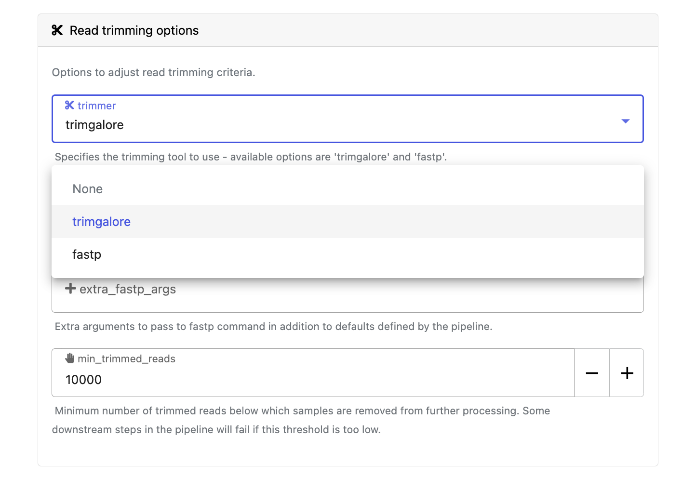

From the Launchpad in every workspace, you can create and share Nextflow pipelines that run on any supported infrastructure, including all public clouds and most HPC schedulers. A Launchpad pipeline consists of a preconfigured workflow Git repository, [compute environment](../../compute-envs/overview), and launch parameters. This tutorial walks you through launching the nf-core/rnaseq pipeline.

:::info[**Prerequisites**]

You need the following:

- An organization and workspace. See [Set up an organization and workspace](../workspace-setup).
- A workspace [compute environment](../../compute-envs/overview) for your cloud or HPC compute infrastructure.
- A [pipeline](./add-pipelines) added to your workspace.
- [Pipeline input data](./add-data) added to your workspace.

:::

## Launch a pipeline

Navigate to the Launchpad and select **Launch** next to your pipeline to open the launch form.

The launch form consists of **General config**, **Run parameters**, and **Advanced options** sections to specify your run parameters before execution, and an execution summary. Use section headings or select the **Previous** and **Next** buttons at the bottom of the page to navigate between sections.

  
Nextflow parameter schema

The launch form configures the pipeline run. Platform renders the pipeline parameters in this form from a [pipeline schema](../../pipeline-schema/overview) file in the root of the pipeline Git repository. `nextflow_schema.json` is a JSON-based schema that describes pipeline parameters. Pipeline developers use it to adapt their in-house Nextflow pipelines to run in Platform.

:::tip
See [Best Practices for Deploying Pipelines with the Seqera Platform](https://seqera.io/blog/best-practices-for-deploying-pipelines-with-seqera-platform/) to learn how to build the parameter schema for any Nextflow pipeline automatically with tooling maintained by the nf-core community.
:::

### General config

- **Pipeline to launch**: The pipeline Git repository name or URL. For saved pipelines, this is prefilled and cannot be edited.
- **Version name**: The version that will be selected as default for this pipeline.
- **Version ID**: The ID of the pipeline version.
- **Revision**: A valid repository commit ID, tag, or branch name. Determines the version of the pipeline to launch.
- **Commit ID**: Pin pipeline revision to the most recent HEAD commit ID. If no commit ID is pinned, the latest revision of the repository branch or tag is used.
- **Pull latest**: Fetch the most recent HEAD commit ID of the pipeline revision at launch time. Unpins the **Commit ID**, if set.
  :::info
  See [Git revision management](../../pipelines/revision.md) for more information on **Commit ID**, **Pull latest**, and **Revision** behavior.
  :::
- **Main script**: The script file to execute (default: `main.nf`). Config profiles suggestions may update when this field changes.
- **Config profiles**: One or more [configuration profile](https://docs.seqera.io/nextflow/config#config-profiles) names to use for the execution.
- **Workflow run name**: An identifier for the run, pre-filled with a random name. This can be customized.
- **Labels**: Assign new or existing [labels](../../labels/overview) to the run.
- **Compute environment**: Select an existing workspace [compute environment](../../compute-envs/overview).
- **Work directory**: The (cloud or local) file storage path where pipeline scratch data is stored. If you specify only a cloud bucket location, Platform creates a scratch subfolder.
  :::note
  The credentials associated with the compute environment must have access to the work directory.
  :::
- **Schema**: The schema to validate pipeline parameters and prevent runtime failures.
  - **Repository default**: The default schema provided by the pipeline repository.
  - **Repository path**: A schema at a specific path in the repository.
  - **Seqera Platform schema**: A schema stored in Seqera Platform.

### Run parameters

There are three ways to enter **Run parameters** prior to launch:

- The **Input form view** displays form fields to enter text or select attributes from lists, and browse input and output locations with [Data Explorer](../../data/data-explorer).
- The **Config view** displays raw configuration text that you can edit directly. Select JSON or YAML format from the **View as** list.
- **Upload params file** allows you to upload a JSON or YAML file with run parameters.

Specify your pipeline input and output and modify other pipeline parameters as needed:

#### input

Use **Browse** to select your pipeline input data:

- In the **Data Explorer** tab, select the existing cloud bucket that contains your samplesheet, browse or search for the samplesheet file, and select the chain icon to copy the file path before closing the data selection window and pasting the file path in the input field.
- In the **Datasets** tab, search for and select your existing dataset.

#### outdir

Use the `outdir` parameter to specify where the pipeline publishes outputs. `outdir` must be unique for each run to avoid overwriting results from a previous run.

**Browse** and copy cloud storage directory paths using Data Explorer, or enter a path manually.

#### Pipeline-specific parameters

Modify other parameters to customize the pipeline execution through the parameters form. For example, in [nf-core/rnaseq](https://github.com/nf-core/rnaseq) (version 3.15.1), change the `trimmer` under **Read trimming options** to `fastp` instead of `trimgalore`.

### Advanced settings

- Use [resource labels](../../resource-labels/overview) to tag the computing resources created during the workflow execution. While resource labels for the run are inherited from the compute environment and pipeline, workspace admins can override them from the launch form. Applied resource label names must be unique.
- Use [Pipeline secrets](../../secrets/overview) to store keys and tokens used by workflow tasks to interact with external systems. Enter the names of any stored user or workspace secrets required for the workflow execution.
- See [Advanced options](../../launch/advanced) for more details.

After you fill in the launch details, select **Launch**. The **Runs** tab shows your new run in a **submitted** status at the top of the list. Select the run name to open the [**View Workflow Run**](../../monitoring/overview) page, where you can view the configuration, parameters, status of individual tasks, and run report.
