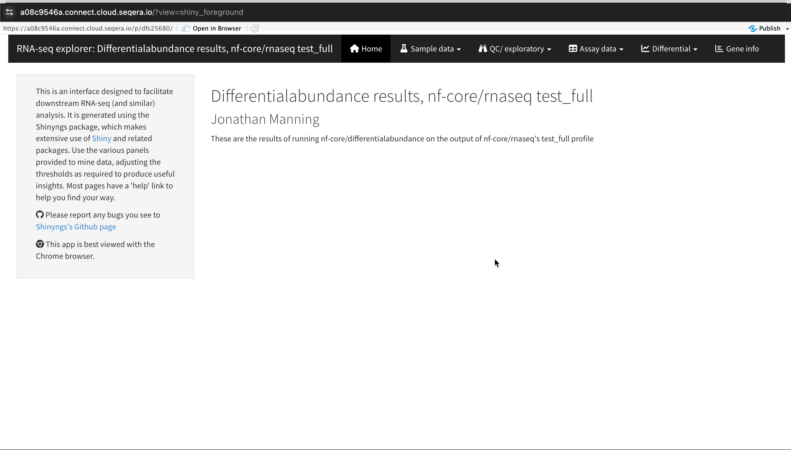
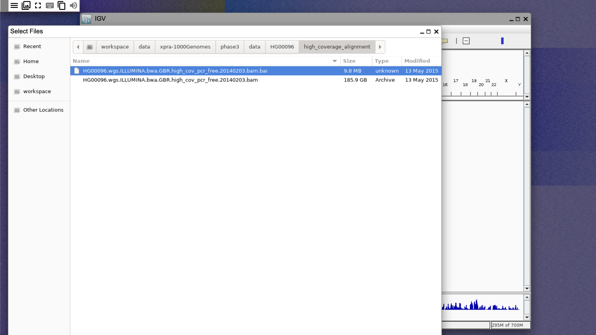
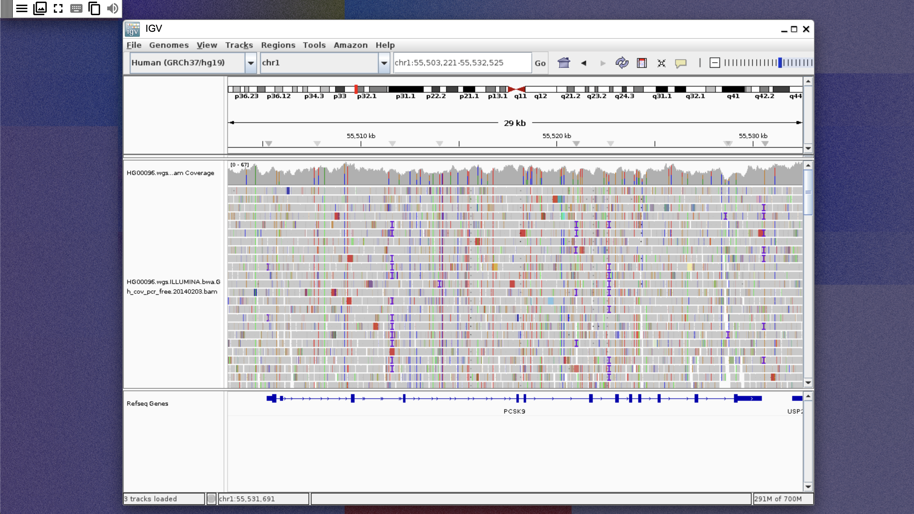

[Studios](../studios/overview) runs interactive analysis environments — [Jupyter](https://jupyter.org/) notebooks, an [R-IDE](https://github.com/seqeralabs/r-ide), [Visual Studio Code](https://code.visualstudio.com/), and [Xpra](https://xpra.org/index.html) remote desktops — on your Seqera Platform compute environments, with your cloud data mounted directly into each session.

In this tutorial, you'll set up a compute environment and mount public pipeline data, then build a Studio for each environment type:

- [**Jupyter**](#jupyter-visualize-protein-structure-predictions): visualize protein structures predicted by *nf-core/proteinfold*.
- [**R-IDE**](#r-ide-explore-rna-seq-differential-expression-results): explore RNA-Seq differential expression results in a Shiny app.
- [**Xpra**](#xpra-view-genetic-variants-in-igv): view genetic variants from the 1000 Genomes Project in IGV desktop.
- [**VS Code**](#vs-code-develop-nextflow-pipelines): create a Nextflow development environment with nf-core tools.

Each example stands alone. Complete the [setup](#set-up-a-compute-environment) once, then jump to the environment you use.

### Before you begin

You need:

- At least the **Maintain** workspace [user role](../orgs-and-teams/roles) to create and configure Studios.
- Valid [credentials](../credentials/overview) for your cloud storage account and compute environment.
- [Data Explorer](../data/data-explorer) enabled in your workspace.

:::note
The library and package versions pinned in these examples may become outdated over time and lead to unexpected results.
:::

## Set up a compute environment

The examples in this tutorial use an [AWS Batch compute environment](../compute-envs/aws-batch#create-a-seqera-aws-batch-compute-environment). Studios also supports [AWS Cloud](../compute-envs/aws-cloud), [Azure Cloud](../compute-envs/azure-cloud), and [Google Cloud](../compute-envs/google-cloud) compute environments — see [Add a Studio](../studios/add-studio) for requirements per platform.

If you don't have an existing AWS Batch compute environment, create one with the following attributes:

- **Region**: To minimize costs, create the compute environment in the same region as your data. Each example below lists the region of its public dataset.
- **Provisioning model**: Use **On-demand** EC2 instances.
- Do not enable **Use Fargate for head job**. Studios does not support AWS Fargate.
- At least 2 available CPUs and 8192 MB of RAM. The VS Code example needs 4 CPUs and 16384 MB of RAM.

:::note
Studio sessions compete for resources with pipeline runs on a shared compute environment. Ensure the compute environment has sufficient resources to run both.
:::

## Add public data with Data Explorer

Each example mounts a public dataset into the Studio session:

| Example | Bucket path                                                                              | Region      |
| ------- | ---------------------------------------------------------------------------------------- | ----------- |
| Jupyter | `s3://nf-core-awsmegatests/proteinfold/results-9bea0dc4ebb26358142afbcab3d7efd962d3a820` | `eu-west-1` |
| R-IDE   | `s3://nf-core-awsmegatests`                                                              | `eu-west-1` |
| Xpra    | `s3://1000genomes`                                                                       | `us-east-1` |
| VS Code | `s3://ngi-igenomes/test-data/`                                                           | `eu-west-1` |

To add a bucket to your workspace:

1. From the **Data Explorer** tab, select **Add cloud bucket**.
1. Specify the bucket details:
    - **Provider**: AWS
    - **Bucket path**: the path from the table above
    - A unique **Name** for the bucket, such as `nf-core-awsmegatests`
    - **Credentials**: **Public**
    - An optional bucket **Description**
1. Select **Add**.

:::info
To analyze your own pipeline results instead, add the cloud bucket that contains them. See [Add a cloud bucket](./quickstart-demo/add-data#add-a-cloud-bucket).
:::

## Jupyter: Visualize protein structure predictions

Jupyter notebooks enable interactive analysis with Python libraries and tools. In this example, you use [Py3DMol](https://pypi.org/project/py3Dmol/) to visualize and compare protein structures produced by [nf-core/proteinfold](https://nf-co.re/proteinfold/1.1.1), rendering interactive composite 3D images of the [H1065 sequence](https://predictioncenter.org/casp14/multimer_results.cgi?target=H1065) from the nf-core AWS megatests public dataset. The same script works with the results of your own *nf-core/proteinfold* runs.

### Create the Jupyter Studio

1. From the **Studios** tab, select **Add Studio**.
1. In the **Compute & Data** tab:
    - Select your AWS Batch compute environment.
    - Optional: Enter CPU and memory allocations. The default values are 2 CPUs and 8192 MB memory (RAM).
    - Mount the proteinfold bucket you added with Data Explorer, or the results directory of your own *nf-core/proteinfold* run.
1. In the **General config** tab:
    - Select the latest **Jupyter** container image template from the list.
    - Optional: Enter a unique name and description for the Studio.
    - Check **Install Conda packages** and paste the following into the YAML textfield:

    ```yaml
    channels:
    - schrodinger
    - conda-forge
    - bioconda
    dependencies:
    - python=3.10
    - conda-forge::libgl
    - pip
    - pip:
      - biopython==1.85
      - mdtraj==1.10.3
      - py3dmol==2.4.2
    ```

1. Select **Add and start**, then select **Connect** in the options menu to open the session in a new browser tab when it is running.

:::tip
Installing Conda packages builds a custom container environment for your session. For the package syntax, prerequisites, and other ways to customize a Studio — including your own container images — see [Custom environments](../studios/custom-envs).
:::

### Visualize protein structures

The following Python script creates a composite interactive 3D image of the structures predicted by AlphaFold2 and ESMFold in contrasting colors. It aligns the mobile structure to the reference structure with Biopython's `Superimposer`, then renders individual and combined interactive views with Py3DMol.

Run the script in your Jupyter notebook:

<details>
<summary>Full Python script</summary>

    ```python
    import py3Dmol
    from IPython.display import display
    from Bio import PDB
    from Bio.PDB import Superimposer
    import numpy as np

    # Keep file paths unchanged to visualize structures of the H1065 sequence in nf-core AWS megatests.
    # Update file paths (to PDB files) to visualize structures of your own nf-core/proteinfold output data.
    alphafold2_multimer_standard = "/workspace/data/nf-core-awsmegatests-proteinfold-h1065/mode_alphafold2_multimer/alphafold2/standard/H1065.alphafold.pdb"
    esmfold_multimer = "/workspace/data/nf-core-awsmegatests-proteinfold-h1065/mode_esmfold_multimer/esmfold/H1065.pdb"

    def align_structures(ref_pdb_path, mobile_pdb_path):
        """Align mobile structure to reference structure and return aligned coordinates"""
        # Set up parser
        parser = PDB.PDBParser()

        # Load structures
        ref_structure = parser.get_structure("reference", ref_pdb_path)
        mobile_structure = parser.get_structure("mobile", mobile_pdb_path)

        # Get lists of C-alpha atoms from both structures
        ref_atoms = []
        mobile_atoms = []

        for model in ref_structure:
            for chain in model:
                for residue in chain:
                    if 'CA' in residue:
                        ref_atoms.append(residue['CA'])

        for model in mobile_structure:
            for chain in model:
                for residue in chain:
                    if 'CA' in residue:
                        mobile_atoms.append(residue['CA'])

    # Align structures using Superimposer
    super_imposer = Superimposer()
    super_imposer.set_atoms(ref_atoms, mobile_atoms)
    super_imposer.apply(mobile_structure.get_atoms())

    # Save aligned structure
    io = PDB.PDBIO()
    io.set_structure(mobile_structure)
    aligned_pdb_path = "./"+mobile_pdb_path.split("/")[-1].replace('.pdb', '_aligned.pdb')
    io.save(aligned_pdb_path)

    return aligned_pdb_path

    def create_structure_view(pdb_path, color, width=400, height=400, label=None):
        """Create a view for a single structure"""
        view = py3Dmol.view(width=width, height=height)

        with open(pdb_path, 'r') as f:
            pdb_data = f.read()
        view.addModel(pdb_data, "pdb")
        view.setStyle({'model': -1}, {'cartoon': {'color': color}})
        view.zoomTo()

        if label:
            view.addLabel(label, {
                'position': {'x': 0, 'y': 0, 'z': 0},
                'backgroundColor': color,
                'fontColor': 'white'
            })

        return view

    def visualize_structures(pdb1_path, pdb2_path):
        # Align the second structure to the first
        aligned_pdb2_path = align_structures(pdb1_path, pdb2_path)

        # Create three separate views
        view1 = create_structure_view(pdb1_path, 'blue', label="AlphaFold2")
        view2 = create_structure_view(aligned_pdb2_path, 'darkgrey', label="ESMFold")

        # Create combined view
        view3 = py3Dmol.view(width=800, height=400)

        # Load and display first structure (AlphaFold2)
        with open(pdb1_path, 'r') as f:
            pdb1_data = f.read()
        view3.addModel(pdb1_data, "pdb")
        view3.setStyle({'model': -1}, {'cartoon': {'color': 'blue'}})

        # Load and display aligned second structure (ESMFold)
        with open(aligned_pdb2_path, 'r') as f:
            pdb2_data = f.read()
        view3.addModel(pdb2_data, "pdb")
        view3.setStyle({'model': 1}, {'cartoon': {'color': 'darkgrey'}})

        # Set up the combined view
        view3.zoomTo()

        # Add labels for combined view
        view3.addLabel("AlphaFold2", {'position': {'x': -20, 'y': 0, 'z': 0}, 'backgroundColor': 'blue', 'fontColor': 'white'})
        view3.addLabel("ESMFold", {'position': {'x': 20, 'y': 0, 'z': 0}, 'backgroundColor': 'darkgrey', 'fontColor': 'white'})

        return view1, view2, view3

    # Visualize the structures
    view1, view2, view3 = visualize_structures(alphafold2_multimer_standard, esmfold_multimer)

    # Display all views
    print("AlphaFold2 Structure:")
    view1.show()
    print("\nESMFold Structure:")
    view2.show()
    print("\nAligned Structures:")
    view3.show()
    ```

</details>


## R-IDE: Explore RNA-Seq differential expression results

An R-IDE enables interactive analysis with R libraries and tools. In this example, you deploy [ShinyNGS](https://github.com/pinin4fjords/shinyngs), a Shiny web app created by members of the nf-core community, to explore public RNA sequencing data that was processed by *nf-core/rnaseq* to quantify gene expression, followed by *nf-core/differentialabundance* to derive differential expression statistics.

### Create the R-IDE Studio

1. From the **Studios** tab, select **Add Studio**.
1. In the **Compute & Data** tab:
    - Select your AWS Batch compute environment.
    - Optional: Enter CPU and memory allocations. The default values are 2 CPUs and 8192 MB memory (RAM).
    - Mount the nf-core AWS megatests bucket you added with Data Explorer, or the results directory of your own *nf-core/differentialabundance* run.
1. In the **General config** tab:
    - Select the latest **R-IDE** container image template from the list.
    - Optional: Enter a unique name and description for the Studio.
1. Select **Add and start**, then select **Connect** in the options menu to open the session in a new browser tab when it is running.

### Deploy the ShinyNGS app

The following R script installs the prerequisite packages, downloads the RDS input file, and launches the app's plots, heatmaps, and tables. To use your own *nf-core/rnaseq* and *nf-core/differentialabundance* results, replace the download URL in step 2:

<details>
<summary>R script individual steps</summary>

    1. Configure the R-IDE session with installed packages, including [ShinyNGS](https://github.com/pinin4fjords/shinyngs):

        ```r
        if (!require("BiocManager", quietly = TRUE))
          install.packages("BiocManager")

        BiocManager::install(version = "3.20", ask = FALSE)
        BiocManager::install(c("SummarizedExperiment", "GSEABase", "limma"))

        install.packages(c("devtools", "matrixStats", "rmarkdown", "markdown"))
        install.packages("shiny", repos = "https://cran.rstudio.com/")

        devtools::install_version("cpp11", version = "0.2.1", repos = "http://cran.us.r-project.org")
        devtools::install_github('pinin4fjords/shinyngs', upgrade_dependencies = FALSE)
        ```

    1. Download the RDS file from nf-core AWS megatests or your own *nf-core/differentialabundance* results (see [Shiny app](https://nf-co.re/differentialabundance/1.5.0/docs/output/#shiny-app) from the nf-core documentation for file details):

        ```r
        # For nf-core AWS megatests
        download.file("https://nf-core-awsmegatests.s3-eu-west-1.amazonaws.com/differentialabundance/results-3dd360fed0dca1780db1bdf5dce85e5258fa2253/shinyngs_app/study/data.rds", 'data.rds')

        # For your nf-core/differentialabundance results, replace the URL with your RDS file URL)
        download.file("https://bucket.s3-region.amazonaws.com/differentialabundance/results/shinyngs_app/study-name/data.rds", 'data.rds')
        ```

    1. Import libraries, read your RDS data, and launch the app:

        ```r
        library(shinyngs)
        library(markdown)
        esel <- readRDS("data.rds")
        app <- prepareApp("rnaseq", esel)
        shiny::shinyApp(app$ui, app$server)
        ```

</details>



## Xpra: View genetic variants in IGV

Xpra provides a remote desktop inside the Studio session. In this example, you install [IGV desktop](https://igv.org/) with Conda and visually explore genomic data from the [1000 Genomes Project](https://www.coriell.org/1/NHGRI/Collections/1000-Genomes-Project-Collection/1000-Genomes-Project).

### Create the Xpra Studio

1. From the **Studios** tab, select **Add Studio**.
1. In the **Compute & Data** tab:
    - Select your AWS Batch compute environment.
    - Optional: Enter CPU and memory allocations.
    - Mount the 1000 Genomes bucket you added with Data Explorer.
1. In the **General config** tab:
    - Select the latest **Xpra** container image template from the list.
    - Optional: Enter a unique name and description for the Studio.
    - Check **Install Conda packages** and paste the following into the YAML textfield:

        ```yaml
        channels:
          - conda-forge
          - bioconda
        dependencies:
          - igv
          - samtools
        ```

1. Select **Add and start**, then select **Connect** in the options menu to open the session in a new browser tab when it is running.

### View variants in IGV desktop

1. In the Xpra terminal, run `igv` to open IGV desktop.
1. In IGV, change the genome version to hg19.
1. Select **File**, then **Load from file**, then navigate to `/workspace/data/xpra-1000Genomes/phase3/data/HG00096/high_coverage_alignment` and select the `.bai` file, as shown below:
    
1. Search for PCSK9 and zoom into one of the exons of the gene. A coverage graph and reads are shown, as below:
    

## VS Code: Develop Nextflow pipelines

VS Code Studios give you a portable, interactive Nextflow development environment. The template includes the [Nextflow VS Code extension](https://marketplace.visualstudio.com/items?itemName=nextflow.nextflow), which uses the Nextflow language server to provide syntax highlighting, code navigation, code completion, and diagnostics for Nextflow scripts and configuration files. In this example, you add Conda and nf-core tools, run *nf-core/fetchngs* with its `test` profile, and scaffold a new pipeline with the nf-core template.

### Create the VS Code Studio

1. From the **Studios** tab, select **Add Studio**.
1. In the **Compute & Data** tab:
    - Select your AWS Batch compute environment.
    - Allocate at least 4 CPUs and 16384 MB RAM.
    - Mount the NGI iGenomes bucket you added with Data Explorer, plus any data directories you need for your own pipelines. The *nf-core/fetchngs* `test` profile uses the NGI iGenomes public data.
1. In the **General config** tab:
    - Select the latest **VS Code** container image template from the list.
    - Optional: Enter a unique name and description for the Studio.
    - Check **Install Conda packages** and paste the following into the YAML textfield:

        ```yaml
        channels:
          - conda-forge
          - bioconda
          - anaconda
        dependencies:
          - nf-core
          - conda
        ```

1. Select **Add and start**, then select **Connect** in the options menu to open the session in a new browser tab when it is running.
1. Inside the Studio session, run `code .` to use the clipboard.

:::tip
See [User and workspace settings](https://code.visualstudio.com/docs/editor/settings) to import your existing VS Code configuration and preferences into the session.
:::

### Run *nf-core/fetchngs* with Conda

Run the following command in the session terminal:

```shell
nextflow run nf-core/fetchngs -profile test,conda --outdir ./nf-core-fetchngs-conda-out -resume
```

### Write a Nextflow pipeline with nf-core tools

1. Run `nf-core pipelines create` to create a new pipeline. Choose which parts of the nf-core template you want to use.
1. Run `code <your new pipeline>` to open the new pipeline as a project in VS Code and develop it with the help of the Nextflow language server and nf-core tools.


## Share a session with collaborators

To share a running Studio session with collaborators inside your workspace, select the options menu for the session, then select **Copy Studio URL**. Other authenticated workspace users can use this link to access the session directly and collaborate in real time.

## Stop and manage your sessions

A Studio session runs — and consumes compute resources — until you stop it or it encounters a technical issue. To stop, restart, or inspect the configuration of your sessions, see [Manage Studios](../studios/managing).

## Next steps

- [Custom environments](../studios/custom-envs): Add Conda packages to a Seqera-provided image or bring your own container image.
- [Example custom Studios](../studios/example-studios): Ready-to-use Dockerfiles and pre-built images for Marimo, Streamlit, CELLxGENE, Shiny, and more.
- [Add a Studio from a Git repository](../studios/add-studio-git-repo): Build a Studio directly from a repository that contains a Dockerfile.
- [Studios troubleshooting](../troubleshooting_and_faqs/studios_troubleshooting): Fixes for common session and build issues.
