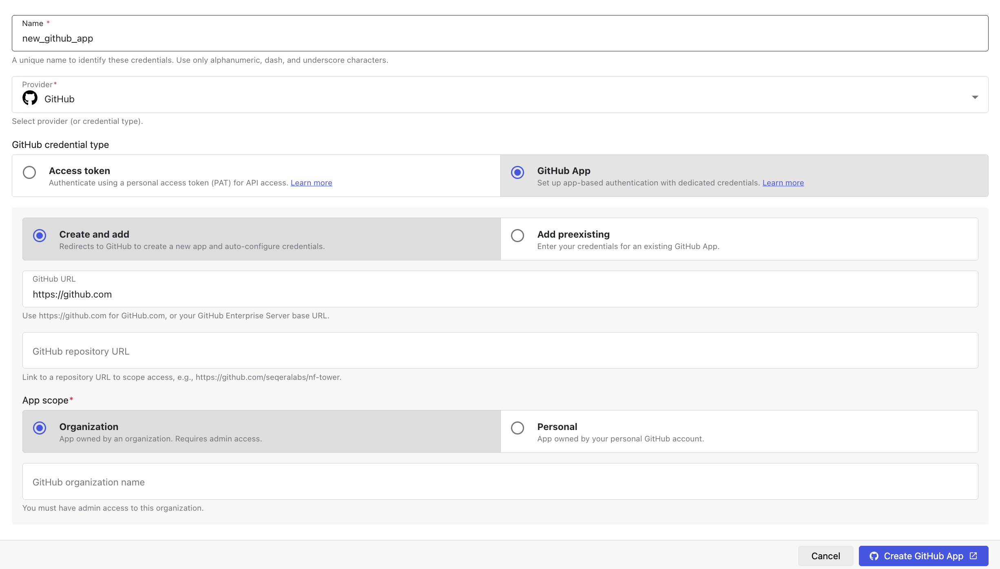
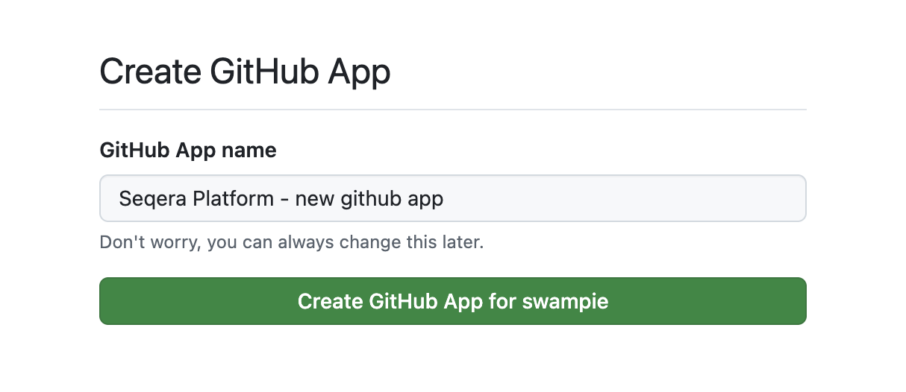
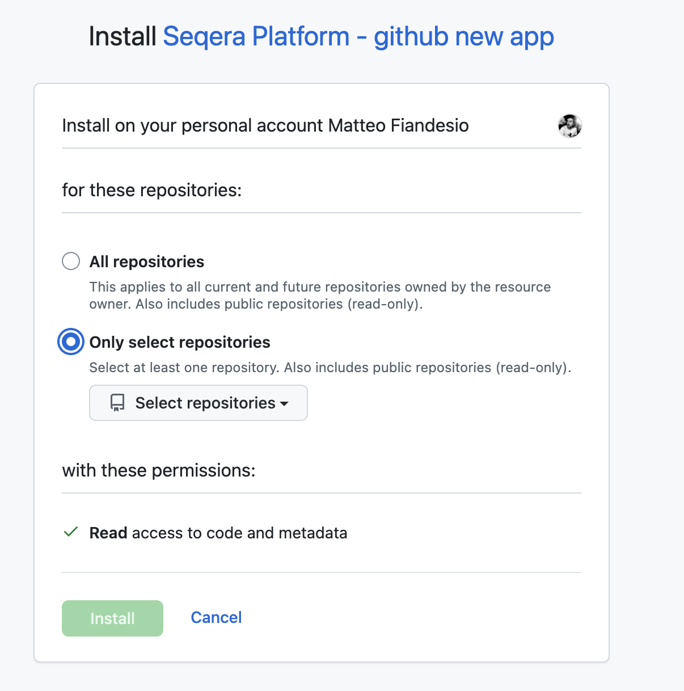

Data pipelines are composed of many assets, including pipeline scripts, configuration files, dependency descriptors (such as for Conda or Docker), documentation, etc. When you manage complex data pipelines as Git repositories, all assets can be versioned and deployed with a specific tag, release, or commit ID. Version control and containerization are crucial to enable reproducible pipeline executions, and provide the ability to continuously test and validate pipelines as the code evolves over time.

Seqera products have built-in support for [Git](https://git-scm.com) and several Git-hosting platforms. This page covers Git integration for both **Seqera Platform** and [**Seqera AI**](#seqera-ai).

## Seqera Platform

Seqera Platform enables launching pipelines directly from Git repositories. Pipelines can be pulled remotely from both public and private Git providers, including the most popular platforms: GitHub, GitLab, and BitBucket.

### Public repositories

Launch a public Nextflow pipeline by entering its Git repository URL in the Pipeline to launch field.

When you specify the Revision number, the list of available revisions are automatically pulled using the Git provider's API. By default, the default branch (usually `main` or `master`) will be used.

:::tip
[nf-core](https://nf-co.re/pipelines) is a great resource for public Nextflow pipelines.
:::

:::info
The GitHub API imposes [rate limits](https://docs.github.com/en/developers/apps/building-github-apps/rate-limits-for-github-apps) on API requests. You can increase your rate limit by adding [GitHub credentials](#github) to your workspace as shown below.
:::

### Private repositories

To access private Nextflow pipelines, add the credentials for your private Git hosting provider to Seqera.

:::info
Credentials are encrypted with the AES-256 cypher before secure storage and are never exposed in an unencrypted way by any Seqera API.
:::

### Multiple credential filtering

When you have multiple stored credentials, Seqera selects the most relevant credential for your repository in the following order:

1. Seqera evaluates all the stored credentials available to the current workspace.
2. Credentials are filtered by Git provider (GitHub, GitLab, Bitbucket, etc.)
3. Seqera selects the credential with a Repository base URL most similar to the target repository.
4. If no Repository base URL values are specified in the workspace credentials, the most long-lived credential is selected.

#### Credential filtering example

Workspace A contains four credentials:

**Credential A**
- Type: GitHub
- Repository base URL:

**Credential B**
- Type: GitHub
- Repository base URL: `https://github.com/`

**Credential C**
- Type: GitHub
- Repository base URL: `https://github.com/pipeline-repo`

**Credential D**
- Type: GitLab
- Repository base URL: `https://gitlab.com/repo-a`

If you launch a pipeline with a Nextflow workflow in the `https://github.com/pipeline-repo`, Seqera will use Credential C.

For the application to select the most appropriate credential for your repository, we recommend that you:
- Specify the Repository base URL values as completely as possible for each Git credential used in the workspace.
- Favor the use of service account type credentials where possible (such as GitLab group access tokens).
- Avoid storing multiple user-based tokens with similar permissions.

## Seqera AI

[Seqera AI](https://seqera.io/ask-ai/chat-v2) integrates with your pipeline GitHub repositories to provide intelligent assistance with pipeline development and modification. To fully utilize the power of Seqera AI, it needs access to your pipeline codebase to analyze, suggest changes, and even create pull requests on your behalf.

### Set up GitHub access

To enable Seqera AI to interact with your pipeline GitHub repositories:

1. **Generate a personal access token**
   - Navigate to [GitHub Personal Access Tokens](https://github.com/settings/personal-access-tokens)
   - Create a new token with the following permissions:
     - **Pull Requests**: Read & Write
     - **Contents**: Read & Write
   - Your token value will be displayed only once. Copy it before navigating away from the tokens page.

2. **Add the token to Seqera AI**
   - Open [Seqera AI](https://seqera.io/ask-ai/chat-v2).
   - In the bottom-left user menu, select **Add token**.
   - Enter your personal access token in the field provided, then select **Set token**.

### Capabilities

With proper GitHub access configured, Seqera AI can:
- Access and analyze your pipeline codebase
- Create feature branches for proposed changes
- Generate pull requests for your review
- Suggest improvements based on your existing code patterns

:::tip
Seqera AI respects your repository's branch protection rules and will create pull requests for review rather than directly modifying protected branches.
:::

## Seqera Platform Git provider credentials

The following sections detail how to configure credentials for specific Git providers in Seqera. These credentials enable access to private repositories for pipeline execution.

### Azure DevOps repositories

You can authenticate to Azure DevOps repositories using a [personal access token (PAT)](https://learn.microsoft.com/en-us/azure/devops/organizations/accounts/use-personal-access-tokens-to-authenticate?view=azure-devops&tabs=Windows#about-pats).

Once you have created and copied your access token, create a new credential in Seqera using these steps:

#### Create Azure DevOps credentials

1. From an organization workspace: Select **Credentials** > **Add Credentials**. From your personal workspace: Go to the user menu and select **Your credentials** > **Add credentials**.
2. Enter a **Name** for the new credentials.
3. Select **Azure DevOps** as the **Provider**.
4. Enter your **Username** and **Access token**.
5. (Recommended) Enter the **Repository base URL** for which the credentials should be applied. This option is used to apply the provided credentials to a specific repository, e.g., `https://dev.azure.com/<your organization>/<your project>`.

### GitHub

Use an access token to connect Seqera Platform to a private [GitHub](https://github.com/) repository. Personal (classic) or fine-grained access tokens can be used.

:::info
A user's personal access token (classic) can access every repository that the user has access to. GitHub recommends using fine-grained personal access tokens (currently in beta) instead, which you can restrict to specific repositories. Fine-grained personal access tokens also enable you to specify granular permissions instead of broad scopes.
:::

For personal (classic) tokens, you must grant access to the private repository by selecting the main `repo` scope when the token is created. See [Creating a personal access token (classic)](https://docs.github.com/en/authentication/keeping-your-account-and-data-secure/creating-a-personal-access-token#creating-a-personal-access-token-classic) for instructions to create your personal access token (classic).

For fine-grained tokens, the repository's organization must [opt in](https://docs.github.com/en/organizations/managing-programmatic-access-to-your-organization/setting-a-personal-access-token-policy-for-your-organization) to the use of fine-grained tokens. Tokens can be restricted by resource owner (organization), repository access, and permissions. See [Creating a fine-grained personal access token](https://docs.github.com/en/authentication/keeping-your-account-and-data-secure/managing-your-personal-access-tokens#creating-a-fine-grained-personal-access-token) for instructions to create your fine-grained access token.

After you've created and copied your access token, create a new credential in Seqera:

#### Create GitHub credentials

1. From an organization workspace: Select **Credentials** > **Add Credentials**. From your personal workspace: Go to the user menu and select **Your credentials** > **Add credentials**.
1. Enter a **Name** for the new credentials.
1. Select **GitHub** as the **Provider**.
1. Enter your **Username** and **Access token**.
1. (Recommended) Enter the **Repository base URL** for which the credentials should be applied. This option is used to apply the provided credentials to a specific repository, e.g., `https://github.com/seqeralabs`.

### GitHub App

Authenticate Seqera Platform to GitHub using [GitHub Apps](https://docs.github.com/en/apps/creating-github-apps/about-creating-github-apps/about-creating-github-apps), the GitHub-recommended way to integrate with the GitHub API. They act on their own behalf rather than impersonating a user, support fine-grained permissions that target specific repositories, and use short-lived installation tokens that don't belong to a single account.

When you select **GitHub** as the **Provider**, the credentials form shows a **GitHub credential type** selector with two tabs:

- **Access token**: Authenticate using a personal access token (PAT) for API access. See the legacy flow in the [GitHub](#github) section above.
- **GitHub App**: Set up app-based authentication with dedicated credentials. Select this tab to access a second selector with two flows:
  - **Create and add** — Use the GitHub App manifest flow to create a new app on GitHub directly from Seqera. Seqera generates a pre-filled manifest, redirects you to GitHub for approval, then automatically retrieves and stores the resulting App ID, private key, client secret, and webhook secret.
  - **Add preexisting** — Register an app you have already created on GitHub by entering its App ID, installation ID, private key, and other security keys manually.

The manifest flow (**Create and add**) is recommended for new integrations: it eliminates the manual copy-paste of multiple secrets, ensures the app is created with the minimum required permissions (`contents: read`, `metadata: read`), and avoids configuration errors. Use **Add preexisting** only when the app already exists or when you must create the app outside of Seqera.

#### Create a new GitHub App from Seqera

To create and install a GitHub App from Seqera using the manifest flow:

1. From an organization workspace: Select **Credentials** > **Add Credentials**. From your personal workspace: Go to the user menu and select **Your credentials** > **Add credentials**.
1. Enter a **Name** for the new credentials, e.g., `my-github-app`. Underscores in the credential name are replaced with spaces in the resulting GitHub App name (`Seqera Platform - my github app`).
1. Select **GitHub** as the **Provider**, set the **GitHub credential type** to **GitHub App**, then select **Create and add**.
1. Enter the **GitHub URL**:
    - For GitHub.com, leave the default value (`https://github.com`).
    - For a GitHub Enterprise Server instance, enter the base URL of your instance (for example, `https://github.example.com`). HTTPS is required, and private or loopback addresses are rejected.
1. (Optional) Enter the **GitHub repository URL** to scope access to a single repository, e.g., `https://github.com/seqeralabs/nf-tower`. Leave this field empty to create credentials that are not bound to a specific repository.
1. Select the **App scope**:
    - **Organization** — App owned by an organization (requires admin access). Enter the **GitHub organization name** (case-sensitive). You must be an **owner** of the target organization to create an app on its behalf.
    - **Personal** — App owned by your personal GitHub account. The **GitHub organization name** field is hidden.
1. Select **Create app on GitHub**. Seqera redirects you to GitHub:
    - For personal scope: `https://github.com/settings/apps/new`
    - For organization scope: `https://github.com/organizations/<your-org>/settings/apps/new`
    - For GitHub Enterprise Server, the equivalent path on your instance.

   The manifest is pre-filled with the app name, callback URL, webhook URL, and the required permissions (`contents: read`, `metadata: read`).

   

1. On GitHub, review the requested permissions and select **Create GitHub App**. GitHub redirects you back to Seqera, which exchanges the temporary code for the app credentials and stores them in your workspace or personal credentials.
1. After the redirect, install the app on the repositories you want Seqera to access:
    - Open the new app on GitHub: **Settings** > **Developer settings** > **GitHub Apps** > **[your app]** > **Install App**.
    - For an organization-owned app, select the organization. For a personal app, select your user account.
    - Choose **Only select repositories** and add the specific repositories Seqera should access, or **All repositories** to grant access to all current and future repositories.
    - Select **Install** to complete installation.

   

The new credential appears in the **Credentials** list with the GitHub App icon. Credentials created from a workspace credentials page are scoped to that workspace; credentials created from your personal credentials page are scoped to your user and are not visible to any workspace.

:::info
If you cancel the manifest flow on GitHub or close the browser tab before approving the app, no credential is created on the Seqera side. The temporary state that protects the redirect against CSRF expires after 10 minutes and cannot be reused — restart the flow from the credentials form.
:::

#### Add an existing GitHub App

If you have already created and installed a GitHub App, register it in Seqera by setting the **GitHub credential type** to **GitHub App** and selecting **Add preexisting**, then entering the app's security keys (App ID, installation ID, app slug, private key, client secret, and webhook secret) along with the same **GitHub URL**, **App scope**, and optional **GitHub repository URL** fields described above. You can find these values under **Settings** > **Developer settings** > **GitHub Apps** > **[your app]** on GitHub.

#### Handling duplicate credentials

Seqera enforces uniqueness of GitHub App credentials by **Repository URL** within the same workspace or user context. If you attempt to create a credential — through either the manifest flow or the existing-app flow — for a repository URL that already has a GitHub App credential, the operation fails with a duplicate error and no new credential is stored.

To resolve a duplicate:

- **Reuse the existing credential** — In most cases the existing credential already grants Seqera the access it needs. Open it from the **Credentials** list to confirm the installed app and repository association.
- **Delete the obsolete credential first** — If the existing credential is stale (for example, the app has been uninstalled or the private key was rotated outside of Seqera), delete it from the **Credentials** list and then re-run the creation flow.
- **Use a different repository URL or leave the field empty** — If you need a second credential covering a broader scope, omit the **Repository URL** or use a different one. Seqera's [credential filtering](#multiple-credential-filtering) then selects the most specific match at launch time.

### GitLab

GitLab supports [Personal](https://docs.gitlab.com/ee/user/profile/personal_access_tokens.html), [Group](https://docs.gitlab.com/ee/user/group/settings/group_access_tokens.html#group-access-tokens), and [Project](https://docs.gitlab.com/ee/user/project/settings/project_access_tokens.html) access tokens for authentication. Your access token must have the `api`, `read_api`, and `read_repository` scopes to work with Seqera. For all three token types, use the token value in both the **Password** and **Access token** fields in the Seqera credential creation form.

After you have created and copied your access token, create a new credential in Seqera with these steps:

#### Create GitLab credentials

1. From an organization workspace: Select **Credentials** > **Add Credentials**. From your personal workspace: Go to the user menu and select **Your credentials** > **Add credentials**.
1. Enter a **Name** for the new credentials.
1. Select **GitLab** as the **Provider**.
1. Enter your **Username**. For Group and Project access tokens, the username can be any non-empty value.
1. Enter your token value in both the **Password** and **Access token** fields.
1. Enter the **Repository base URL** (recommended). This option is used to apply the credentials to a specific repository, e.g. `https://gitlab.com/seqeralabs`.

### Gitea

To connect to a private [Gitea](https://gitea.io/) repository, use your Gitea user credentials to create a new credential in Seqera with these steps:

#### Create Gitea credentials

1. From an organization workspace, go to the **Credentials** tab and select **Add Credentials**. From your personal workspace, select **Your credentials** from the user menu, then select **Add credentials**.
1. Enter a **Name** for the new credentials.
1. Select **Gitea** as the **Provider**.
1. Enter your **Username**.
1. Enter your **Password**.
1. Enter your **Repository base URL** (required).

### Bitbucket 

To connect to a private BitBucket repository, see [API tokens](https://support.atlassian.com/bitbucket-cloud/docs/api-tokens/) to learn how to create a BitBucket API token (the API token must have at least `read:repository:bitbucket` scope). Then, create a new credential in Seqera with these steps:

:::warning
API tokens are tied to users. This differs from access tokens, which are tied to a specific resource. While Seqera supports API tokens, access tokens are not supported for accessing BitBucket repositories.

API tokens replace [app passwords](https://support.atlassian.com/bitbucket-cloud/docs/app-passwords/), which can no longer be created after September 9, 2025 and will be phased out June 9, 2026. While app passwords are still supported, they are not recommended. See [Bitbucket Cloud transitions to API tokens](https://www.atlassian.com/blog/bitbucket/bitbucket-cloud-transitions-to-api-tokens-enhancing-security-with-app-password-deprecation) for more information.
:::

#### Create BitBucket credentials

1. From an organization workspace: Select **Credentials** > **Add Credentials**. From your personal workspace: Go to the user menu and select **Your credentials** > **Add credentials**.
1. Enter a **Name** for the new credentials.
1. Select **BitBucket** as the **Provider**.
1. Enter your **Username** (account email) and **Token**.
1. Enter the **Repository base URL** (recommended). This option can be used to apply the credentials to a specific repository, e.g., `https://bitbucket.org/seqeralabs`.

### AWS CodeCommit

To connect to a private AWS CodeCommit repository, see the [AWS documentation](https://docs.aws.amazon.com/codecommit/latest/userguide/auth-and-access-control-iam-identity-based-access-control.html) to learn more about IAM permissions for CodeCommit. Then, use your IAM account access key and secret key to create a credential in Seqera with these steps:

#### Create AWS CodeCommit credentials

1. From an organization workspace: Select **Credentials** > **Add Credentials**. From your personal workspace: Go to the user menu and select **Your credentials** > **Add credentials**.
1. Enter a **Name** for the new credentials.
1. Select **CodeCommit** as the **Provider**.
1. Enter the **Access key** and **Secret key** of the AWS IAM account that will be used to access the target CodeCommit repository.
1. Enter the **Repository base URL** for which the credentials should be applied (recommended). This option can be used to apply the credentials to a specific region, e.g., `https://git-codecommit.eu-west-1.amazonaws.com`.