import Tabs from '@theme/Tabs';
import TabItem from '@theme/TabItem';

Select a workflow run from the **Runs** list to open a run details page. 

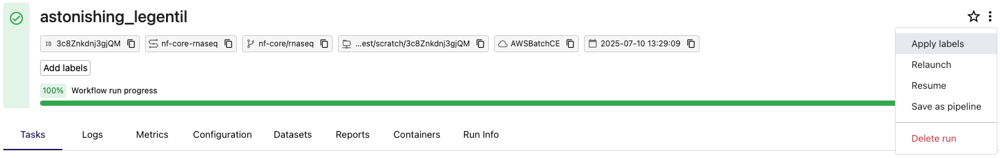

The top of the page contains basic run details and a progress overview for an at-a-glance view of the run's status:
- View and copy the run ID, pipeline name and repository, pipeline work directory, compute environment, and launch date. 
- Select the star icon to favorite the run and find it more easily via a filter view in the runs list later. 
- Use the options menu to apply labels, relaunch, resume, or delete the run, or to save the run as a new pipeline. 

Select the tabs below the workflow run progress bar to view further run details:
- **Tasks**: View the status and progress of pipeline tasks and [processes](#processes), including extensive [task details](#tasks)
- **Logs**: View and download the pipeline run's execution log
- **Metrics**: View resource [metrics](#metrics) for the run 
- 
- [Run information](#run-information) with real-time Nextflow execution details
- [General summary](#general-summary) and [task status](#task-status)
- List of pipeline 
- [Aggregated stats](#aggregate-stats), [load](#load), and [utilization](#utilization)

<Tabs>
<TabItem value="Tasks" label="Tasks" default>

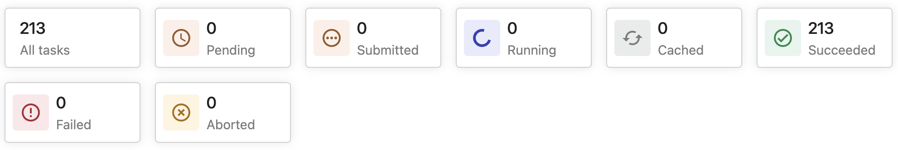

The cards at the top of the **Tasks** tab provide a real-time status of all tasks in the pipeline run:

- **Pending**: The task has been created, but not yet submitted to an executor.
- **Submitted**: The task has been submitted to an executor, but is not yet running.
- **Running**: The task has been launched by an executor (the precise definition of "running" may vary for each executor).
- **Cached**: A previous (and valid) execution of the task was found and used instead of executing the task again. See [Cache and resume](../launch/cache-resume.mdx).
- **Succeeded**: The task completed successfully.
- **Failed**: The task failed.
- **Aborted**: The task was submitted, but the run was cancelled or failed before the task could begin.

### Processes 

The **Processes** panel displays the status of each process in a pipeline run. In Nextflow, a process is an individual step in a pipeline, while a task is a particular invocation of a process for given input data. In the panel, each process is shown with a progress bar indicating how many tasks have been completed for that process.

The progress bar is color-coded based on task status (**created**, **submitted**, **completed**, **failed**).

Select a process to navigate to the [Tasks](#tasks) panel and filter the table contents by the selected process.

### Tasks 

The **Tasks** panel shows all the tasks that were executed in the run.

Use the search bar to filter tasks with substrings in the table columns such as **process**, **tag**, **hash**, and **status**. For example, if you enter `succeeded` in the **Search task** field, the table displays only tasks that succeeded.

#### Task details

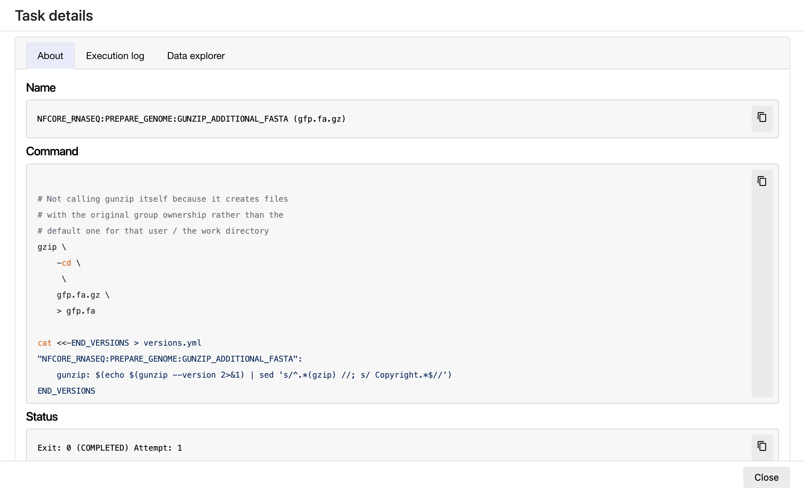

Select a task in the task table to open the **Task details** dialog. The dialog has three tabs:

- **About**
  - **Name**: Process name and tag
  - **Command**: Task script, defined in the pipeline process
  - **Status**: Exit code, task status, attempts
  - **Work directory**: Directory where the task was executed
  - **Environment**: Environment variables supplied to the task
  - **Execution time**: Metrics for task submission, start, and completion time
  - **Resources requested**: Metrics for the resources requested by the task
  - **Resources used**: Metrics for the resources used by the task

- **Execution log**

  The **Execution log** tab provides a real-time log of the selected task's execution. Task execution and other logs (such as `stdout` and `stderr`) are available for download from here, if still available in your compute environment.

- **Data Explorer**

  If the pipeline work directory is in cloud storage, this tab shows a [Data Explorer](../data/data-explorer.mdx) view of the task's work directory location with the files associated with the task.

</TabItem>
<TabItem value="Logs" label="Logs" default>

The **Logs** tab contains a window with the Nextflow execution log console output. Select **Download log files** to download: 
- Nextflow console output, in TXT format.
- Nextflow log file, in LOG format.
- Execution timeline graph, in HTML format.

</TabItem>
<TabItem value="Metrics" label="Metrics" default>

The cards at the top of the **Metrics** tab display a real-time summary of the resources used by the run.

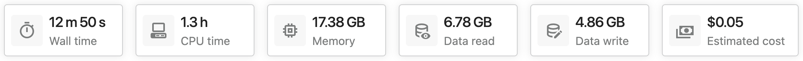

#### Wall time

Wall time is the duration of the entire workflow run, from submission to completion. While the run is in progress, wall time is a measure of the time elapsed since run start. 

#### CPU time

CPU time is the total CPU time used by all tasks, measured in CPU hours. It is based on the CPUs _requested_, not the actual CPU usage. The CPU time of an individual task is computed as follows:
=======
Select a workflow run from the **Runs** list to view execution details. This view contains:

- [Run information](#run-information) with real-time Nextflow execution details
- [General summary](#general-summary) and [task status](#task-status)
- List of pipeline [processes](#processes)
- [Aggregated stats](#aggregate-stats), [load](#load), and [utilization](#utilization)
- [Tasks](#tasks) and [metrics](#metrics)

### Run information

This section contains details about the Nextflow execution:

- The Nextflow **Command line** executed.
- The pipeline **Parameters** (taken from the configuration `params` scope).
- The **Configuration** files and the final resolved configuration.
- The **Execution log** from the main Nextflow process, updated in real-time.
- Available **Reports**, if any are [configured](../reports/overview).

### General summary

The **General** panel displays top-level information about a pipeline run:

- Unique workflow run ID
- Run name
- Timestamp of run start
- Project revision and Git commit ID
- Nextflow session ID
- Username of the launcher
- Work directory path

  :::tip
  If your work directory resides in cloud storage, select the work directory path in the **General** panel to browse its contents in [Data Explorer](../data/data-explorer).
  :::

- Container image
- Executor
- Compute environment name
- Resource labels
- Nextflow version

Hover over each item with the cursor to view a description. Hover over the compute environment name for more compute environment details.

### Task status

The **Status** panel provides a real-time status of all tasks in the pipeline run:

- **pending**: The task has been created, but not yet submitted to an executor
- **submitted**: The task has been submitted to an executor, but is not yet running
- **running**: The task has been launched by an executor (the precise definition of "running" may vary for each executor)
- **cached**: A previous (and valid) execution of the task was found and used instead of executing the task again (See [Cache and resume](../launch/cache-resume))
- **completed**: The task completed successfully
- **failed**: The task failed

### Processes 

The **Processes** panel displays the status of each process in a pipeline run. In Nextflow, a process is an individual step in a pipeline, while a task is a particular invocation of a process for given input data. In the panel, each process is shown with a progress bar indicating how many tasks have been completed for that process.

The progress bar is color-coded based on task status (**created**, **submitted**, **completed**, **failed**).

Select a process to navigate to the [Tasks](#tasks) panel and filter the table contents by the selected process.

### Aggregate stats 

The **Aggregate stats** panel displays a real-time summary of the resources used by a pipeline run.

#### Wall time

The _wall time_ is the duration of the entire workflow run, from submission to completion.

#### CPU time

The _CPU time_ is the total CPU time used by all tasks. It is based on the CPUs _requested_, not the actual CPU usage. The CPU time of an individual task is computed as follows:

$$
\text{CPU time (CPU-hours)} = \text{Task CPUs} \times \text{Task runtime}
$$

The runtime of an individual task is computed as follows:

$$
\text{Task runtime} = \text{Task complete} - \text{Task start}
$$

See also: **cpus**, **start**, and **complete** in the task table.

#### Memory

Memory is the total memory used by all tasks. It is based on the memory _requested_, not the actual memory usage.

See also: **peakRss** in the task table.

#### Data read and write

Data read and Data write are the total amount of data (in GB) read from and written to storage.

See also: **readBytes** and **writeBytes** in the task table.

#### Estimated cost

An estimated cost for the run. See [Seqera cost estimate](../monitoring/cloud-costs.mdx#seqera-cost-estimate) for details. 

#### Load

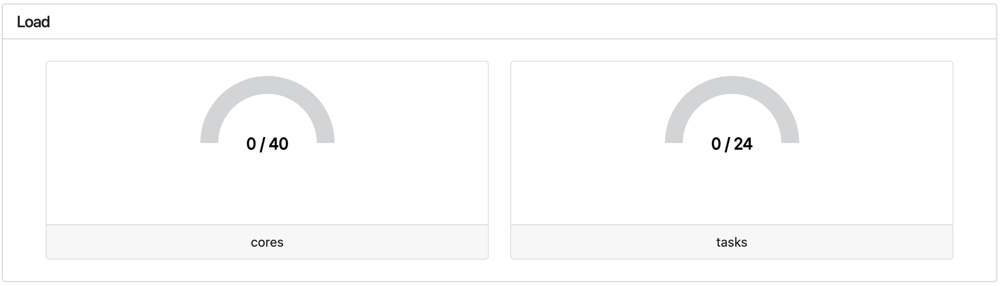

The **Load** panel displays the current number of running tasks and CPU cores vs the maximum number of tasks and CPU cores for the entire pipeline run.

These metrics measure the level of parallelism achieved by the pipeline. Use these metrics to determine whether your pipeline runs are fully utilizing the capacity of your compute environment.

#### Utilization

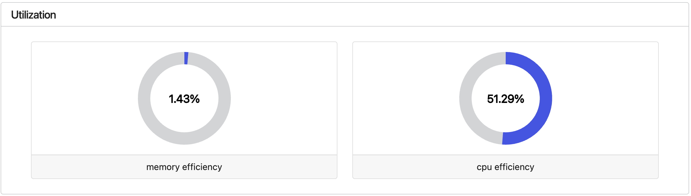

The **Utilization** panel displays the average resource utilization of all tasks that have completed successfully in a pipeline run. The CPU and memory efficiency of a task are computed as follows:

$$
\text{CPU efficiency (\%)} = \text{CPU usage (\%)} \times \text{Task CPUs}
$$

$$
\text{Memory efficiency (\%)} = \frac{ \text{Peak memory usage} }{ \text{Task memory} } \times \text{100 \%}
$$

See also: **pcpu**, **cpus**, **peakRss**, and **memory** in the task table.

These metrics measure how efficiently the pipeline is using its compute resources. Low utilization indicates that the pipeline may be over-requesting resources for some tasks.

#### Interactive resource plots

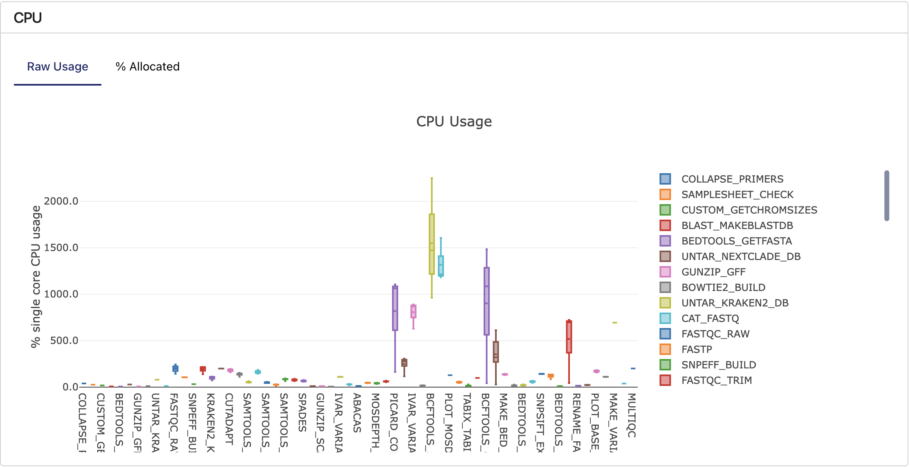

The **CPU**, **Memory**, **Job duration**, and **I/O** interactive plots visualize detailed resource usage, grouped by process. These metrics include succeeded and failed tasks. Use these plots to quickly inspect a pipeline run to determine the resources requested and consumed by each process.

:::tip
Hover the cursor over each box plot to show more details.
:::

</TabItem>
<TabItem value="Configuration" label="Configuration" default>

The **Configuration** tab contains information about the pipeline parameters, Nextflow configuration, and Nextflow command used for the run. 

#### Parameters 

The **Parameters** window displays the pipeline parameters configured for the run, with options to view, copy, or download the parameters in Groovy, JSON, or YAML format.

#### Configuration 

The **Configuration** window displays the locations of the Nextflow configuration files used for the run, and the resolved configuration resulting from those configuration files. 

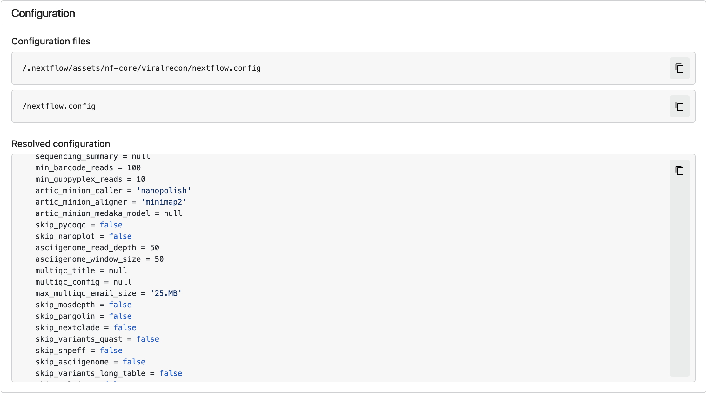

#### Command

The **Command** window displays the Nextflow command used for the run. 

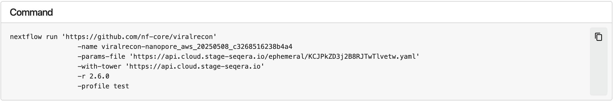

</TabItem>
<TabItem value="Datasets" label="Datasets" default>

The **Datasets** tab displays information about the [datasets](../data/datasets) used as input for the run. This view is empty if no datasets were selected. 

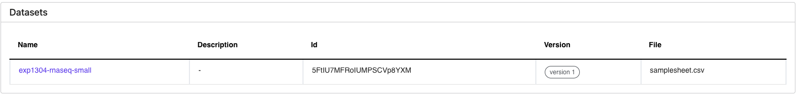

</TabItem>
<TabItem value="Reports" label="Reports" default>

The **Reports** tab contains a table with the names, details, and paths to all [reports](../reports/overview) generated by the run, if any were configured. Select a report to open a Data Explorer file preview of the report, with options to open the report in a new tab or download it.

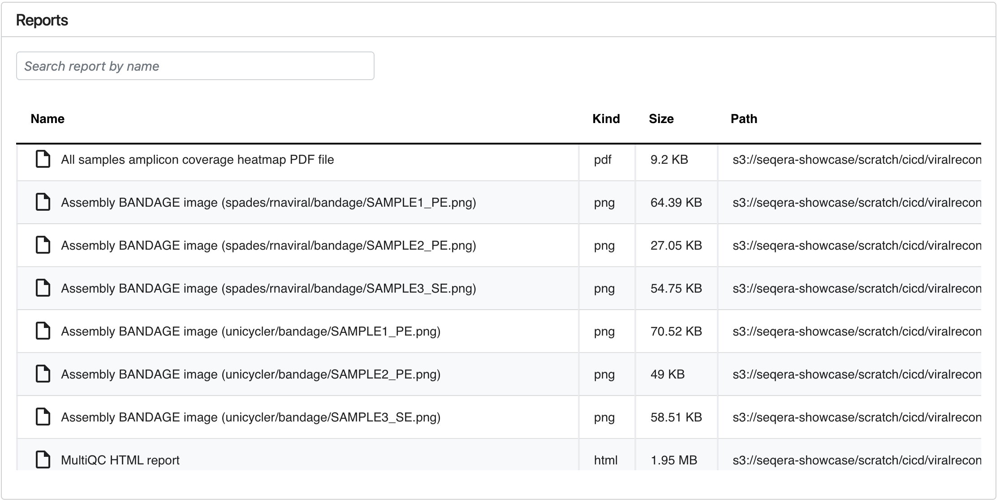

</TabItem>
<TabItem value="Containers" label="Containers" default>

:::info
The containers feature is only available from Nextflow 25.03.1-edge. 
:::

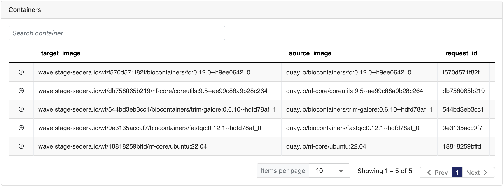

The **Containers** tab displays the details of containers used in the run, if any. Container details shown include:

- **Target image**: Container image used to execute the task.
- **Source image**: Container image specified in the workflow configuration, if available.
- **Request ID**: Unique request ID associated with the container.
- **Request time**: Timestamp when the container request was made.
- **Build ID**: Unique build ID assigned when the container was provisioned, linked to the Wave container build report.
- **Mirror ID**: Unique mirror ID assigned when the container was copied between repositories, linked to the Wave mirror report.
- **Scan ID**: Unique scan ID for the vulnerability security scan of the container, linked to the Wave scan report.
- **Cached**: Indicates if the container was built during a previous request.
- **Freeze**: Indicates if the container was provisioned for persistent storage using Wave freeze mode.

</TabItem>
<TabItem value="Run Info" label="Run Info" default>

The **Run Info** tab contains at-a-glance details about the run, infrastructure, and executor. Hover over the information icon next to a card's name to view a value description. Select the icons next to any run detail values to copy them. 

#### Run details 

The **Run details** view displays basic run details: 

- **Pipeline** name. Select **View pipeline details** to navigate to the pipeline's details page. 
- **Workflow repository**. Select **View repository** to navigate to the pipeline Git repository.
- Run **ID**. 
- **Run start time**.
- **Total run duration**.
- **Launch user**. Select **View user runs** to view a list of the launch user's runs in the same workspace. 
- **Executor(s)** used for the run (AWS Batch, Azure Batch, etc.).
- **Revision and Git commit ID**. The pipeline version and Git commit ID associated with the version used for the run. 

#### Infrastructure details 

The **Infrastructure details** view displays compute environment and work directory information:

- **Compute environment** name. Select **Preview** to view a window with basic compute environment details, or **View** to navigate to the compute environment page.
- **(Provider) operation ID**. The unique identifier for the task submitted to the cloud provider or compute platform, such as an AWS Batch operation ID. 
- **Work directory**. Select **View** to browse the work directory in Data Explorer.
- **Compute environment ID**. 

#### Executor(s) details 

The **Executor(s) details** view displays the Nextflow version and Nextflow session ID for the run. 

</TabItem>
</Tabs>
