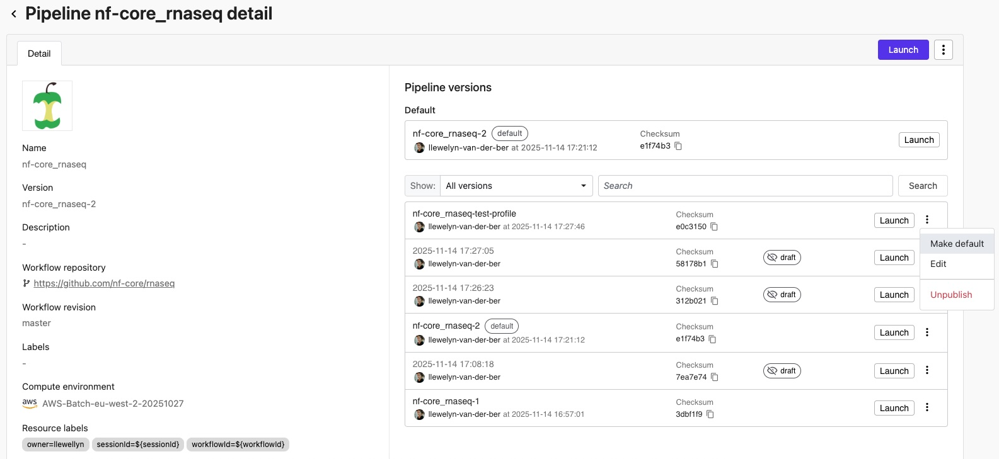

:::info
Pipeline versioning is a preview feature. [Contact Seqera support](https://support.seqera.io/) to enable this feature in your organization workspaces.
:::

Seqera's pipeline versioning system captures configuration changes as new draft versions of the pipeline, ensuring configuration traceability and execution reproducibility. Users with appropriate permissions can edit and publish draft versions, creating published versions that teams can reference and launch consistently.
When you add a new pipeline to Seqera, the first default version of that pipeline is automatically published.

New draft versions are automatically generated when you modify the following:
- All pipeline schema parameters, unless the `track_changes` schema configuration for a given property is set to `false`.
  :::info
  Changes to all pipeline schema parameters trigger a new version by default (`"track_changes": true`). To alter this behavior for specific parameters, add `"track_changes": false` to the parameter definition:
  ```json
  "my_parameter": {
    "type": "string",
    "description": "Changes to this parameter will not trigger a new pipeline version to be created",
    "track_changes": false
  }
  ```

  For nested parameters, `track_changes` is supported at the leaf node level:
  ```json
  "nestedParam": {
    "type": "object",
    "properties": {
      "leafParam": {
        "type": "string",
        "track_changes": false
      }
    }
  }
  ```
  :::
- Fields in the pipeline **Edit** form, excluding:
  - **Name**
  - **Image**
  - **Description**
  - **Labels**

Published versions provide a stable reference for team-wide pipeline launches. Users with Maintain or higher permissions can publish a draft version, giving it a name and optionally setting it as the default version. This makes important configurations easy to identify, share, and promote across your team.

:::info
A pipeline's default version is shown in the Launchpad and automatically selected during launch.
:::

Seqera maintains a history of all draft and published versions, providing an audit trail of pipeline evolution.

#### Manage pipeline versions



Select a pipeline from the workspace Launchpad to open the pipeline's details page. From here, users with Maintain or higher permissions can:

- **View version history**: See a chronological list of all draft and published versions with creator, date, and hash.
  - Use the dropdown next to **Show:** to show all versions, or filter by draft or published versions.
  - **Search** for specific version names (freetext search), or use keywords to search by `versionId:`, `versionName:`, or `versionHash:` ([version hash](#version-hash)).
- **Manage draft versions**:
  - Select **Publish** from the options menu of a draft version to name this version and optionally make it the default version to launch from the Launchpad.
    :::note
    Draft versions created from workflow runs can only be published from the pipeline's original workspace. For shared pipelines, the **Publish** action is only available in the workspace where the pipeline was created.
    :::
  - Select **Edit** to open the pipeline edit form and either save a new draft or publish the current draft version.
- **Manage published versions**:
  - Select **Make default** from the options menu of a published version to use this version for every pipeline launch.
  - Select **Edit** to open the pipeline edit form and either save a new draft or update the current published version.
  - Select **Unpublish** to turn this version back into a draft. Draft versions are still visible to launch users.

Individual draft versions cannot be deleted - the pipeline configuration audit trail is immutable. However, published versions can be unpublished or have their names reassigned to different draft versions.

:::note
A shared pipeline's versions can only be edited and published from its original workspace. Draft versions created from shared pipeline runs in other workspaces cannot be published.
:::

#### Pipeline optimization

[Pipeline optimization](../pipeline-optimization/overview) is available directly from the pipeline details page for the default version. Users with Maintain or higher permissions can:

- **Optimize pipeline**: Configure pipeline optimization settings for the default version from the **Default** section or the **Edit pipeline** form.
- **Toggle optimization**: Enable or disable optimization for a pipeline that has already been optimized.
- **Customize profile**: Modify the optimization profile settings when optimization is enabled.

Pipeline optimization settings apply to the default version and remain configured when you set a different version as the default.

#### Version hash

Seqera calculates a hash for each draft version based on its version-triggering parameters. This provides:

- **Cryptographic verification** that a workflow run's configuration matches its associated pipeline version
- **Provenance tracking** for audit and compliance requirements
