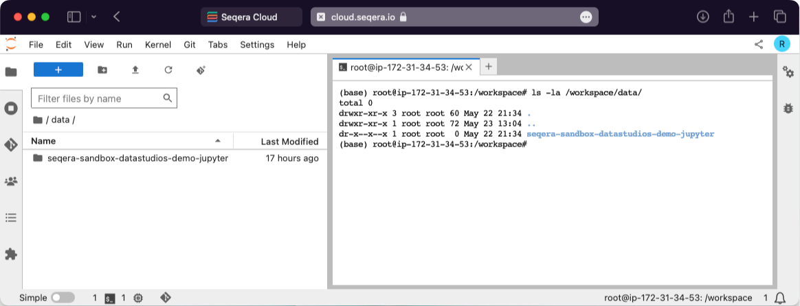

## View all mounted datasets

In your interactive analysis environment, open a new terminal and type `ls -la /workspace/data`. This displays all the mounted datasets available in the current session.



## Enable AI coding assistants in Studios

VS Code, RStudio, and Jupyter environments natively integrate with [GitHub Copilot][gh-copilot]. Enabling it requires a GitHub account and an active Copilot subscription.

- **VS Code:** To enable GitHub Copilot in your VS Code session, install the extension and then sign in with your GitHub account. [Learn more][vscode-blog].
- **RStudio:** Enabling GitHub Copilot in your RStudio session requires RStudio configuration changes. By default, the Studio session user has root permissions and can make these changes. Restart RStudio afterward. [Learn more][posit-ghcopilot-guide].
- **Jupyter:** [Notebook Intelligence (NBI)][nbi] is an AI coding assistant and extensible AI framework for Jupyter. It can use GitHub Copilot or AI models from any other LLM Provider. [Learn more][nbi-blog].

## Session size limited by compute environment advanced options: Head job CPUs and Head job memory

When adding a compute environment, setting the Advanced options **Head job CPUs** and **Head job memory** for Nextflow **also applies** to any Studio session created in the compute environment. This is because Studio sessions are managed by the Nextflow runner job. To avoid artificially constraining the resources of your Studio sessions, **do not define these optional compute environment settings**.

## Rebuild of a failed custom Studios environment: rebuilding from cache

Building a custom Studios image with the Wave service occasionally fails, typically because of conflicting libraries. If you rebuild the image with the same name and tag, Studios and Wave use the cached version if available. Change the version number or tag to pull a fresh image.

The Elastic Container Service (ECS) agent's `ECS_IMAGE_PULL_BEHAVIOR` environment variable determines this behavior. In Seqera Platform Cloud, it is set to `once` when the compute environment is created. Enterprise installations might be configured differently. Contact your organization's administrator to learn more.

## Session is stuck in **starting**

If your Studio session doesn't advance from **starting** status to **running** status within 30 minutes, and you are a **Maintain** role or higher, select the three dots next to the status message for the Studio you want to stop, then select **Stop**.

If you are not a **Maintain** or higher user but you have access to the AWS Console for your organization, check that the AWS Batch compute environment associated with the session is in the **ENABLED** state with a **VALID** status. You can also check the **Compute resources** settings. Contact your organization's AWS administrator if you don't have access to the AWS Console.

If sufficient compute resources aren't available, select **Stop** for the session and any others that are running before trying again. If you have access to the AWS Console for your organization, you can terminate a specific session from the AWS Batch Jobs page (filtering by compute environment queue).

## Session status is **errored**

The **errored** status is generally related to problems creating the Studio session resources in the compute environment, such as invalid credentials, insufficient permissions, or network issues. It can also be related to insufficient compute resources set in your compute environment configuration. Contact your organization's AWS administrator if you don't have access to the AWS Console, and contact your Seqera account executive to investigate.

## Session can't be **stopped**

If you can't stop a session, the Batch job running the session usually failed. If you have access to the AWS Console for your organization, stop the session from the compute environment screen. Contact your organization's AWS administrator if you don't have access to the AWS Console, and contact your Seqera account executive to investigate.

## Session performance is poor

A slow or unresponsive session might be caused by its AWS Batch compute environment being used for other jobs, such as running Nextflow pipelines. The compute environment schedules jobs to the available compute resources. Sessions compete for resources with the Nextflow pipeline head job, and Seqera does not currently have an established pattern of precedence.

If you have access to the AWS Console for your organization, check the jobs associated with the AWS Batch compute environment and compare the resources allocated with its **Compute resources** settings.

## Memory allocation of the session is exceeded

The running container in the AWS Batch compute environment inherits the memory limits specified by the session configuration when adding or starting the session. The kernel then handles the memory as if running natively on Linux. Linux can overcommit memory, leading to possible out-of-memory errors in a container environment. The kernel has protections in place to prevent this, but it can happen, and in this case, the process is killed. This can manifest as a performance lag, killed subprocesses, or at worst, a killed session.

Running sessions have automated snapshots created every five minutes, so if the running container is killed only those changes made after the prior snapshot creation will be lost.

## All datasets are read-only

By default, AWS Batch compute environments created with Batch Forge restrict S3 access to the working directory only, unless you specify additional **Allowed S3 Buckets**. If the compute environment does not have write access to the mounted dataset, the dataset is mounted as read-only.

## My session with GPU isn't starting

Check whether the instance type you selected [supports GPU](https://aws.amazon.com/ec2/instance-types/). If you specify multiple GPUs make sure that multi-GPU instances can be launched by your compute environment and are not limited by the maximum CPU config that you've set.

## RStudio session initializes with error

Connecting to a running RStudio session with R version 4.4.1 (2024-06-14) -- "Race for Your Life" returns a `[rsession-root]` error similar to the following:

```
ERROR system error 2 (No such file or directory) [path:/sys/fs/cgroup/memory/memory.limit_in_bytes]; OCCURRED AT rstudio::core::Error rstudio::core::FilePath::openForRead(std::shared_ptr<std::basic_istream<char> >&)
...
```

This is displayed because logging is set to `stderr` by default to ensure all logs are shown during the session, and can safely be ignored.

## Running session does not show new data in object storage

By default, Fusion does not resync objects from remotely mounted data-link(s) after initial mounting.

If you have a running session with data mounted and the underlying storage is updated, the data will not be resynced to the Studio session.

You can change this behavior when you [add a Studio session](../studios/add-studio) by setting the `FUSION_REFRESH_TIMEOUT` environment variable to a number of seconds (e.g., `30`). Fusion then refreshes the view of the mounted data links at that interval.

:::note
Setting the environment variable _inside_ an already running Studio session by executing the command `export FUSION_REFRESH_TIMEOUT=30` won't change the behavior of the outer Fusion session. The environment variable should be set in the "General config" section during Studio creation.
:::

:::warning
This is an experimental feature and can cause consistency issues in the Fusion namespace, resulting in data loss.
:::

## When starting an existing Studio session, extra processes are not automatically restarted

A process you start manually in a running Studio session (e.g., `eval $(ssh-agent)`) is not automatically restarted when the Studio restarts, because the Connect client does not manage user-initiated daemon processes. Automatically starting extra processes on each Studio restart would require a user-defined startup script or an integrated supervisor such as `s6`, `s6-overlay`, or `supervisord`, none of which are currently supported.

## New compute environment doesn't appear in the drop-down when migrating a Studio

When [migrating a Studio to a different compute environment](../studios/managing#migrate-a-studio-between-compute-environments), the **Compute environment** drop-down filters out any compute environment that isn't compatible with the Studio's current one. Confirm the new compute environment is in the `AVAILABLE` status and uses the same `workDir` as the Studio's current compute environment.

## Studio fails to start after switching compute environments

The new compute environment's [credentials](../credentials/overview) must have read and write access to the `workDir` bucket. Confirm they have the required S3 permissions on the checkpoint location.

## Resource labels change after switching compute environments

When you switch a Studio to a different compute environment, labels inherited from the previous compute environment are removed and the new compute environment's labels are added automatically. If you need a label that was tied to the old compute environment, attach it to the Studio directly so that it survives future compute environment switches. See [Resource label changes](../studios/managing#resource-labels-on-migration).

## Container template image security scan false positives

### VS Code

When you run a software composition analysis (SCA) security scan (e.g., with Trivy) on the latest Seqera-provided VS Code image [container template](../studios/container-images), you might encounter multiple false-positive findings. VS Code defines extensions in a way that can cause some security scanners to incorrectly identify them as `npm` packages.

This is a known limitation, discussed in the Trivy community [discussion](https://github.com/aquasecurity/trivy/discussions/6112).

These are the false positive confirmed findings:

| Component        | Vulnerability id⁠    |
| :--------------- | :------------------- |
| handlebars:1.0.0 | CVE-2021-23383⁠      |
| handlebars:1.0.0 | CVE-2021-23369⁠      |
| handlebars:1.0.0 | CVE-2019-19919⁠      |
| handlebars:1.0.0 | GHSA-q42p-pg8m-cqh6  |
| handlebars:1.0.0 | GHSA-q2c6-c6pm-g3gh⁠ |
| handlebars:1.0.0 | GHSA-g9r4-xpmj-mj65⁠ |
| handlebars:1.0.0 | GHSA-2cf5-4w76-r9qv⁠ |
| handlebars:1.0.0 | CVE-2019-20920⁠      |
| handlebars:1.0.0 | CVE-2015-8861⁠       |
| handlebars:1.0.0 | GMS-2015-33⁠         |
| npm:1.0.1        | CVE-2019-16777⁠      |
| npm:1.0.1        | CVE-2019-16776⁠      |
| npm:1.0.1        | CVE-2019-16775⁠      |
| npm:1.0.1        | CVE-2018-7408⁠       |
| npm:1.0.1        | CVE-2016-3956⁠       |
| npm:1.0.1        | CVE-2020-15095⁠      |
| npm:1.0.1        | CVE-2013-4116⁠       |
| npm:1.0.1        | GMS-2016-23⁠         |
| grunt:1.0.0      | CVE-2022-1537⁠       |
| grunt:1.0.0      | CVE-2020-7729⁠       |
| grunt:1.0.0      | CVE-2022-0436⁠       |
| pug:1.0.0        | CVE-2021-21353⁠      |
| pug:1.0.0        | CVE-2024-36361⁠      |
| json:1.0.0       | CVE-2020-7712⁠       |
| ini:1.0.0        | CVE-2020-7788⁠       |
| diff:1.0.0       | GHSA-h6ch-v84p-w6p9⁠ |

## SSH connections (public preview)

### Permission denied (publickey)

```bash
ssh user@studio-session-id@connect.example.com
# user@studio-session-id@connect.example.com: Permission denied (publickey).
```

If you receive a permission denied error, there are several possible causes:

1. Verify the user has the correct role and permissions in the workspace.
2. Check that the user's SSH public key is configured in their Seqera user profile.
3. Ensure SSH was enabled when starting the Studio using the **SSH Connection** toggle. The SSH setting defaults to disabled for new Studios.
4. Ensure the Studio is built with Connect client version 0.10.0 or later.

### VS Code Remote SSH not working

If VS Code fails to connect or shows errors when using the Remote SSH extension, disable local server mode in VS Code settings:

```json
{
  "remote.SSH.useLocalServer": false
}
```

VS Code's local server mode uses SSH multiplexing over SOCKS proxy, which is not supported. See [Connect to a Studio via SSH - VS Code Remote SSH](../studios/managing#vs-code-remote-ssh) for detailed setup instructions.

Additionally, you might need to update your `~/.ssh/config` file to connect directly to the Studio session:

```bash
Host <connect-domain>
  HostName <connect-domain>
  User <username>@<studio-session-id>
  Port <port>
```

### SSH connection string format

**Correct format:**

```bash
ssh <username>@<studio-session-id>@<connect-domain> -p 2222
```

**Example:**

```bash
ssh alice@a01ac8894@connect.example.com -p 2222
```

Where:
- `<username>`: Your Seqera Platform username
- `<studio-session-id>`: The Studio session ID (8-character hex string visible in the Studios list)
- `<connect-domain>`: Your connect proxy domain
- Port: `2222` (default SSH proxy port)

{/* links */}

[gh-copilot]: https://github.com/features/copilot
[vscode-blog]: https://code.visualstudio.com/docs/copilot/setup-simplified
[posit-ghcopilot-guide]: https://docs.posit.co/ide/user/ide/guide/tools/copilot.html
[nbi]: https://github.com/notebook-intelligence/notebook-intelligence
[nbi-blog]: https://blog.jupyter.org/introducing-notebook-intelligence-3648c306b91a
[contact]: https://seqera.io/contact-us/
