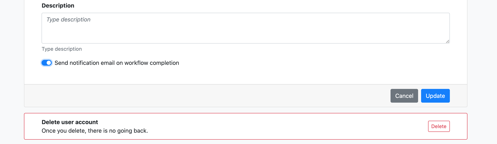

### Email Notifications

You can receive email notifications at the completion or a failure of a workflow execution.

Navigate to your [profile page](https://tower.nf/profile) using dropdown on your avatar in the top-right of the page. Select the **Send notification email on workflow completion** toggle option at the bottom of the profile settings page.

