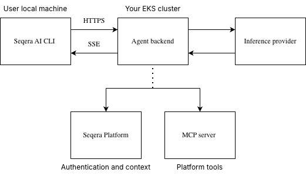

:::caution
Seqera AI requires Seqera Platform Enterprise 26.1 or later for the agent backend, MCP server, portal web interface, and CLI integration.
:::

Seqera AI is an intelligent command-line assistant that helps you build, run, and manage bioinformatics workflows. This guide describes how to deploy Seqera AI in a Seqera Enterprise deployment.

## Overview

Seqera AI enables users to interact with Seqera Platform through a conversational AI interface, available through both the web (portal) and the CLI. Deploying Seqera AI involves standing up the following components in sequence:

| Step | Component | Purpose |
|------|-----------|---------|
| 1 | **MCP server** | Model Context Protocol server that provides Platform-aware tools (workflows, datasets, compute environments). Deploy this first. |
| 2 | **MySQL database** | Stores session state and conversation history. Can share the same database instance as Platform or use a dedicated instance. |
| 3 | **Redis** | Caching and session management layer for the agent backend. |
| 4 | **Agent backend** | FastAPI service that orchestrates AI interactions between the CLI/web, the inference provider, and MCP. Deployed as a Helm subchart alongside Platform. |
| 5 | **Portal web interface** | Browser-based interface for Seqera AI and related Platform features. |

Each step below includes a verification checkpoint so you can confirm the component is working before moving to the next.

## Prerequisites

Before you begin, you need:

- **Seqera Enterprise 26.1+** deployed and accessible. Platform can be deployed via [Helm](./platform-helm.md), [Kubernetes](./platform-kubernetes.md), or [Docker Compose](./platform-docker-compose.md) — a Helm-based deployment is not required.
- **MySQL 8.0+ database**
- **Redis 6.0+** instance accessible from your cluster
- **API key** from a supported inference provider (see below)
- **OIDC-compatible identity provider** for the portal web interface, MCP server, and CLI login flow
- **Token encryption key** for encrypting sensitive tokens at rest. Generate with:

    ```bash
    python -c "from cryptography.fernet import Fernet; print(Fernet.generate_key().decode())"
    ```
- [Helm v3](https://helm.sh/docs/intro/install) and [kubectl](https://kubernetes.io/docs/tasks/tools/) installed locally

### Permissions

The person performing this installation needs:

- **Kubernetes cluster access**: `kubectl` access with permissions to create and manage deployments, services, secrets, and ingress resources in the target namespace
- **Database administration**: Ability to create databases and users on the MySQL instance
- **DNS management**: Access to create or update DNS records for the Seqera AI subdomains
- **AWS IAM** (if using Bedrock): Permissions to invoke Bedrock models in the target AWS account
- **Secret management**: Access to create Kubernetes secrets in the target namespace
- **Helm**: Permission to install and upgrade Helm releases in the target namespace
- **TLS certificate management**: Access to provision or reference TLS certificates (e.g., via AWS Certificate Manager)

## Supported inference providers

Seqera AI uses Claude models from Anthropic. The following inference providers are supported for Enterprise deployments:

| Inference provider | Description |
|--------------------|-------------|
| **Anthropic API** | Direct access to Claude models via Anthropic's API ([console.anthropic.com](https://console.anthropic.com/)) |
| **AWS Bedrock** | Access Claude models through [AWS Bedrock](https://aws.amazon.com/bedrock/) in your AWS account |

## Architecture

Seqera AI connects your local CLI environment to your Platform resources through a secure backend service:



**Components:**

| Component | Description |
|-----------|-------------|
| **Agent backend** | FastAPI service that orchestrates AI interactions. Deployed as a Helm subchart alongside Platform. |
| **MCP server** | Model Context Protocol server providing Platform-aware tools (workflows, datasets, compute environments). |
| **Portal web interface** | Browser-based interface for Seqera AI and related Platform features. |
| **MySQL database** | Database for session state and conversation history. Can share the same instance as Platform (recommended) or use a dedicated instance. |
| **Redis** | Caching and session management layer used by the agent backend. |

**Flow:**

1. Users authenticate via `seqera login`, which initiates OIDC authentication with Platform.
1. The CLI creates a session with the agent backend, passing the Platform access token.
1. The agent backend validates tokens against Platform's `/user-info` endpoint.
1. User prompts are processed by the inference provider, which can invoke Platform tools via MCP.
1. MCP tools execute Platform operations using the user's credentials.
1. Results stream back to the CLI via Server-Sent Events (SSE).

## Step 1: Deploy the MCP server

The MCP server must be running and accessible before deploying the agent backend. The agent backend connects to MCP at startup to register Platform-aware tools.

Deploy the MCP server using the [MCP Helm chart](https://github.com/seqeralabs/helm-charts/tree/master/platform/charts/mcp). The MCP server can be installed alongside Platform in a single Helm release or as a separate release.

### Checkpoint: Verify MCP is running

Confirm the MCP server is healthy and reachable from within your cluster:

```bash
curl -i https://mcp.platform.example.com/health
curl -i https://mcp.platform.example.com/service-info
```

You should receive `200 OK` responses. If these fail, resolve MCP connectivity before proceeding.

:::tip
If you see connection errors, verify:
- The MCP server pod is running (`kubectl get pods` in the MCP namespace)
- Network policies or security groups allow traffic to the MCP endpoint
- DNS resolves correctly for the MCP domain
:::

## Step 2: Provision the database

Seqera AI requires its own MySQL database for session state and conversation history. You can create this database on the same instance that hosts your Platform database (recommended) or on a separate dedicated instance.

:::tip Recommended: Use the same database instance as Platform
Creating the Seqera AI database on your existing Platform database instance simplifies infrastructure management, reduces costs, and avoids additional networking configuration. The Seqera AI database is lightweight and does not compete for resources with the Platform database under typical usage.

If you have strict isolation requirements, you can provision a separate instance instead.
:::

Connect to your database instance and create the Seqera AI database and user:

```sql
CREATE DATABASE seqera_ai;
CREATE USER 'seqera_ai'@'%' IDENTIFIED BY '<secure-password>';
GRANT ALL PRIVILEGES ON seqera_ai.* TO 'seqera_ai'@'%';
FLUSH PRIVILEGES;
```

### Checkpoint: Verify database connectivity

Confirm the database is accessible from your cluster:

```bash
kubectl run db-check --rm -it --restart=Never \
    --image=mysql:8.0 -- \
    mysql -h <db-hostname> -u seqera_ai -p<secure-password> -e "SELECT 1;"
```

You should see a result set with the value `1`. If this fails, check security group rules and network connectivity.

## Step 3: Provision Redis

Seqera AI requires a Redis instance for caching and session management. Use a managed Redis service or a self-managed instance, as long as it is accessible from your cluster on port 6379.

- **Engine**: Redis 6.0+
- **Security group**: Allow inbound Redis (port 6379) from your cluster

### Checkpoint: Verify Redis connectivity

Confirm Redis is accessible from your cluster:

```bash
kubectl run redis-check --rm -it --restart=Never \
    --image=redis:7 -- \
    redis-cli -h <redis-hostname> -p 6379 PING
```

You should see `PONG` in the output. If this fails, check security group rules and network connectivity.

## Step 4: Deploy the agent backend and portal

With MCP, the database, and Redis confirmed working, deploy the remaining Seqera AI components using the [Seqera Helm charts](https://github.com/seqeralabs/helm-charts). Refer to the examples in the repository for sample configurations.

Store sensitive values (database passwords, API keys, OIDC settings, cryptographic keys) as Kubernetes secrets and reference them in the Helm values, rather than specifying them as plain text.

The Seqera AI components can be installed alongside Platform and other subcharts in a single Helm release, or individually as separate releases.

Documentation for the individual charts:
- [Agent backend](https://github.com/seqeralabs/helm-charts/tree/master/platform/charts/agent-backend)
- [Portal web interface](https://github.com/seqeralabs/helm-charts/tree/master/platform/charts/portal-web)

### Checkpoint: Agent backend is running

Confirm the agent-backend pod shows `Running` status and ready containers:

```bash
kubectl get pods -n <namespace> -l app.kubernetes.io/component=agent-backend
```

Expected output:

```
NAME                             READY   STATUS    RESTARTS   AGE
agent-backend-xxxxxxxxxx-xxxxx   1/1     Running   0          2m
```

If the pod is in `CrashLoopBackOff` or `Error` state, check the logs for connection errors to the database, Redis, or MCP server:

```bash
kubectl logs -n <namespace> -l app.kubernetes.io/component=agent-backend --tail=50
```

### Additional configuration

The following optional environment variables are not covered by the Helm chart values. Set them in the `.extraEnvVars` section of each chart as needed.

#### Agent backend

| Variable | Description | Default |
|----------|-------------|---------|
| `ANTHROPIC_MODEL` | Primary model for AI interactions | `claude-sonnet-4-6` |
| `FAST_MODEL` | Model for quick tasks (search, summaries) | `claude-haiku-4-5-20251001` |
| `DEEP_MODEL` | Model for complex planning tasks | `claude-opus-4-5-20251101` |
| `SEQERA_PLATFORM_URL` | Platform UI URL for constructing links to runs and pipelines | Automatically derived from platform domain |
| `SESSION_TIMEOUT_SECONDS` | Session timeout | `86400` (24 hours) |
| `MAX_SESSIONS_PER_USER` | Max concurrent sessions per user | `10` |
| `SESSION_RETENTION_DAYS` | Days to retain session data | `14` |
| `CORS_ORIGINS` | Allowed CORS origins (JSON array) | `["*"]` |

## Step 5: Verify the installation

At this point, all components are deployed. Run through the following checks to confirm end-to-end functionality.

### Checkpoint: Health endpoints

```bash
curl -i https://ai-api.platform.example.com/health
curl -i https://mcp.platform.example.com/health
```

You should receive `200 OK` responses from both. If not, check DNS resolution, ingress configuration, and that pods are running.

### Checkpoint: CLI connectivity

Test the full authentication and chat flow from a machine with the Seqera AI CLI installed. Install the CLI by following [Seqera AI CLI installation](../seqera-ai/installation.mdx), or install it directly with:

```bash
npm install -g seqera
```

Connect to your Enterprise deployment:

```bash
export SEQERA_AUTH_DOMAIN=https://platform.example.com/api
export SEQERA_AUTH_CLI_CLIENT_ID=seqera_ai_cli
export SEQERA_AI_BACKEND_URL=https://ai.platform.example.com
seqera login
seqera ai "list my pipelines"
```

You should see the OIDC login flow complete and receive a response listing the user's pipelines. This confirms:

- The agent backend is reachable from outside the cluster
- OIDC authentication with Platform is working
- The MCP server is connected and can query Platform resources
- The database and Redis are operational

### Checkpoint: Portal web interface

Navigate to the portal URL in a browser (e.g., `https://ai.platform.example.com`) and confirm you can authenticate and send a message.

## CLI configuration reference

If your Enterprise deployment uses a different OAuth client ID for the CLI, replace `seqera_ai_cli` with the value configured for your installation.

If you are testing a development build of the CLI against the hosted production Seqera AI service, use the following settings instead:

| Variable | Purpose | Example value |
| --- | --- | --- |
| `SEQERA_AI_BACKEND_URL` | Seqera AI backend endpoint used by the CLI | `https://ai-api.seqera.io` |
| `SEQERA_AUTH_DOMAIN` | Platform API base URL used for browser-based login | `https://cloud.seqera.io/api` |
| `SEQERA_AUTH_CLI_CLIENT_ID` | OAuth client ID for the Seqera AI CLI | `seqera_ai_cli` |
| `SEQERA_ACCESS_TOKEN` | Platform personal access token used instead of browser login (`TOWER_ACCESS_TOKEN` also supported) | `<PLATFORM_ACCESS_TOKEN>` |

Use the OAuth login flow:

```bash
export SEQERA_AUTH_DOMAIN=https://cloud.seqera.io/api
export SEQERA_AUTH_CLI_CLIENT_ID=seqera_ai_cli
export SEQERA_AI_BACKEND_URL=https://ai-api.seqera.io
seqera ai
```

Use a Platform personal access token instead of browser login:

```bash
export SEQERA_ACCESS_TOKEN=<PLATFORM_ACCESS_TOKEN>
export SEQERA_AI_BACKEND_URL=https://ai-api.seqera.io
seqera ai
```

You only need `SEQERA_AUTH_DOMAIN` and `SEQERA_AUTH_CLI_CLIENT_ID` when using the OAuth login flow. `SEQERA_ACCESS_TOKEN` (`TOWER_ACCESS_TOKEN`) is also supported.

## Environment variables reference

### Required

| Variable | Description |
|----------|-------------|
| `SEQERA_PLATFORM_API_URL` | Platform API URL (e.g., `https://platform.example.com/api`) |
| `SEQERA_MCP_URL` | MCP server URL (e.g., `https://mcp.example.com/mcp`) |
| `ANTHROPIC_API_KEY` | API key for inference provider |
| `AGENT_BACKEND_DB_HOST` | MySQL database hostname |
| `AGENT_BACKEND_DB_NAME` | MySQL database name |
| `AGENT_BACKEND_DB_USER` | MySQL database username |
| `AGENT_BACKEND_DB_PASSWORD` | MySQL database password |
| `TOKEN_ENCRYPTION_KEY` | Fernet encryption key for encrypting sensitive tokens at rest. Also accepted as `AGENT_BACKEND_TOKEN_ENCRYPTION_KEY`. |
| `REDIS_HOST` | Redis hostname |
| `REDIS_PORT` | Redis port (default: `6379`) |

### Optional

| Variable | Description | Default |
|----------|-------------|---------|
| `SEQERA_PLATFORM_URL` | Platform UI URL for constructing links to runs and pipelines | Derived from platform domain |
| `AGENT_BACKEND_DB_PORT` | MySQL port | `3306` |
| `SESSION_TIMEOUT_SECONDS` | Session timeout | `86400` (24 hours) |
| `MAX_SESSIONS_PER_USER` | Max concurrent sessions per user | `10` |
| `SESSION_RETENTION_DAYS` | Days to retain session data | `14` |
| `LOG_LEVEL` | Application log level (`CRITICAL`, `ERROR`, `WARNING`, `INFO`, `DEBUG`) | `INFO` |
| `CORS_ORIGINS` | Allowed CORS origins (JSON array) | `["*"]` |

## Helm values reference

For the full list of configuration options, see the [agent-backend chart documentation](https://github.com/seqeralabs/helm-charts/tree/master/platform/charts/agent-backend).

### Global

| Value | Description | Default |
|-------|-------------|---------|
| `global.platformExternalDomain` | Domain where Seqera Platform listens | `example.com` |
| `global.agentBackendDomain` | Domain where the agent backend listens | `""` |
| `global.mcpDomain` | Domain where MCP server listens | `""` |

### Agent backend

| Value | Description | Default |
|-------|-------------|---------|
| `agentBackend.replicaCount` | Number of replicas | `1` |
| `agentBackend.image.registry` | Image registry | `cr.seqera.io` |
| `agentBackend.image.repository` | Image repository | `ai/agent-backend/backend` |
| `anthropicApiKeyExistingSecretName` | Existing secret containing `ANTHROPIC_API_KEY` | `""` |
| `tokenEncryptionKeyExistingSecretName` | Existing secret containing `TOKEN_ENCRYPTION_KEY` | `""` |

### Database

| Value | Description | Default |
|-------|-------------|---------|
| `database.host` | MySQL hostname | `""` |
| `database.port` | MySQL port | `3306` |
| `database.name` | MySQL database name | `""` |
| `database.username` | MySQL username | `""` |
| `database.existingSecretName` | Existing secret with DB password | `""` |
| `database.existingSecretKey` | Key in the secret | `DB_PASSWORD` |

### Redis

| Value | Description | Default |
|-------|-------------|---------|
| `redis.host` | Redis hostname | `""` |
| `redis.port` | Redis port | `6379` |

### Ingress

| Value | Description | Default |
|-------|-------------|---------|
| `ingress.enabled` | Enable ingress | `false` |
| `ingress.path` | Ingress path (use `/*` for AWS ALB) | `/` |
| `ingress.ingressClassName` | Ingress class name | `""` |
| `ingress.annotations` | Ingress annotations | `{}` |
| `ingress.tls` | TLS configuration | `[]` |

## Security considerations

- **Token validation**: Every request validates the user's Platform token
- **User isolation**: Sessions are isolated by user ID
- **Credential passthrough**: MCP tools use the user's credentials for Platform operations
- **Token encryption**: Sensitive tokens (e.g., GitHub PATs) are encrypted at rest using Fernet symmetric encryption before storage in the database
- **No credential storage**: The agent backend does not store user credentials
- **TLS required**: All communication should use HTTPS

## Next steps

- See [Use cases](../seqera-ai/use-cases.md) for CLI usage.
