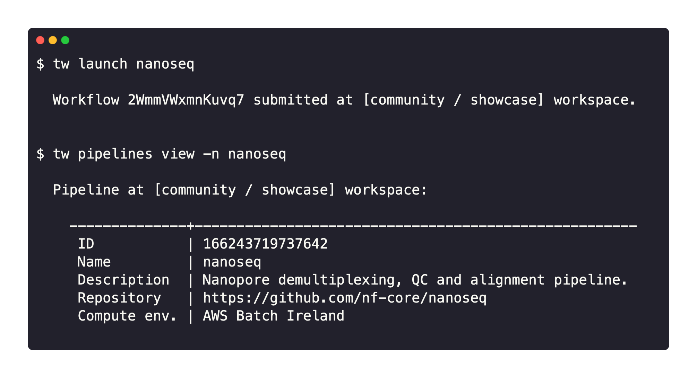

Seqera Platform provides several programmatic interfaces to automate pipeline execution, chain pipelines together, and integrate Platform with third-party services.

## Platform API

The Seqera Platform public API is the lowest-level programmatic interface. It can perform every operation available in the user interface.

Use the API to launch pipelines in response to a file event (such as a file upload to a bucket) or the completion of a previous run.

The API is available at `https://api.cloud.seqera.io`.

The full list of endpoints is available in Seqera's [OpenAPI schema](https://cloud.seqera.io/openapi/index.html). Every API request requires an authentication token. Create one from your user menu under **Your tokens**.

The token is displayed only once. Store it securely and use it to authenticate API requests.

<details>
  <summary>**Example pipeline launch API request**</summary>
    ```
    curl -X POST "https://api.cloud.seqera.io/workflow/launch?workspaceId=38659136604200" \
        -H "Accept: application/json" \
        -H "Authorization: Bearer <ACCESS_TOKEN>" \
        -H "Content-Type: application/json" \
        -H "Accept-Version:1" \
        -d '{
        "launch": {
            "computeEnvId": "hjE97A8TvD9PklUb0hwEJ",
            "runName": "first-time-pipeline-api-byname",
            "pipeline": "first-time-pipeline",
            "workDir": "s3://nf-ireland",
            "revision": "master"
        }
    }'
    ```

</details>

### Find your organization and workspace IDs

Many API endpoints take an organization ID (for example, `org/{orgId}/workspaces`) or a workspace ID (for example, the `workspaceId` query parameter). The two are different numeric values: a workspace ID used where an endpoint expects an organization ID returns a permission error.

- **Organization ID**: Select your organization, then **Settings**. The organization ID is the numeric value in the page URL.
- **Workspace ID**: Select your organization, then the **Workspaces** tab. Each workspace lists its ID.

To retrieve these IDs from the command line, use `tw organizations list` and `tw workspaces list`.

## Platform CLI

For bioinformaticians and scientists who prefer the command line, Platform provides `tw`, a command-line tool to manage resources.

Use the CLI to launch pipelines, manage compute environments, retrieve run metadata, and monitor runs on Platform. It provides a Nextflow-like experience and lets you store Seqera resource configuration, such as pipelines and compute environments, as code. The CLI is built on the [Seqera Platform API](#platform-api) but is simpler to use. For example, you can refer to resources by name instead of by unique identifier.



See [CLI](https://docs.seqera.io/platform-cli) for installation and usage details.

<details>
  <summary>**Example pipeline launch CLI command**</summary>

  ```bash
  tw launch hello --workspace community/showcase
  ```

</details>

## seqerakit

`seqerakit` is a Python wrapper for the Platform CLI that automates the creation of Platform entities from a single YAML configuration file. It can create everything from organizations and workspaces to pipelines and compute environments, and launch workflows.

The key features are:

- **Simple configuration**: Define all Platform CLI command-line options in YAML format.
- **Infrastructure as code**: Manage and provision your infrastructure specifications.
- **Automation**: Create entities end-to-end, from adding an organization to launching pipelines within it.

See the [seqerakit GitHub repository](https://github.com/seqeralabs/seqera-kit/) for installation and usage details.

<details>
  <summary>**Example pipeline launch seqerakit configuration and command**</summary>

  Create a YAML file called `hello.yaml`:

      ```yaml
      launch:
      - name: "hello-world"
          url: "https://github.com/nextflow-io/hello"
          workspace: "seqeralabs/showcase"
      ```

  Then run seqerakit:

    ```bash
    $ seqerakit hello.yaml
    ```

</details>

## Resources

Common use cases for these automation methods include executing a pipeline as data arrives from a sequencer, or integrating Platform into a broader user-facing application. For a step-by-step guide to setting up these automation methods, see [Workflow automation for Nextflow pipelines](https://seqera.io/blog/workflow-automation/).

For examples of how to use automation methods, see [Automating pipeline execution with Nextflow and Tower](https://seqera.io/blog/automating-workflows-with-nextflow-and-tower/).
