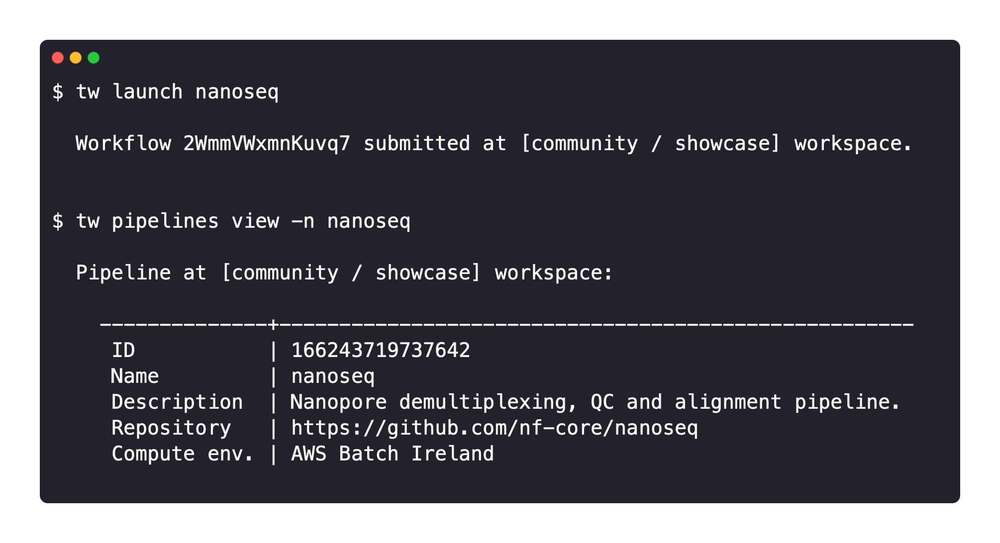

# Nextflow Tower CLI

`tw` is [Tower](https://tower.nf/) on the command line. It brings Tower concepts including Pipelines, Actions and Compute Environments to the terminal.

Tower is a full-stack application for the management of data pipelines and compute resources. It enables collaborative data analysis at scale, on-premises or in any cloud.

The Tower CLI interacts with Tower, providing an interface to launch pipelines, manage cloud resources and administer your analysis.

### Key features

- **A Nextflow-like experience**: Tower CLI provides a developer-friendly environment. Pipelines can be launched with the CLI similar to Nextflow but with the benefits of Tower such as monitoring, logging, resource provisioning, dataset management, and collaborative sharing.

- **Infrastructure as Code**: All Tower resources including Pipelines and Compute Environments can be described in a declarative manner. This allows a complete definition of an analysis environment that can be versioned and treated as code. It greatly simplifies sharing and re-use of configuration as well as routine administration.

- **Built on OpenAPI**: Tower CLI interacts with Tower via the [Tower API](./api/overview) which is created using the latest OpenAPI 3.0 specification. Tower CLI provides full control of the Tower application allowing users to get maximum insights into their pipeline submissions and execution environments.

### Availability

Tower CLI can be installed on macOS, Windows, and Linux.

Visit the [Tower CLI](https://github.com/seqeralabs/tower-cli/) page on GitHub for installation and configuration details.
