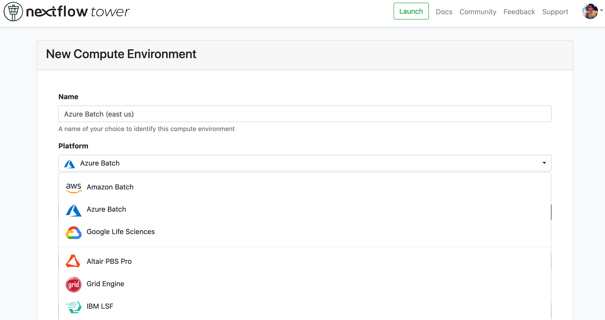
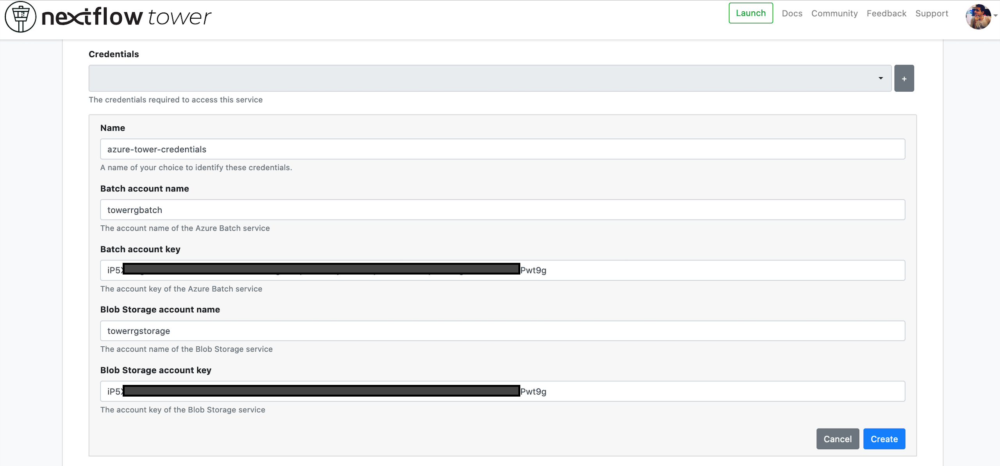
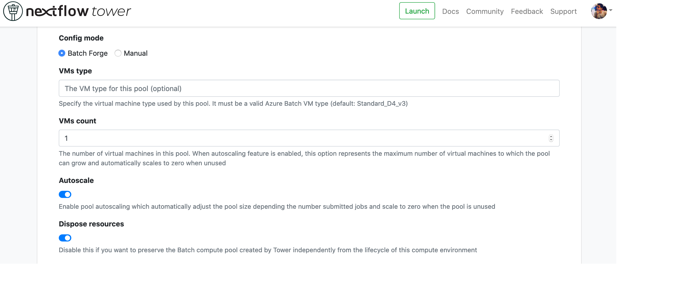
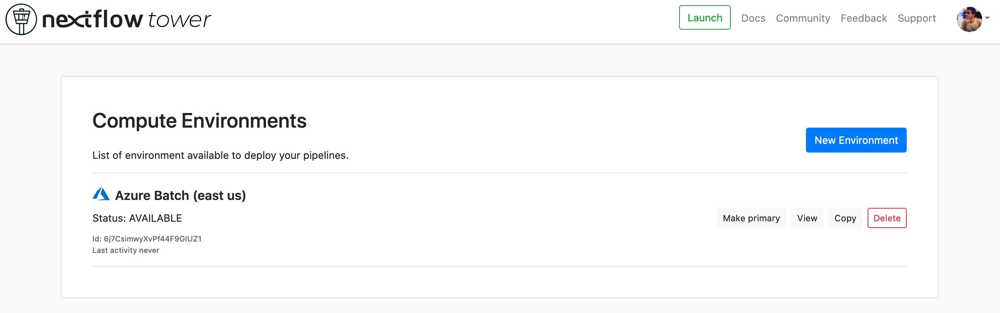
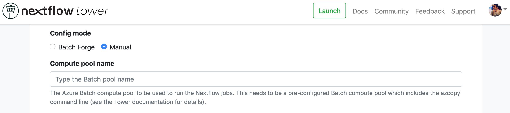

## Overview

:::caution
The Tower support for Azure Batch is currently in beta. Any feedback and suggestions are welcome.

    In order to manage capacity during the global health pandemic, Microsoft has reduced core quotas for new Batch accounts. Depending on your region and subscription type, a newly-created account may not be entitled to any VMs without first making a service request to Azure.

    Please see Azure's [Batch service quotas and limits](https://docs.microsoft.com/en-us/azure/batch/batch-quota-limit#view-batch-quotas) page for further details.

:::

:::note
This guide assumes you have an existing [Azure Account](https://azure.microsoft.com/en-us). Sign up for a free Azure account [here](https://azure.microsoft.com/en-us/free/).
:::

There are two ways to create a **Compute Environment** for **Azure Batch** with Tower.

1. **Batch Forge**: This option automatically manages the Azure Batch resources in your Azure account.

2. **Manual**: This option allows you to create a compute environment using existing Azure Batch resources.

If you don't yet have an Azure Batch environment fully set up, follow the [Batch Forge](#tower-forge) guide to do so.

If you have been provided an Azure Batch queue from your account administrator, or if you have set up Azure Batch previously, directly follow the [Manual](#manual) guide.

### Batch Forge

:::caution
Follow these instructions only if you have **not** pre-configured an Azure Batch environment. Note that this option will create resources in your Azure account that you may be charged for by Azure.
:::

### Resource group

To create the necessary Azure Batch and Azure Storage accounts, we must first create a **resource group** in the region of your choice.

When you open [this link](https://portal.azure.com/#create/Microsoft.ResourceGroup), you'll notice the **Create new resource group** dialogue.

1. Enter a name for the resource group (e.g. `towerrg`).

2. Select the preferred region for this resource group.

3. Select **Review and Create** to proceed to the review screen.

4. Select **Create** to create the resources.

### Storage account

The next step is to create the necessary Azure Storage.

When you open [this link](https://portal.azure.com/#blade/HubsExtension/BrowseResource/resourceType/Microsoft.Storage%2FStorageAccounts), you'll notice the **Create a storage account** dialogue.

1. Enter a name for the storage account (e.g. `towerrgstorage`).

2. Select the preferred region for this resource group.

3. Select **Review and Create** to proceed to the review screen.

4. Select **Create** to create the Azure Storage account.

5. Navigate to your new storage account and select **Container**.

6. Create a new Blob container by selecting **+ Container**.

   A new container dialogue will open. Enter a suitable name (e.g. `towerrgstorage-container`).

7. Once the new Blob container is created, navigate to the **Access Keys** section of the storage account (`towerrgstorage` in this example).

8. Store the access keys for the newly created Azure Storage account.

   :::note
   Blob container storage credentials are associated with the Batch pool configuration when it is created. Once your compute environment has been created with Batch Forge, these credentials should not be changed in Tower.
   :::

### Batch account

The next step is to create the necessary Batch account.

When you open [this link](https://portal.azure.com/#blade/HubsExtension/BrowseResource/resourceType/Microsoft.Batch%2FbatchAccounts), you'll notice the **Create a batch account** dialogue.

1. Enter a name for the storage account (e.g. `towerrgbatch`).

2. Select the preferred region for this resource group.

3. Select **Review and Create** to proceed to the review screen.

4. Select **Create** to create the Azure Batch account.

### Compute Environment

Batch Forge automates the configuration of an [Azure Batch](https://azure.microsoft.com/en-us/services/batch/) compute environment and queues required for the deployment of Nextflow pipelines.

Once the Azure resources are set up, we can add a new **Azure Batch** environment in Tower. To create a new compute environment:

1. In a workspace, select **Compute Environments** and then **New Environment**.

2. Enter a descriptive name for this environment, e.g. "Azure Batch (east-us)"

3. Select **Azure Batch** as the target platform.

   

4. From the **Credentials** drop-down, select existing Azure credentials, or add new credentials by selecting the **+** button. If you select to use existing credentials, skip to step 7.

5. Enter a name, e.g. "Azure Credentials".

6. Add the **Batch account** and **Blob Storage** credentials that we created previously.

   

   :::tip
   You can create multiple credentials in your Tower environment.
   :::

   :::note
   From version 22.3, Tower supports the use of credentials for container registry services. These credentials can be created from the [Credentials](../credentials/overview) tab.
   :::

7. Select a **Region**, for example "eastus (East US)".

8. Enter the **Pipeline work directory** as the Azure blob container we created in the previous section, e.g. `az://towerrgstorage-container/work`.

   :::caution
   The blob container should be in the same **Region** from the previous step.
   :::

9. Set the **Config mode** to **Batch Forge**.

   

10. Enter the default VM type depending on your quota limits. The default is `Standard_D4_v3`.

11. Enter the **VMs count**, which is the number of VMs you'd like to deploy.

12. Enable **Autoscale** if you'd like to automatically scale up and down based on the number of tasks. The number of VMs will vary from **0** to **VMs count**.

13. Enable **Dispose resources** if you'd like Tower to automatically delete the Batch pool once the workflow is complete.

14. Configure any advanced options described below, as needed.

15. Select **Create** to finalize the compute environment setup. It will take a few seconds for all the resources to be created, and then you will be ready to launch pipelines.

    

Jump to the documentation for [Launching Pipelines](../launch/launchpad).

### Advanced options

- You can use the **Jobs cleanup policy** to control how jobs should be deleted on workflow completion.

- You can use the **Token duration** to control the duration of the SAS token generated by Nextflow.

### Manual

This section is for users with a pre-configured Azure environment. You will need an Azure Batch account and Storage account already set up.

To create a new compute environment for AWS Batch (without Forge):

1. In a workspace, select **Compute Environments** and then **New Environment**.

2. Enter a descriptive name for this environment, e.g. "Azure Batch (east-us)"

3. Select **Azure Batch** as the target platform.

   

4. Select your Azure credentials or add new credentials by selecting the **+** button.

5. Enter a name, e.g. "Azure Credentials".

6. Add the **Batch account** and **Blob Storage** credentials that we created previously.

   

   :::tip
   You can create multiple credentials in your Tower environment.
   :::

7. Select a **Region**, for example "eastus (East US)".

8. Enter the **Pipeline work directory** as the Azure blob container we created in the previous section, e.g. `az://towerrgstorage-container/work`.

   :::caution
   The blob container should be in the same **Region** you specified in step 7 above.
   :::

9. Set the **Config mode** to **Manual**.

10. Enter the **Compute Pool name**, the name of the Azure Batch pool provided to you by your Azure administrator.

    

11. You can use the **Environment variables** option to specify custom environment variables for the Head job and/or Compute jobs.

12. Configure any advanced options described below, as needed.

13. Select **Create** to finalize the compute environment setup. It will take a few seconds for all the resources to be created, and then you will be ready to launch pipelines.

    

Jump to the documentation for [Launching Pipelines](../launch/launchpad).

### Advanced options

- You can use the **Jobs cleanup policy** to control how jobs should be deleted on workflow completion.

- You can use the **Token duration** to control the duration of the SAS token generated by Nextflow.
