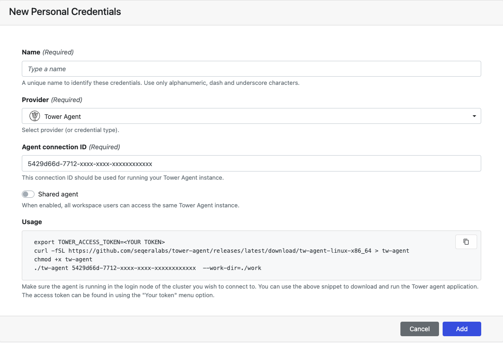

[Tower Agent](../agent) enables Tower to launch pipelines on HPC clusters that do not allow direct access through an SSH client. Tower Agent authenticates a secure connection with Tower using a Tower Agent credential.

### Tower Agent sharing

You can share a single Tower Agent instance with all members of a workspace. Create a Tower Agent credential, with **Shared agent** enabled, in the relevant workspace. All workspace members can then use this Tower Agent credential (Connection ID + Tower access token) to use the same Tower Agent instance.

### Create a Tower Agent credential

- From an organization workspace: navigate to the Credentials tab and select **Add Credentials**.

- From your personal workspace: select **Your credentials** from the user top-right menu, then select **Add credentials**.

| Property            | Description                                                                                                                                                       | Example                                |
| ------------------- | ----------------------------------------------------------------------------------------------------------------------------------------------------------------- | -------------------------------------- |
| Name                | A unique name for the credentials using alphanumeric characters, dashes, or underscores.                                                                          | `my-agent-creds`                       |
| Provider            | Credential type                                                                                                                                                   | Tower Agent                            |
| Agent connection ID | The connection ID used to run your Tower Agent instance. Must match the connection ID used when running the Agent (see **Usage** below)                           | `5429d66d-7712-xxxx-xxxx-xxxxxxxxxxxx` |
| Shared agent        | Enables Tower Agent sharing for all workspace members.                                                                                                            |                                        |
| Usage               | Populates a code snippet for Tower Agent download with your connection ID. Replace `<YOUR TOKEN>` with your [Tower access token](../api/overview#authentication). |                                        |

Once the form is complete, select **Add**. The new credential is now listed under the **Credentials** tab.
