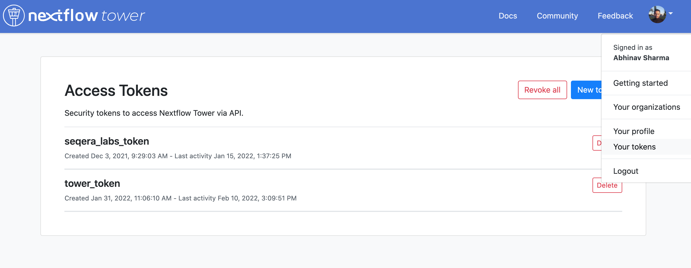
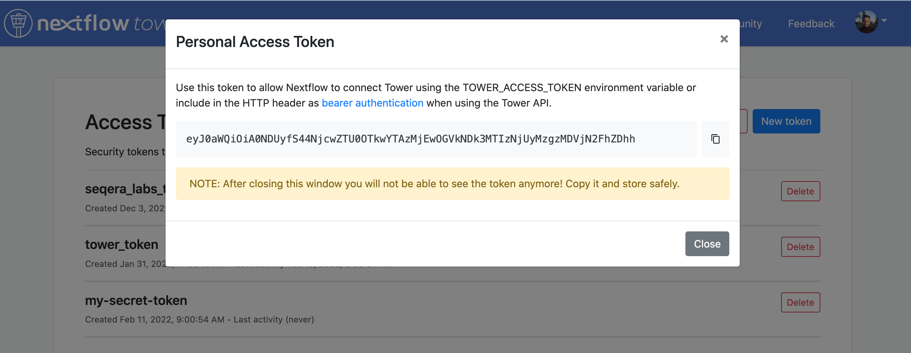

You can use Tower through the web interface, the API, the CLI, or in Nextflow directly using the `-with-tower` option.

### Tower web interface

1. Create an account and log in to Tower, available free of charge at [tower.nf](https://cloud.tower.nf).

2. Create and configure a new [compute environment](../compute-envs/overview.mdx).

3. Start [launching pipelines](../launch/launchpad.mdx).

### Tower API

See [API](../api/overview.mdx).

### Tower CLI

See [CLI](../cli.mdx).

### Nextflow `-with-tower`

1. Create an account and log in to Tower.

2. Create a new token. You can access your tokens from the **Settings** drop-down menu:

   

3. Name your token.

   

4. Store your token securely.

   

:::note
The token will only be displayed once. You must copy and save the token before closing the Personal Access Token window.
:::

5. Open a terminal and enter the following commands:

   ```bash
   export TOWER_ACCESS_TOKEN=eyxxxxxxxxxxxxxxxQ1ZTE=
   export NXF_VER=22.10.6
   ```

   Where `eyxxxxxxxxxxxxxxxQ1ZTE=` is the token you just created.

   :::note
   Bearer token support requires Nextflow version 20.10.0 or later, set with the second command above.

   To submit a pipeline to a [workspace](./workspace.mdx) using Nextflow, add the workspace ID to your environment:

   ```bash
   export TOWER_WORKSPACE_ID=000000000000000
   ```

   The workspace ID can be found on the organization workspaces overview page.
   :::

6. Run your Nextflow pipeline with the `-with-tower` flag:

   ```bash
   nextflow run hello.nf -with-tower
   ```

   You can now monitor your workflow runs in Tower.

   To configure and execute Nextflow pipelines in cloud environments, see [Compute Environments](../compute-envs/overview.mdx).

:::tip
See the [Nextflow documentation](https://www.nextflow.io/docs/latest/config.html?highlight=tower#scope-tower) for further run configuration options using Nextflow configuration files.
:::
