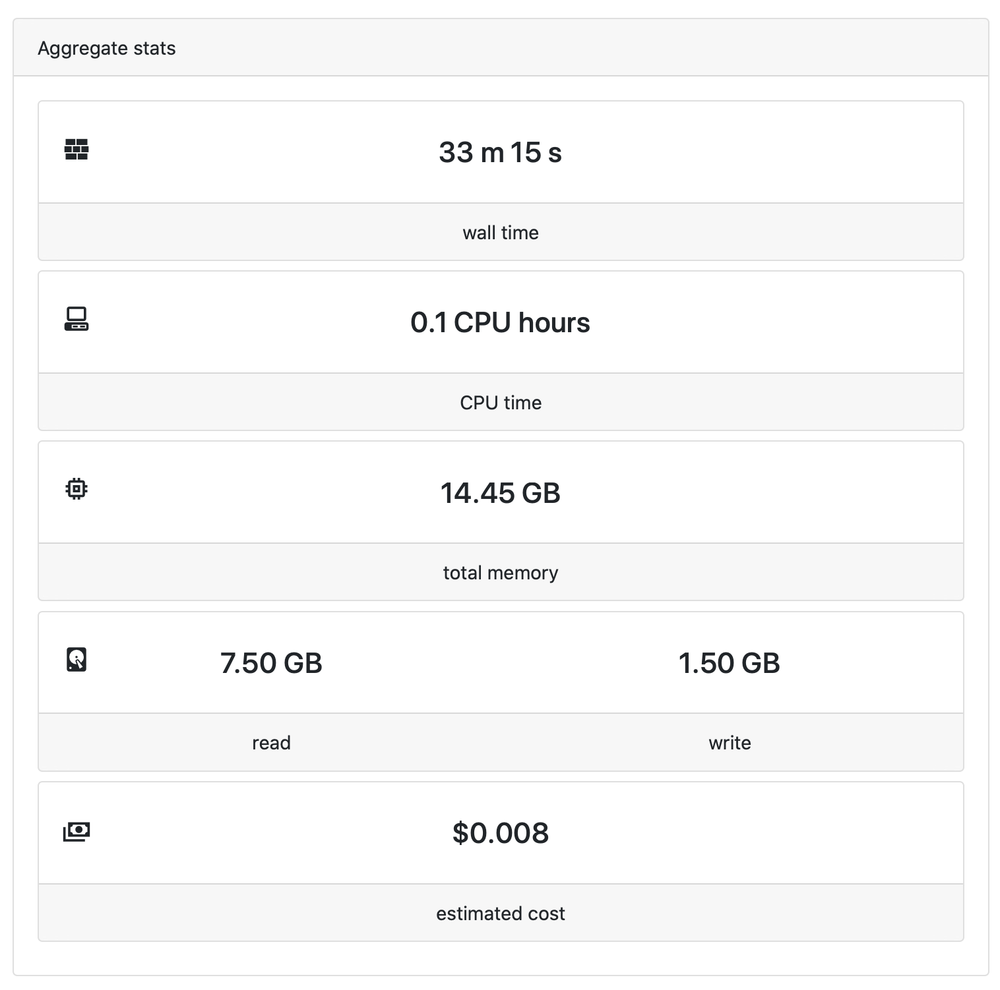
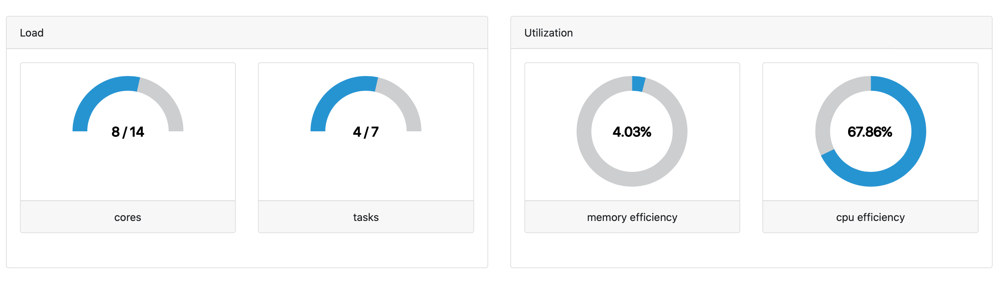

The **Aggregate stats** panel displays a real-time summary of the resources used by the workflow. These include total running time ('wall time'), aggregated CPU time (CPU hours), memory usage (GB hours), data i/o and cost.

### Estimated cost

Note that the cost estimate in Tower is a heuristic estimation of computation-only cost and is not intended to be a replacement for your cloud provider tooling (such as AWS Cost Explorer). Tower uses a database of costs for all cloud instances of AWS and Google Cloud in all regions and zones. This estimate does not currently take storage or associated network costs into account.

The addition of [Resource labels](../resource-labels/overview) to your compute environments provides additional cost tracking through annotation of the actual cloud resources consumed by a run.

### Load and Utilization

As processes are being submitted to the compute environment, the **Load** monitors how many cores and tasks are currently being used. For the cores gauge chart, the denominator is the maximum number of cores that have already been used at that moment during the execution of that specific pipeline.

**Utilization** is calculated for memory and CPUs. This is the average value across all tasks and is calculated by dividing the memory (or CPUs) usage by the memory (or CPUs) requested.

