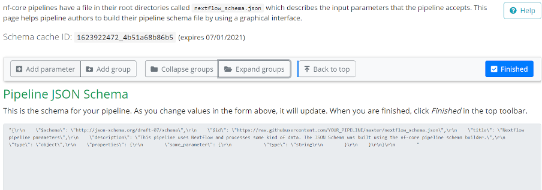

## Overview

Pipeline schema files describe the structure and validation constraints of your workflow parameters. They are used to validate parameters before launch to prevent software or pipelines from failing in unexpected ways at runtime.

You can populate the parameters in the pipeline by uploading a YAML or JSON file, or in the Tower UI. Tower uses your pipeline schema to build a bespoke launchpad parameters form.

See [nf-core/rnaseq](https://github.com/nf-core/rnaseq/blob/e049f51f0214b2aef7624b9dd496a404a7c34d14/nextflow_schema.json) as an example of the pipeline parameters that can be represented by a JSON schema file.

### Building pipeline schema files

The pipeline schema is based on [json-schema.org](https://json-schema.org/) syntax, with some additional conventions. While you can create your pipeline schema manually, we highly recommmend the use of [nf-core tools](https://nf-co.re/tools/#pipeline-schema), a toolset for developing Nextflow pipelines built by the nf-core community.

When you run the `nf-core schema build` command in your pipeline root directory, the tool collects your pipeline parameters and gives you interactive prompts about missing or unexpected parameters. If no existing schema file is found, the tool creates one for you. `schema build` commands include the option to validate and lint your schema file according to best practice guidelines from the nf-core community.

### Customizing pipeline schema

Once the skeleton pipeline schema file has been built with `nf-core schema build`, the command line tool will prompt you to open a [graphical schema editor](https://nf-co.re/pipeline_schema_builder) on the nf-core website.

Leave the command-line tool running in the background - it checks the status of your schema on the website. When you select <kbd>Finished</kbd> on the schema editor page, your changes are saved to the schema file locally.

:::note
The schema builder is created by the nf-core community, but can be used any Nextflow pipeline.
:::
