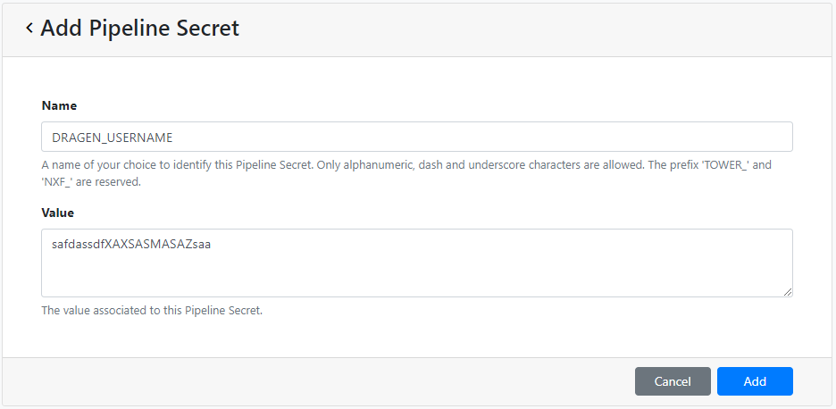

## Illumina DRAGEN

DRAGEN is a platform provided by Illumina that offers accurate, comprehensive, and efficient secondary analysis of next-generation sequencing (NGS) data with a significant speed-up over tools that are commonly used for such tasks.

The improved performance offered by DRAGEN is possible due to the use of Illumina proprietary algorithms in conjunction with a special type of hardware accelerator called field programmable gate arrays (FPGAs). For example, when using AWS, FPGAs are available via the [F1 instance type](https://aws.amazon.com/ec2/instance-types/f1/).

### Running DRAGEN on Nextflow Tower

We have extended the [Batch Forge](../../compute-envs/aws-batch?h=forge#tower-forge) feature for AWS Batch to support DRAGEN. Batch Forge ensures that all of the appropriate components and settings are automatically provisioned when creating a Compute Environment for executing pipelines.

When deploying data analysis workflows, some tasks will need to use normal instance types (e.g. for non-DRAGEN processing of samples) and others will need to be executed on F1 instances. If the DRAGEN feature is enabled, Batch Forge will create an additional AWS Batch compute queue which only uses F1 instances, to which DRAGEN tasks will be dispatched.

### Getting started

To showcase the capability of this integration, we have implemented a proof of concept pipeline called [nf-dragen](https://github.com/seqeralabs/nf-dragen). To run it, sign-in into Tower, navigate to the [Community Showcase](https://tower.nf/orgs/community/workspaces/showcase/launchpad) and select the "nf-dragen" pipeline.

You can run this pipeline at your convenience without any extra setup. Note however that it will be deployed in the Compute Environment owned by the Community Showcase.

To deploy the pipeline on your own AWS cloud infrastructure, please follow the instructions in the next section.

### Deploy DRAGEN in your own workspace

DRAGEN is a commercial technology provided by Illumina, so you will need to purchase a license from them. To run on Tower, you will need to obtain the following information from Illumina:

1. DRAGEN AWS private AMI ID
2. DRAGEN license username
3. DRAGEN license password

Batch Forge automates most of the tasks required to set up an AWS Batch Compute Environment. Please follow [our guide](../../compute-envs/aws-batch) for more details.

In order to enable support for DRAGEN acceleration, simply toggle the "Enable DRAGEN" option when setting up the Compute Environment via Batch Forge.

In the "DRAGEN AMI Id" field, enter the AWS AMI ID provided to you by Illumina.


:::caution
Please ensure that the Region you select contains DRAGEN F1 instances.
:::

### Pipeline implementation & deployment

Please see the [dragen.nf](https://github.com/seqeralabs/nf-dragen/blob/master/modules/local/dragen.nf) module implemented in the [nf-dragen](https://github.com/seqeralabs/nf-dragen) pipeline for reference. Any Nextflow processes that run DRAGEN must:

1. Define `label 'dragen'`

   The `label` directive allows you to annotate a process with mnemonic identifiers of your choice. Tower will use the `dragen` label to determine which processes need to be executed on DRAGEN F1 instances.

   ```
   process DRAGEN {
       label 'dragen'

       <truncated>
   }
   ```

   Please refer to the [Nextflow label docs](https://www.nextflow.io/docs/latest/process.html?highlight=label#label) for more information.

2. Define Secrets

   At Seqera, we use Secrets to safely encrypt sensitive information when running licensed software via Nextflow. This enables our team to use the DRAGEN software safely via the `nf-dragen` pipeline without having to worry about the setup or safe configuration of the license key. These Secrets will be provided securely to the `--lic-server` option when running DRAGEN on the CLI to validate the license.

   In the nf-dragen pipeline, we have defined two Secrets called `DRAGEN_USERNAME` and `DRAGEN_PASSWORD`, which you can add via the Tower UI by going to _"Secrets -> Add Pipeline Secret"_:

   

   

   Please refer to the [Secrets documentation](../../secrets/overview) for more information about this feature.

### Limitations

DRAGEN integration with Tower is currently only available for use on AWS, however, we plan to extend the functionality to other supported platforms like Azure in the future.
