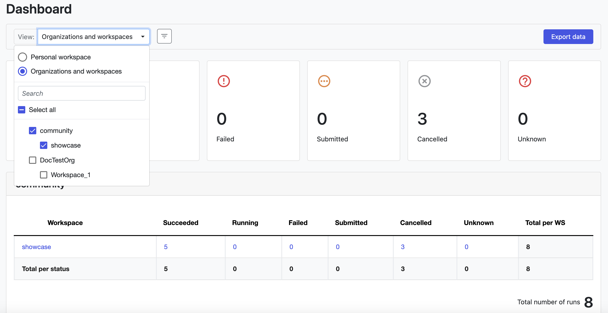
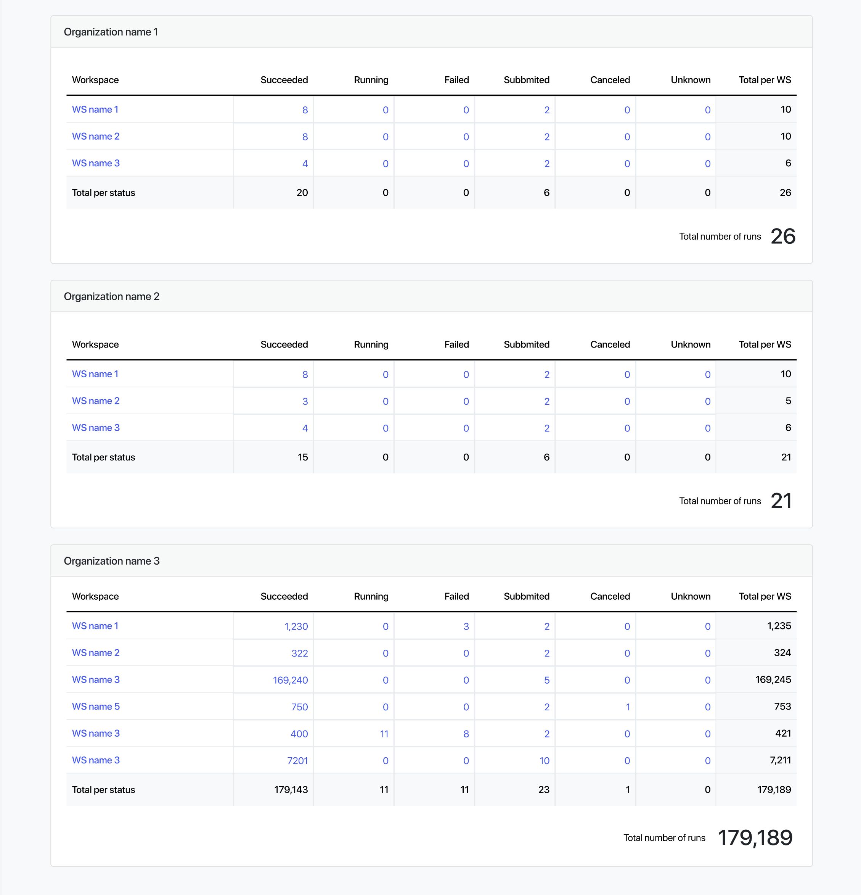

## Overview

:::note
This feature is available from Tower v.22.3.
:::

The Tower **Dashboard** provides an overview of runs in your organizations and personal workspace at a glance. Access it from the user top-right menu, under **Dashboard**.

### Filters and summary

The Dashboard view defaults to all organizations and workspaces you can access. Select the drop-down next to **View:** to filter by specific organizations and workspaces, or to view statistics for your personal workspace only.

The filter button provides options for filtering by time, including a custom date range of up to 12 months. The button icon and color changes to indicate when a filter has been applied to your dashboard view.

Below the filters, a summary of total runs is shown by status.

### Export data

Select **Export data** in the filter panel near the top of the page to download a CSV file of your dashboard data. The export contains data based on the filters you have applied.

### Runs per organization

Below the cards displaying total runs by status, run totals for your selected filters above are displayed.

Depending on the filter selected, each card details a separate workspace or organization. Total runs for each organization are arranged by workspace and status.

Select a run value in the table to navigate to a run list filtered by the status and time range selected.

Select a workspace name in the table to navigate to a run list filtered by the workspace selected.
