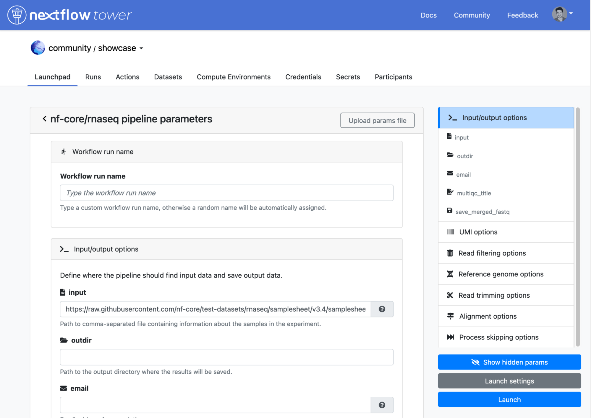

# Release notes for version 22.1.x

title: "22.1"

Nextflow Tower 22.1.x brings the following changes:

- Add Pipeline Secrets feature
- Add Custom workflows run name
- Add CSV and TSV reports rendering
- Add support for AWS agent and logging
- Add support for Moab platform
- Add GetLogsEvents perm to AWS Batch instance role
- Add support for local pipelines
- Add navigate back button to second level screens
- Add validation for SSH hostname and username
- Add credentials view page
- Add ECS pull strategy in user-data template
- Add root users environment when TOWER_ROOT_USERS variable is provided
- Add Tower system message
- Add config option to disable user private workspace
- Add support for JSON formatted logs
- Stability improvements
- Security improvements as for penetration test performed on March 2022

## New features and usability improvements

We are pleased to announce the `22.1` release of Tower. This release brings long-awaited features including a customizable run name for workflows, enhanced secrets handling, better reports and improved HPC scheduler support.

:::tip
The release naming convention is changed and it reflects the year and the quarter, so our customers know to expect 4 enterprise releases per year.
:::

### Customizable workflow run name

From this release, Tower allows users to specify a custom name for each workflow run. This name will override the default runName parameter for the Nextflow run name. This feature allows to identify each run at a glance, facilitating the retrieval of a specific run from the list presented in the Runs page from the application.

More than 60% of new workflow runs in tower.nf already make use of the custom run name.

### Pipeline secrets - improved

Starting from 21.12, Tower uses the concept of Secrets to store the keys and tokens used by workflow tasks to interact with external systems e.g. a password to connect to an external database or an API token. In 22.1 we have improved the Secrets management by:

- Introducing the possibility for users to create user-level secrets
- Implementing a selection mechanism so users can dynamically select which secrets will be used by each pipeline launch
- Enable Tower to capture specific OIDC attributes as secrets

Full information about Secrets is available [here](https://help.tower.nf/latest/secrets/overview/)

### Improved web reports

Most Nextflow pipelines will generate reports or output files which are useful to inspect at the end of the pipeline execution. Since 21.12, Tower has a Reports feature that allows to directly visualise supported file types or to download them directly via the user interface.

The key improvements in 22.1

- Reports are configurable and are no longer limited to workdir subdirectories
- Tower enables the rendering of CSV and TSV files

A comprehensive documentation on how to setup and constraints is available [here](https://help.tower.nf/latest/reports/overview/).

### Enhanced HPC support

Tower `22.1` allows working with [HPC MOAB platform](https://adaptivecomputing.com/moab-hpc-suite/ "
"), expanding the supported alternatives for HPC computing.

We have also implemented a first version of a much requested feature from HPC users: Launch local repositories. Using this feature, users can instruct Tower to source the pipeline code stored as a Git bare repository and launch the workflows.

## Notes

1. As of version 22.1.x, Nextflow Tower Enterprise will follow a three month release cadence, using the following version number scheme: `YY.Q.PATCH`, where `YY` represents the year, `Q` represents the quarter and `PATCH` the incremental patch number.

2. As of version 21.02.x, a license key must be provided to enable the Tower deployment feature. The license key should be specified using the configuration variable `TOWER_LICENSE`. If you don't have a license key, contact sales@seqera.io.

## Warnings

1. This version now expects the use of HTTPS by default for all browser client connections.

   If your Tower installation requires the use of unsecured HTTP, set the following environment variable in the infrastructure hosting the Tower application: `TOWER_ENABLE_UNSAFE_MODE=true`.

2. If you are upgrading from a version of Tower prior to `21.04.x`, please update your implementation to `21.04.x` before installing this release.

## Database Schema

This Tower version requires a database schema update. Follow these steps to update your DB instance and the Tower installation.

1. Make a backup of the Tower database.

2. Download and update your container versions to:

   - `195996028523.dkr.ecr.eu-west-1.amazonaws.com/nf-tower-enterprise/backend:v22.1.5`
   - `195996028523.dkr.ecr.eu-west-1.amazonaws.com/nf-tower-enterprise/frontend:v22.1.5`

3. Redeploy the Tower application:

   - **docker-compose**:

     1. Restart the application with `docker-compose restart`. This will automatically migrate the database schema.

   - **kubernetes**:

     1. Update the cron service with `kubectl apply -f tower-cron.yml`. This will automatically migrate the database schema.
     2. Update the frontend and backend services with `kubectl apply -f tower-srv.yml`.

   - **custom deployment**

     1. Run the `/migrate-db.sh` script provided in the `backend` container. This will migrate the database schema.
     2. Deploy Tower following your usual procedures.

## Nextflow Launcher Image

If you must host your container images on a private image registry:

1.  Copy the the nf-launches image to your private registry:

    - `quay.io/seqeralabs/nf-launcher:j17-22.04.0`

2.  Update your `tower.env` with the following environment variable:

    - `TOWER_LAUNCH_CONTAINER=<FULL_PATH_TO_YOUR_PRIVATE_IMAGE>`

    :::caution
    If using AWS Batch, you will need to [configure a custom job-definition](../advanced-topics/custom-launch-container.mdx) and populate the `TOWER_LAUNCH_CONTAINER` with the job-definition name instead.
    :::

## Compute environments

The Tower compute environments to be made available to users must be specified in the Tower configuration.

The following ids options are available:

- `awsbatch-platform`: AWS Batch cloud compute service
- `gls-platform`: Google LifeSciences cloud compute service
- `azbatch-platform`: Azure Batch cloud compute service
- `lsf-platform`: IBM LSF batch scheduler
- `slurm-platform`: Slurm batch scheduler
- `altair-platform`: Altair PBS Pro batch scheduler
- `univa-platform`: (Univa/Sun) GridEngine
- `moab-platform`: Adaptive Computing Moab batch scheduler
- `k8s-platform`: Kubernetes compute platform
- `eks-platform`: AWS EKS compute platform
- `gke-platform`: Google Kubernetes Engine compute platform

Choose one or more of these platform ids specify them via the environment variable `TOWER_ENABLE_PLATFORMS`, separating them via a comma.

### Changelog

For a detailed list of all changes, please consult the Nextflow Tower [Changelog](./changelog.mdx).

## Questions/Feedback

Contact us at [support@seqera.io](mailto:support@seqera.io).
