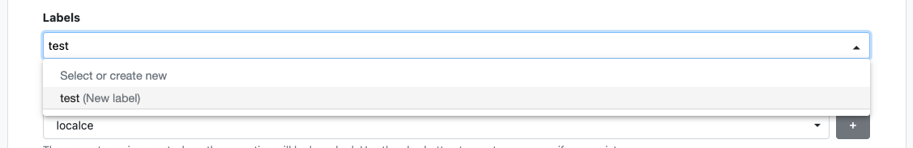
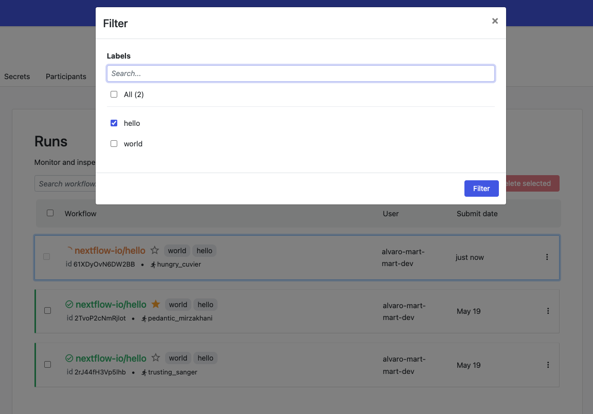
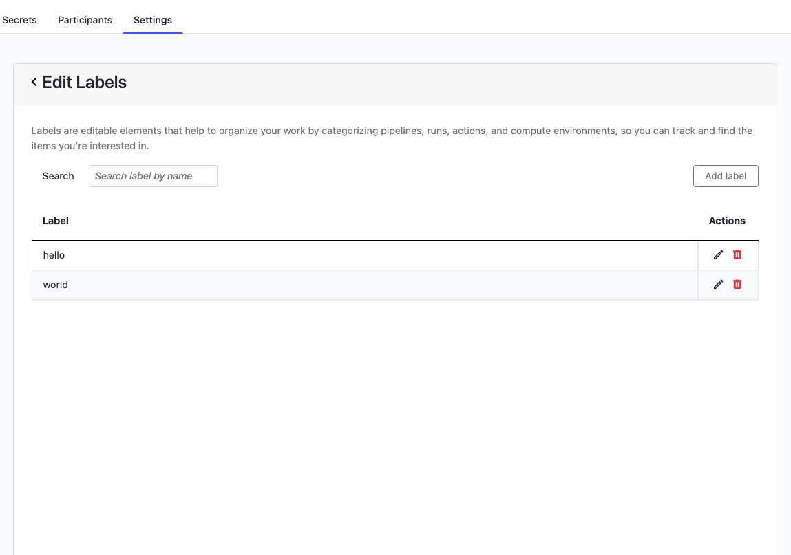

## Overview

Use labels to organize your work and filter key information. Labels are free-text annotations that can be applied to pipelines, actions, or workflow runs either during creation or afterward.

Labels are workspace-specific (each workspace has an independent set of labels) and are not propagated to Nextflow during workflow execution.

### Create and apply labels

Labels can be created, applied, and edited by a workspace maintainer, admin, or owner. When applying a label, users can select from existing labels or add new ones on the fly.

### Labels applied to a pipeline

:::caution
Labels are applied to elements in a workspace-specific context. This means that labels applied to a shared pipeline in workspace A will not be shown when viewing the pipeline from workspace B.
:::

The labels applied to each pipeline are displayed in both list and card views on the Launchpad screen. Select a pipeline to view all applied labels.

Apply a label when adding a new pipeline or editing an existing pipeline.

If a label was applied to a pipeline, all workflow runs of this pipeline will inherit the label. If the labels applied to the pipeline are changed, this change will not be reflected on previously executed workflow runs, only future runs.

### Labels applied to an action

Labels applied to an action are displayed in the action card on the Actions screen. To see all labels, hover over a label with the "+" character.

Apply a label when adding a new action or editing an existing action.

If a label is applied to an action, all workflow runs triggered by this action will inherit the label. If the labels applied to the action are changed, this change will not be reflected on previously executed workflow runs, only future runs.

### Labels applied to a workflow run

Labels applied to a workflow run are displayed on the runs list screen and on the workflow run detail screen. To see all labels, hover over a label with the "+" character.
Apply a label to a workflow run when launching a workflow run, on the workflow runs list screen, or on the run detail screen.

### Search and filter with labels
Search and filter pipelines and workflow runs using one or more labels.
Filter and search are complementary.

### Overview of labels in a workspace

All labels used in a workspace can be viewed, added, edited, and deleted by a maintainer, admin, or workspace owner on the workspace settings screen.
If a label is edited or deleted on this screen, the change is propagated to all items where the label was used. Such a change is irreversible.

### Limits

:::caution
Label names must contain a minimum of 2 and a maximum of 39 alphanumeric characters, separated by dashes or underscores, and must be unique in each workspace.
:::

- Label names cannot begin or end with dashes `-` or underscores `_`.
- Label names cannot contain a consecutive combination of `-` or `_` characters (`--`, `__`, `-_`, etc.)
- A maximum of 25 labels can be applied to each resource.
- A maximum of 100 labels can be used in each workspace.
