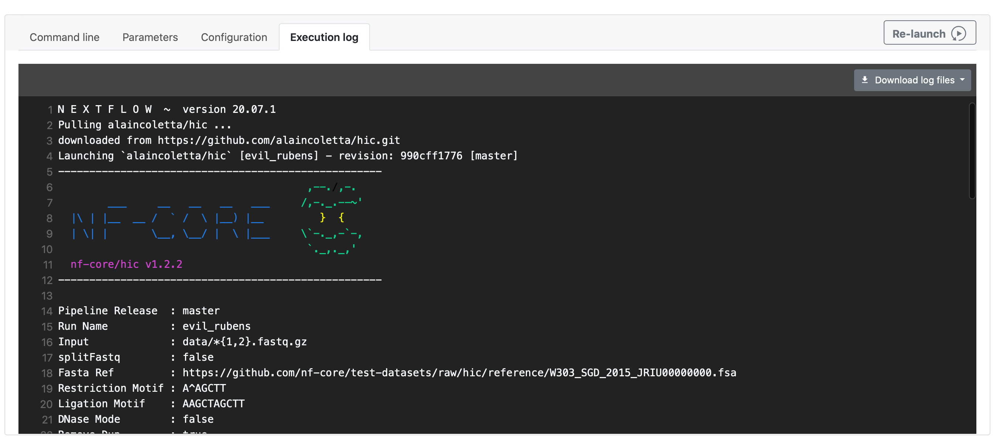

### Run execution details

Selecting a workflow run from the **Runs** tab will display the workflow details. This view contains:

- [Run information](#run-information) with command-line, parameters, configuration, and execution logs in real-time.
- [Summary and status](./summary) section.
- List of pipeline [processes](./processes).
- [Aggregated stats](./aggregate_stats) and [load](./aggregate_stats#load-and-utilization).
- Detailed list of [individual tasks](./tasks#task-table) and [metrics](./tasks#resource-metrics).

### Run information

This section is composed of several tabs containing details about the Nextflow execution:

- The Nextflow **Command line** that was executed.

- The **Parameters** that were provided to the pipeline (taken from the configuration `params` scope).

- The **Configuration** files as well as the final resolved configuration.

- The **Execution log** from the main Nextflow process, which is updated in real time.

  

### Save run as pipeline

**Available from version 23.1**

From the Runs list, any run can be saved as a new pipeline for future use (regardless of run status). Select the item menu to the right of any run in the list, then select **Save as pipeline**. In the dialog box shown, you can edit the pipeline name (the run name is pre-filled by default), add labels, and **Save**. To review and edit any run details prior to saving the pipeline, select **review and edit** near the top of the dialog window. Once saved, the new pipeline is listed on the Launchpad and can be run from the same workspace it was created in.
