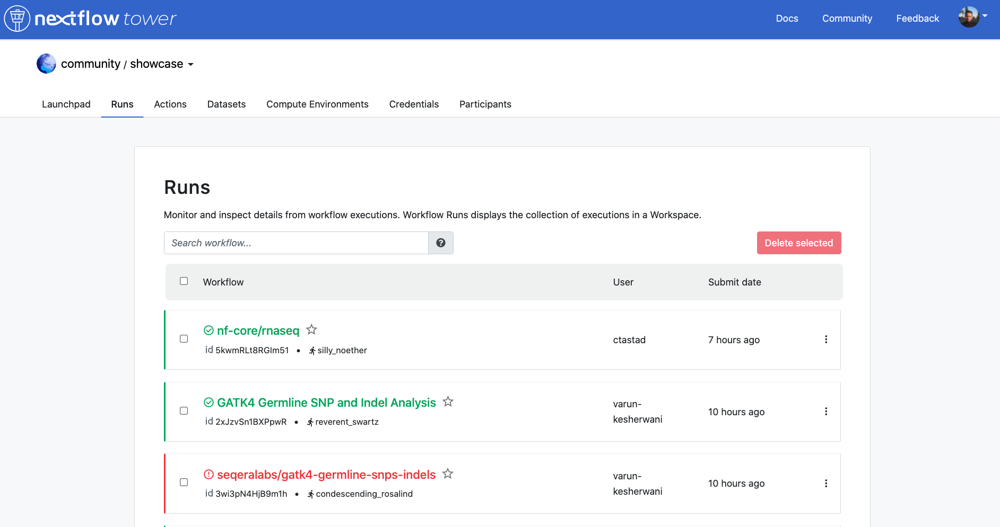
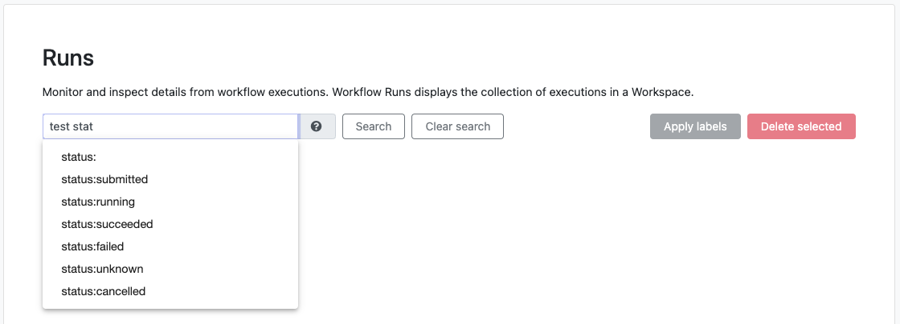
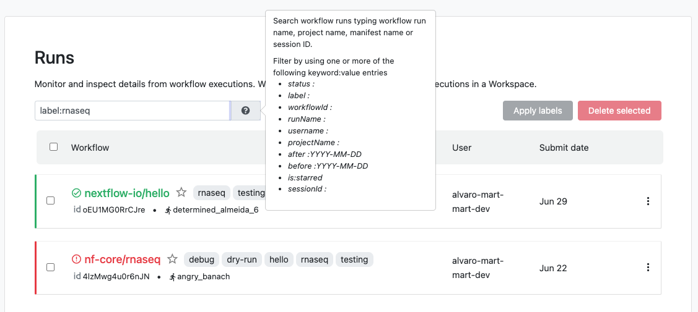

Jobs that have been submitted with Tower can be monitored wherever you have an internet connection.

The **Runs** tab contains all previous job executions. Each new or resumed job will be given a random name, e.g., `grave_williams`.

The colors signify the completion status:

- **Blue** are running.
- **Green** are successfully executed.
- **Red** are successfully executed where at least one task failed with a "terminate" error strategy.
- **Grey** are jobs that were forced to stop during execution.

Selecting any particular run from the panel will display that run's execution details.

### Save run as pipeline

**Available from version 23.1**

From the Runs list, any run can be saved as a new pipeline for future use (regardless of run status). Select the item menu to the right of any run in the list, then select **Save as pipeline**. In the dialog box shown, you can edit the pipeline name (the run name is pre-filled by default), add labels, and **Save**. To review and edit any run details prior to saving the pipeline, select **review and edit** near the top of the dialog window. Once saved, the new pipeline is listed on the Launchpad and can be run from the same workspace it was created in.

### All runs view

**Available from version 22.4.0**

The **All runs** page, accessed from the user top-right menu, provides a comprehensive overview of the runs accessible to a user across the entire Tower instance. This facilitates overall status monitoring and early detection of execution issues from a single view split across organizations and workspaces.

The All runs view defaults to all organizations and workspaces the user has access to. Select the drop-down next to **View:** to filter by specific organizations and workspaces, or to view runs from your personal workspace only.

The **Search workflow** bar allows you to filter by by run name, project name, manifest name, or session ID.

Filter by one or more "keyword:value" entries:

- status:
- label:
- workflowId:
- runName:
- username:
- projectName:
- after: YYYY-MM-DD
- before: YYYY-MM-DD
- sessionId:

The search feature will populate with available suggestions when entering valid keywords. Suggested results for `label:` includes available labels from all workspaces and labels occurring in multiple workspaces will only be displayed for suggestion once.

### Search

Our integrated search covers all workflow runs inside a workspace, enabling easy retrieval of complex queries.
To search and filter the runs in a workspace, the user can write a search query in the "Search workflow" textbox.

The search text is interpreted by identifying all substrings formatted by `keyword:value` (this only applies to valid keywords shown below), combining all the rest in a single `Freetext` string, and then using all these search criteria to filter the runs.

An example of a complex search query is the following:

`rnaseq username:john_doe status:succeeded after:2022-02-20`.

This string will retrieve all runs from the workspace that:

- Ended successfully (`status:succeeded`)
- **AND** have been launched by user john_doe (`username:john_doe`)
- **AND** include "rnaseq" in the data fields covered by the free text search (e.g. the run name includes rnaseq)
- **AND** were submitted after February 20, 2022.

The freetext search uses a **partial** match to find runs, meaning that it will search for "`*freetext*`" when looking for runs.
The `keyword:value` item uses **exact** match to filter runs, so `username:john` will not retrieve runs launched by `john_doe`

:::caution
The implemented logic combines all filtering elements with **AND** logic. This means that queries like `status:succeeded, status:submitted` are formally valid but will return and empty list because a workflow can only have one status.
:::

:::caution
The freetext resulting after identifying all the `keyword:value` are merged into a unique string including spaces, which may result in an empty list of results if there are typos.
:::

:::note
Keywords corresponding to dates (e.g. `after` or `before`) automatically convert the input date to valid ISO-8601, taking into account the user's timezone. Partial dates are also supported e.g. `before:2022-5` will automatically be converted to `before:2022-05-01T00:00:00.000Z` under the hood.
:::

Tower will automatically auto-suggest matching keywords while you type into the search bar. Additionally it will suggest valid values for some keywords, when supported.

### Search keywords

#### Free text

- The search box allows searching for workflows by partial match with `project name`, `run name`, `session id` or `manifest name`. Moreover, wildcards can be used to filter the desired workflows such as using asterisks `*` before and after keyword to filter results.

#### Exact match keywords

- `worlflowId:<id>`: search a workflow by its `id`.

      E.g: `workflowId:3b7ToXeH9GvESr`

- `runName:<name>`: search with a specific `run name`.

      E.g: `runName:happy_einstein`

- `sessionId:<id>`: search workflows with a specific `session id`.

      E.g: `sessionId:85d35eae-21ea-4294-bc92-e35a60efa1a4`

- `projectName:<name>`: search workflows with a specific `project name`.

      E.g: `projectName:nextflow-io/hello`

- `userName:<name>`: search workflows by a specific `user name`.

      E.g: `userName:john_doe`

- `status:<value>`: search workflows with a specific `status` (`submitted`, `running`, `succeeded`, `failed`, `cancelled`, `unknown`).

      E.g: `status:succeeded`

- `before:<date>`: search workflows submitted before the given date (`YYYY-MM-DD` format), this includes the specified date.

      E.g: `before:2022-04-07`

- `after:<date>`: search workflows submitted after the given date (`YYYY-MM-DD` format), this includes the specified date.

      E.g: `after:2022-04-06`

- `label:<name>`: search workflows with a specific label (combine multiple label keywords in order to search workflows associated with all of those labels).

      E.g: `label:label1 label:label2`

- `is:starred`: search workflows that have been starred by the user.
  E.g: `is:starred`

