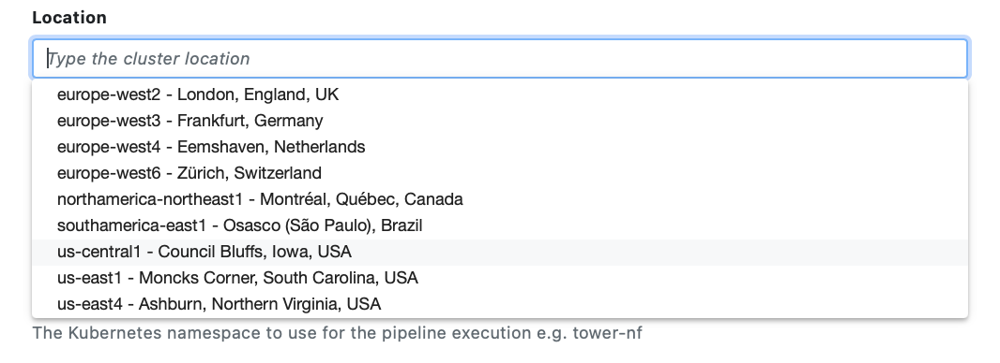

[Google Kubernetes Engine (GKE)](https://cloud.google.com/kubernetes-engine) is a managed Kubernetes cluster that allows the execution of containerized workloads in Google Cloud at scale.

Tower offers native support for GKE clusters and streamlines the deployment of Nextflow pipelines in such environments.

## Requirements

See [here](../compute-envs/google-cloud-batch#configure-google-cloud) for instructions to set up your Google Cloud account and any other services (such as Cloud Storage) that you intend to use.

You need to have a GKE cluster up and running. Make sure you have followed the [cluster preparation](../compute-envs/k8s#cluster-preparation) instructions to create the cluster resources required by Tower. In addition to the generic Kubernetes instructions, you will need to make a few modifications specific to GKE.

### Assign service account role to IAM user

You must grant the cluster access to the service account used to authenticate the Tower compute environment. This can be done by updating the _role binding_:

```yaml
cat << EOF | kubectl apply -f -
---
apiVersion: rbac.authorization.k8s.io/v1
kind: RoleBinding
metadata:
  name: tower-launcher-userbind
subjects:
  - kind: User
    name: <IAM SERVICE ACCOUNT>
    apiGroup: rbac.authorization.k8s.io
roleRef:
  kind: Role
  name: tower-launcher-role
  apiGroup: rbac.authorization.k8s.io
---
EOF
```

In the above snippet, replace `<IAM SERVICE ACCOUNT>` with the corresponding service account, e.g. `test-account@test-project-123456.google.com.iam.gserviceaccount.com`.

For more details, refer to the [Google documentation](https://cloud.google.com/kubernetes-engine/docs/how-to/role-based-access-control).

## Compute Environment

1. In a Tower workspace, select **Compute environments** and then **New environment**.

2. Enter a descriptive name for this environment, e.g., "Google Kubernetes Engine (europe-west1)".

3. From the **Provider** drop-down, select **Google Kubernetes Engine**.

4. From the **Credentials** drop-down, select existing GKE credentials, or add new credentials by selecting the **+** button. If you select to use existing credentials, skip to step 7.

5. Enter a name for the credentials, e.g., "GKE Credentials".

6. Enter the **Service account key** for your Google Service account.

:::tip
You can create multiple credentials in your Tower environment.
:::

7. Select the **Location** of your GKE cluster.

:::caution
GKE clusters can be either _regional_ or _zonal_. For example, `us-west1` identifies the United States West-Coast region, which has three zones: `us-west1-a`, `us-west1-b`, and `us-west1-c`.

        Tower self-completion only shows regions. You should manually edit this field if you are using a zonal GKE cluster.
        

:::

8. Select or enter the **Cluster name** of your GKE cluster.

9. Specify the **Namespace** created in the [cluster preparation](../compute-envs/k8s#cluster-preparation) instructions. This is `tower-nf` by default.

10. Specify the **Head service account** created in the [cluster preparation](../compute-envs/k8s#cluster-preparation) instructions. This is `tower-launcher-sa` by default.

11. Specify the **Storage claim** created in the [cluster preparation](../compute-envs/k8s#cluster-preparation) instructions. This serves as a scratch filesystem for Nextflow pipelines. The storage claim is called `tower-scratch` in each of the provided examples.

12. Apply [**Resource labels**](../resource-labels/overview) to the cloud resources consumed by this compute environment. Workspace default resource labels are prefilled.

13. Expand **Staging options** to include optional pre- or post-run Bash scripts that execute before or after the Nextflow pipeline execution in your environment.

14. You can use the **Environment variables** option to specify custom environment variables for the Head job and/or Compute jobs.

15. Configure any advanced options described below, as needed.

16. Select **Create** to finalize the compute environment setup.

Jump to the documentation for [launching pipelines](../launch/launchpad).

### Advanced options

- The **Storage mount path** is the file system path where the Storage claim is mounted (default: `/scratch`).

- The **Work directory** is the file system path used as a working directory by Nextflow pipelines. It must be the storage mount path (default) or a subdirectory of it.

- The **Compute service account** is the service account used by Nextflow to submit tasks (default: the `default` account in the given namespace).

- The **Pod cleanup policy** determines when to delete terminated pods.

- Use **Custom head pod specs** to provide custom options for the Nextflow workflow pod (`nodeSelector`, `affinity`, etc). For example:

  ```yaml
  spec:
    nodeSelector:
      disktype: ssd
  ```

- Use **Custom service pod specs** to provide custom options for the compute environment pod. See above for an example.

- Use **Head Job CPUs** and **Head Job Memory** to specify the hardware resources allocated for the Nextflow workflow pod.

<!--revisit for k8s CE pages consolidation:

Fusion v2 config options

Did you actually follow this steps during your review?

When I set up my EKS installation a while ago (following @bentsherman 's guide here: https://seqera.io/blog/deploying-nextflow-on-amazon-eks/) I ran into difficulties getting the Tower-EKS link up and had to go off-script to get things working.

We should probably verify nothing changes depending on EKS version (e.g. 1.25). @enekui-->
