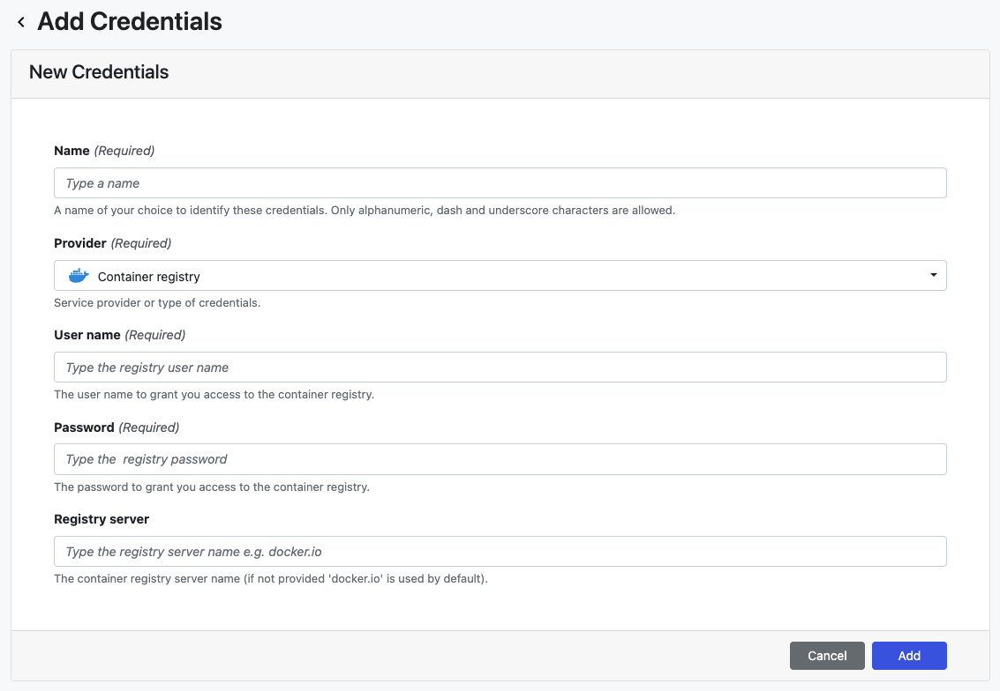

## Container registry credentials

From version 22.3, Tower supports the configuration of credentials for the Nextflow Wave container service to authenticate to private and public container registries. For more information on Wave containers, see [here](https://www.nextflow.io/docs/latest/wave.html).

:::note
Container registry credentials are only leveraged by the Wave containers service. In order for your pipeline execution to leverage Wave containers, add `wave { enabled=true }` either to the **Nextflow config** field on the launch page, or to your nextflow.config file.
:::

### Azure Container Registry access

Azure container registry makes use of Azure RBAC (Role-Based Access Control) to grant users access — for further details, see [Azure container registry roles and permissions](https://learn.microsoft.com/en-us/azure/container-registry/container-registry-roles).

You must use Azure credentials with long-term registry read (**content/read**) access to authenticate Tower to your registry. We recommend a [token with repository-scoped permissions](https://learn.microsoft.com/en-us/azure/container-registry/container-registry-repository-scoped-permissions) that is used only by Tower.

1. In the Azure portal, navigate to your container registry.
2. Under **Repository permissions**, select **Tokens -> +Add**.
3. Enter a token name.
4. Under **Scope map**, select **Create new**.
5. In the **Create scope map** section, enter a name and description for the new scope map.
6. Select your **Repository** from the drop-down menu.
7. Select **content/read** from the **Permissions** drop-down menu, then select **Add** to create the scope map.
8. In the **Create token** section, ensure the **Status** is **Enabled** (default), then select **Create**.
9. Return to **Repository permissions -> Tokens** for your registry, then select the token you just created.
10. On the token details page, select **password1** or **password2**.
11. In the password details section, uncheck the **Set expiration date?** checkbox, then select **Generate**.
12. Copy and save the password after it is generated. The password will be displayed only once.

### Add credentials to Tower

- From an organization workspace: navigate to the Credentials tab and select **Add Credentials**.

- From your personal workspace: select **Your credentials** from the user top-right menu, then select **Add credentials**.

| Property        | Description                                                                                      | Example                 |
| --------------- | ------------------------------------------------------------------------------------------------ | ----------------------- |
| Name            | A unique name for the credentials using alphanumeric characters, dashes, or underscores          | `my-registry-creds`     |
| Provider        | Credential type                                                                                  | Container registry      |
| User name       | Registry token name                                                                              | `my-registry-token`     |
| Password        | Registry token password                                                                          | `OuSrehzUX...ACRDO+2TX` |
| Registry server | The container registry server name (**Settings -> Access keys -> Login server** in Azure portal) | `myregistry.azurecr.io` |

Once the form is complete, select **Add**. The new credential is now listed under the **Credentials** tab.
