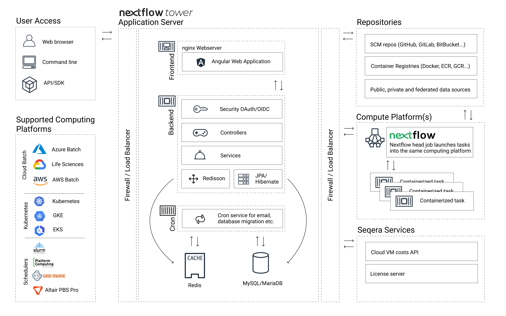
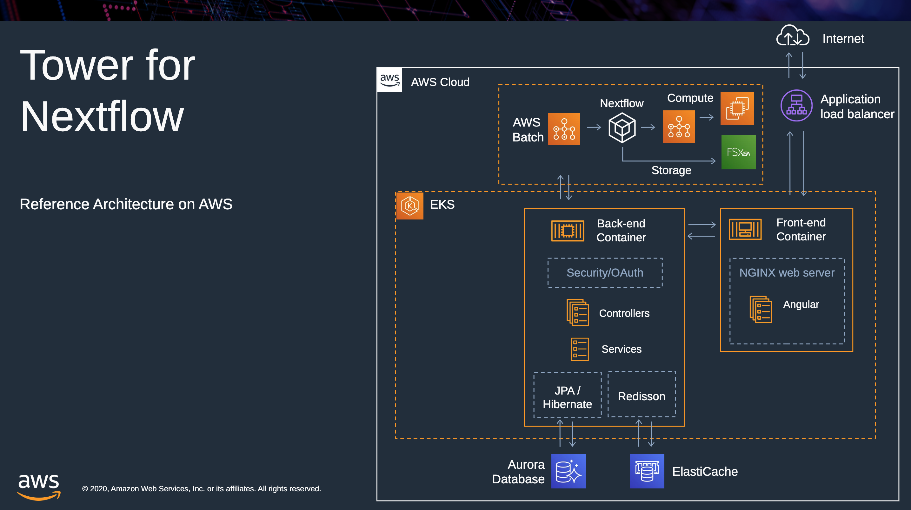

:::tip
Seqera Enterprise requires a license. If you have not already purchased a license, [contact us](https://seqera.io/contact-us/) for more information.
:::

Tower is a web application with a microservice-oriented architecture that is designed to maximize portability, scalability and security.

Tower is composed of several modules that can be configured and deployed according to your organization's requirements. These modules are provided as Docker container images which are securely hosted on several major cloud platforms.

## Architecture

Tower is composed of several Seqera-provided services and standard services that can be provisioned by Tower or by the client.



### Tower backend

The Tower backend is a JVM-based web application based on the [Micronaut](https://micronaut.io/) framework, which provides a modern and secure backbone for the application.

The backend implements the main application logic, which is exposed via a REST API and defined via an OpenAPI schema. The backend uses JPA/Hibernate/JDBC API industry standards to interact with the underlying relational database.

The backend can be run standalone or as multiple replicas for scalability when deployed in high-availability mode. It should run on port `8080`.

### Tower cron

Tower cron is an auxiliary backend service that executes regularly-occurring activities, such as sending email notifications and cleaning up stale data. The cron service also performs database migrations at startup.

### Tower frontend

The Tower frontend is an NGINX web server that serves the [Angular](https://angular.io/) application and reverse-proxies HTTP traffic to the Tower backend. The frontend should run on port `80` within the container, and it should be the only service that accepts incoming HTTP traffic. The frontend can also be exposed via HTTPS or a load balancer.

### Redis database

Tower requires a Redis database for caching purposes.

### SQL database

Tower requires a SQL database to persist user activities and state. Tower has been tested against MySQL 5.7. Please contact Seqera support if you would like to use a different JDBC-compliant SQL database.

### SMTP service

Tower requires a SMTP relay to send email messages and user notifications.

### Authentication service (optional)

Tower supports enterprise authentication mechanisms such as OAuth and OpenID. Third-party identity providers and custom single sign-on flows can be developed according to specific customer requirements.

## Deployment options

Tower can be deployed to a single node (via Docker Compose or natively), or to a Kubernetes cluster. This documentation includes instructions for both options across multiple platforms, including AWS, Azure, Google Cloud, and on-prem infrastructure.

### Single-node

The minimal Tower deployment requires only the frontend, backend, and database services. These services can be deployed as Docker containers or as native services.

### Kubernetes

Kubernetes is emerging as the technology of choice for deploying applications that require high-availability, scalability, and security. Tower Enterprise includes configuration manifests for Kubernetes deployment.


_Reference architecture diagram of Tower on AWS using Elastic Kubernetes Service (EKS)_

## Tower container images

Nextflow Tower is distributed as a collection of Docker containers available through the Seqera Labs
container registry [`cr.seqera.io`](https://cr.seqera.io). Contact [support](https://support.seqera.io) to get your container access credentials. Once you have received your credentials, log in to the registry using these steps:

1. Retrieve the **name** and **secret** values from the JSON file you received from Seqera Labs support.

2. Authenticate to the registry (using the `name` and `secret` values copied in step 1):

   ```bash
   docker login -u '<NAME>' -p '<SECRET>' cr.seqera.io
   ```

3. Pull the Nextflow Tower container images:

   ```bash
   docker pull {{ images.tower_be_image }}

   docker pull {{ images.tower_fe_image }}
   ```

:::caution
The Seqera Labs container registry `cr.seqera.io` is the default Tower container image registry from version 22.4. Use of the AWS, Azure, and Google Cloud Tower image registries in existing installations is still [supported](./advanced-topics/seqera-container-images), but will be deprecated for **new installations** starting June 2023.
:::

## Support

For further information, contact [Seqera support](mailto:support@seqera.io) via email or the support channel provided as part of the Tower Enterprise License agreement.
