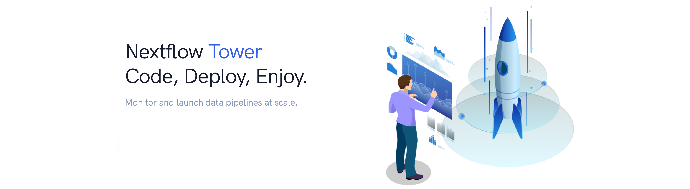
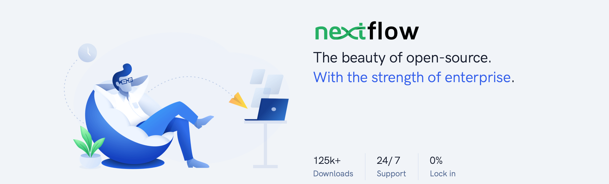

Tower is available in two deployment editions and can be accessed via web UI, [API](../api/overview.mdx), [CLI](../cli/cli.mdx), or directly in your Nextflow command using a flag.

## Tower editions

### Cloud

The hosted Cloud edition of Tower is available free of charge at [cloud.tower.nf](https://tower.nf/login) — log in with your GitHub or Google credentials.

Cloud is recommended for users who are new to Tower. It's an ideal choice for individuals and organizations looking to set up quickly. The service is hosted by Seqera. See [Community showcase](../getting-started/community-showcase.mdx) for instructions to launch your first pipeline. Tower Cloud has a limit of five concurrent workflow runs per user.



### Enterprise

[Tower Enterprise](../enterprise/index.mdx) is installed in an organization's own cloud or on-premises infrastructure. It includes:

- Monitoring, logging, and observability
- Pipeline execution Launchpad
- Cloud resource provisioning
- Pipeline actions and event-based execution
- LDAP & OpenID authentication
- Enterprise role-based access control (RBAC)
- Full-featured API
- Dedicated support for Nextflow and Tower

To install Tower in your organization's infrastructure, [contact us](https://cloud.tower.nf/demo/) for a demo to discuss your requirements.



## Tower usage methods

You can access Tower through the web user interface, the [API](../api/overview.mdx), the [CLI](../cli/cli.mdx), or in Nextflow directly using the `-with-tower` option.

### Tower UI

1. Create an account and log in to Tower, available free of charge at [cloud.tower.nf](https://cloud.tower.nf).

   :::note
   Tower login sessions remain active as long as the application browser window remains open and active. When the browser window is terminated, automatic logout occurs within 6 hours by default.
   :::

2. Create and configure a new [compute environment](../compute-envs/overview.mdx).

3. Start [launching pipelines](../launch/launchpad.mdx).

### Tower API

See [API](../api/overview.mdx).

### Tower CLI

See [CLI](../cli/cli.mdx).

### Nextflow `-with-tower`

If you have an existing environment where you run Nextflow directly, you can still leverage Tower capabilities by executing your Nextflow run with a `with-tower` flag.

1. Create an account and log in to Tower.
2. From your personal workspace, select **Your tokens** from **Settings** in the user top-right menu.
3. Select **Add token**.
4. Enter a unique name for your token, then select **Add**.
5. Copy and store your token securely.

:::caution
The access token will be displayed only once. Save the token value before closing the **Personal Access Token** window.
:::

6. Open a terminal and create environment variables to store the Tower access token and Nextflow version:

   ```bash
   export TOWER_ACCESS_TOKEN=eyxxxxxxxxxxxxxxxQ1ZTE=
   export NXF_VER=23.1.3
   ```

7. Replace `eyxxxxxxxxxxxxxxxQ1ZTE=` with your newly-created token.

:::note
Bearer token support requires Nextflow version 20.10.0 or later. Set with the `NXF_VER` environment variable.
:::

8. To submit a pipeline to a [workspace](./workspace.mdx) using Nextflow, add the workspace ID to your environment:

   ```bash
   export TOWER_WORKSPACE_ID=000000000000000
   ```

   To find your workspace ID, select your organization in Tower and navigate to the **Workspaces** tab.

9. Run your Nextflow pipeline with the `-with-tower` flag:

   ```bash
   nextflow run main.nf -with-tower
   ```

   Replace `main.nf` with the filename of your Nextflow script.

   You can now monitor your workflow runs in Tower.

To configure and execute Nextflow pipelines in cloud environments, see [compute environments](../compute-envs/overview.mdx).

:::tip
See the [Nextflow documentation](https://www.nextflow.io/docs/latest/config.html?highlight=tower#scope-tower) for further run configuration options using Nextflow configuration files.
:::
