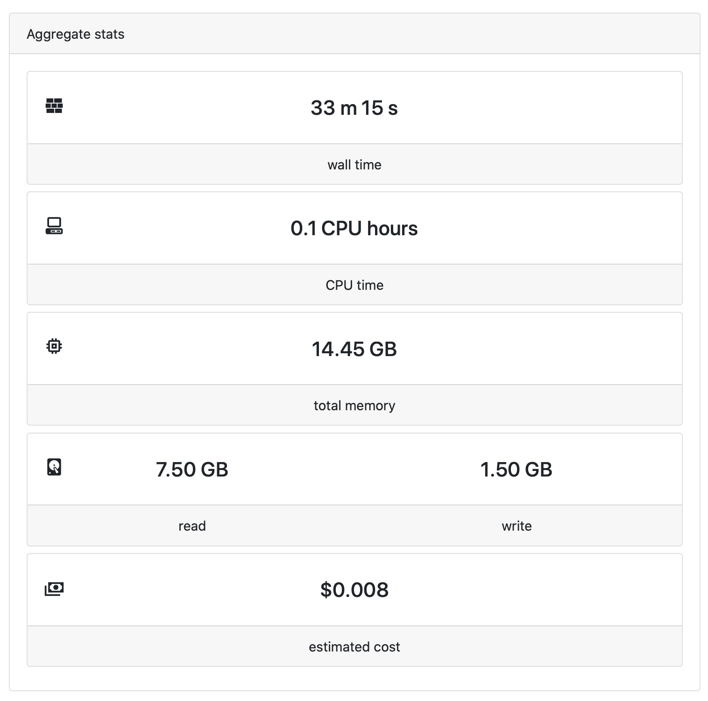
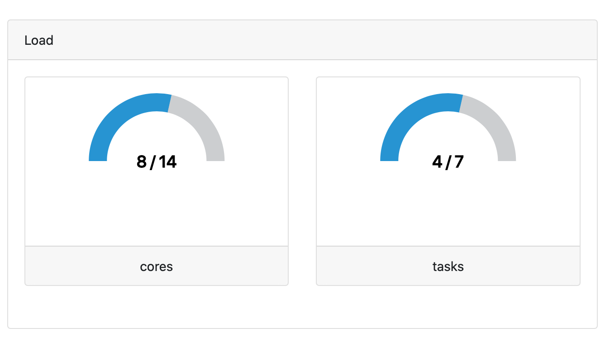
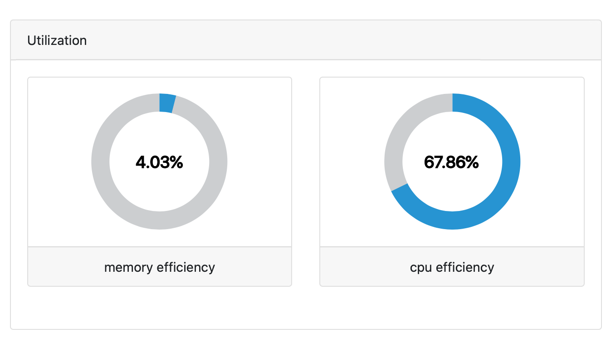

## Aggregate stats

The **Aggregate stats** panel displays a real-time summary of the resources used by a pipeline run.

### Wall time

The _wall time_ is the total running time for all tasks. The runtime of an individual task is computed as follows:

$$
\text{Task runtime} = \text{Task complete} - \text{Task start}
$$

See also: **start** and **complete** in the task table.

### CPU time

The _CPU time_ is the total CPU time used by all tasks. It is based on the CPUs _requested_, not the actual CPU usage. The CPU time of an individual task is computed as follows:

$$
\text{CPU time (CPU-hours)} = \text{Task CPUs} \times \text{Task runtime}
$$

See also: **cpus**, **start**, and **complete** in the task table.

### Total memory

The _total memory_ is the total memory used by all tasks. It is based on the memory _requested_, not the actual memory usage.

See also: **peakRss** in the task table.

### Read and write

The _read_ and _write_ are the total amount of data read from and written to storage.

See also: **readBytes** and **writeBytes** in the task table.

### Estimated cost

The **estimated cost** is the total estimated compute cost of all tasks in the pipeline run. The compute cost of a task is computed as follows:

$$
\text{Task cost} = \text{VM hourly rate} \times \text{VM fraction} \times \text{Task runtime}
$$

$$
\quad \text{VM fraction} = \text{max} ( \frac{\text{Task CPUs}}{\text{VM CPUs}}, \frac{\text{Task memory}}{\text{VM memory}} )
$$

$$
\quad \text{Task runtime} = ( \text{Task complete} - \text{Task start} )
$$

See also: **cost**, **start**, **complete**, **cpus**, and **memory** in the task table.

Tower uses a database of prices for AWS and Google Cloud, across all instance types, regions, and zones, to fetch the VM price for each task. This database is updated periodically to reflect the most recent prices.

:::note
Prior to Tower Enterprise 22.4.x, the cost estimate used `realtime` instead of `complete` and `start` to measure the task runtime. The `realtime` metric tends to underestimate the billable runtime because it doesn't include the time required to stage input and output files.
:::

The estimated cost is subject to several limitations:

- It does not account for the cost of storage, network, the head job, or how tasks are mapped to VMs. As a result, it tends to underestimate the true cost of a pipeline run.

- On a resumed pipeline run, the cost of cached tasks is included in the estimated cost. As a result, the total cost of multiple attempts of a pipeline run tends to overestimate the actual cost, because the cost of cached tasks may be counted multiple times.

For accurate cost accounting, you should use the cost reporting tools for your cloud provider (such as AWS Cost Explorer). You can use [Resource labels](../resource-labels/overview) in your compute environments to annotate and track the actual cloud resources consumed by a pipeline run.

## Load

The **Load** panel displays the current number of running tasks and CPU cores vs the maximum number of tasks and CPU cores for the entire pipeline run. In the example below, there are 4 tasks with a total of 8 CPU cores currently running, and during the pipeline run there have been at most 7 tasks with 14 CPU cores running at one time.

These metrics measure the level of parallelism achieved by the pipeline. You can use these metrics to determine whether your pipeline runs are fully utilizing the capacity of your compute environment.

## Utilization

The **Utilization** panel displays the average resource utilization of all tasks that have completed successfully in a pipeline run. The CPU and memory efficiency of a task are computed as follows:

$$
\text{CPU efficiency (\%)} = \text{CPU usage (\%)} \times \text{Task CPUs}
$$

$$
\text{Memory efficiency (\%)} = \frac{ \text{Peak memory usage} }{ \text{Task memory} } \times \text{100 \%}
$$

See also: **pcpu**, **cpus**, **peakRss**, and **memory** in the task table.

These metrics measure how efficiently the pipeline is using its compute resources. Low utilization indicates that the pipeline might be requesting too many resources for some tasks.

