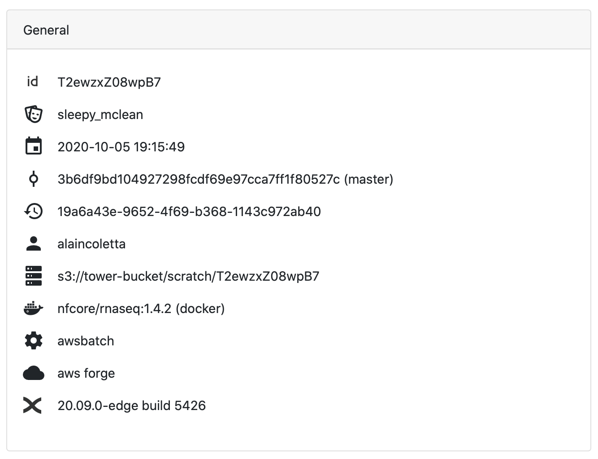
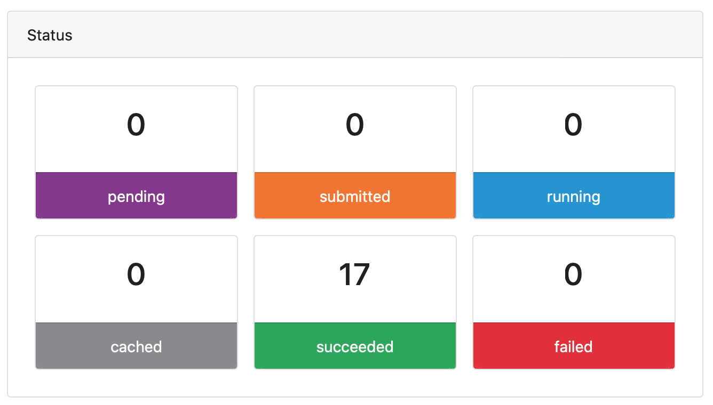

## General summary

The **General** panel displays top-level information about a pipeline run:

- Unique workflow run ID
- Workflow run name
- Timestamp of pipeline start
- Project revision and Git commit ID
- Nextflow session ID
- Username of the launcher
- Work directory path
- Container image
- Executor
- Compute environment details
- Resource labels
- Nextflow version

:::tip
You can hover over each item with the cursor to show a description. Hovering over the compute environment also shows more details about that compute environment.
:::

## Task status

The **Status** panel provides a real-time summary of all tasks in the pipeline run.

The possible task statuses can be described as follows:

- **pending**: the task has been created but not yet submitted to an executor
- **submitted**: the task has been submitted to an executor but is not yet running
- **running**: the task has been launched by an executor (the exact meaning of "running" may vary for each executor)
- **cached**: a previous (and valid) execution of the task was found and used instead of executing the task again
- **completed**: the task completed successfully
- **failed**: the task failed

