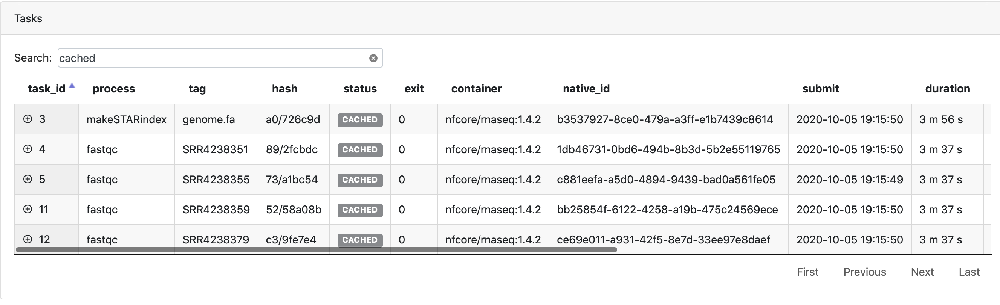
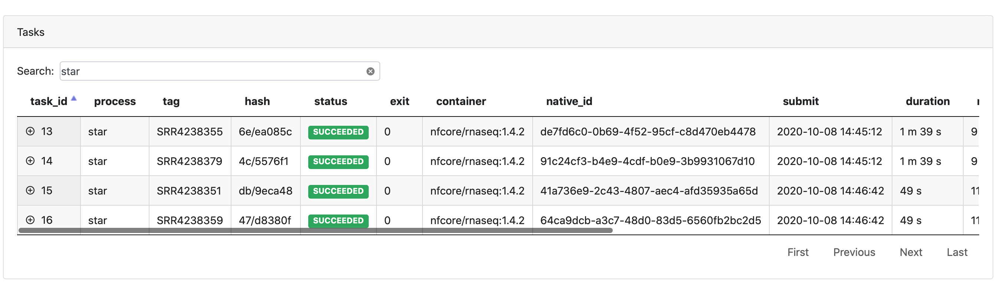
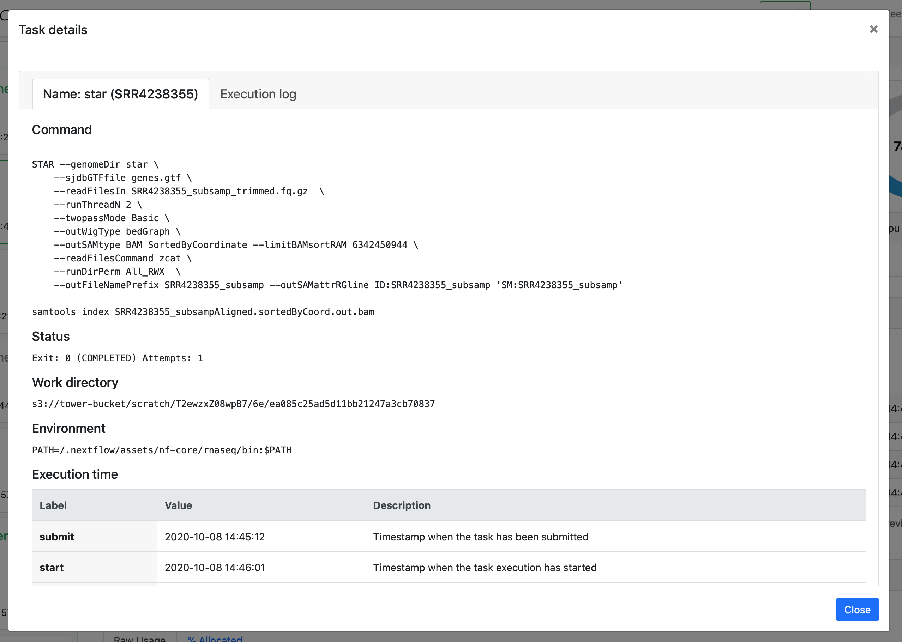
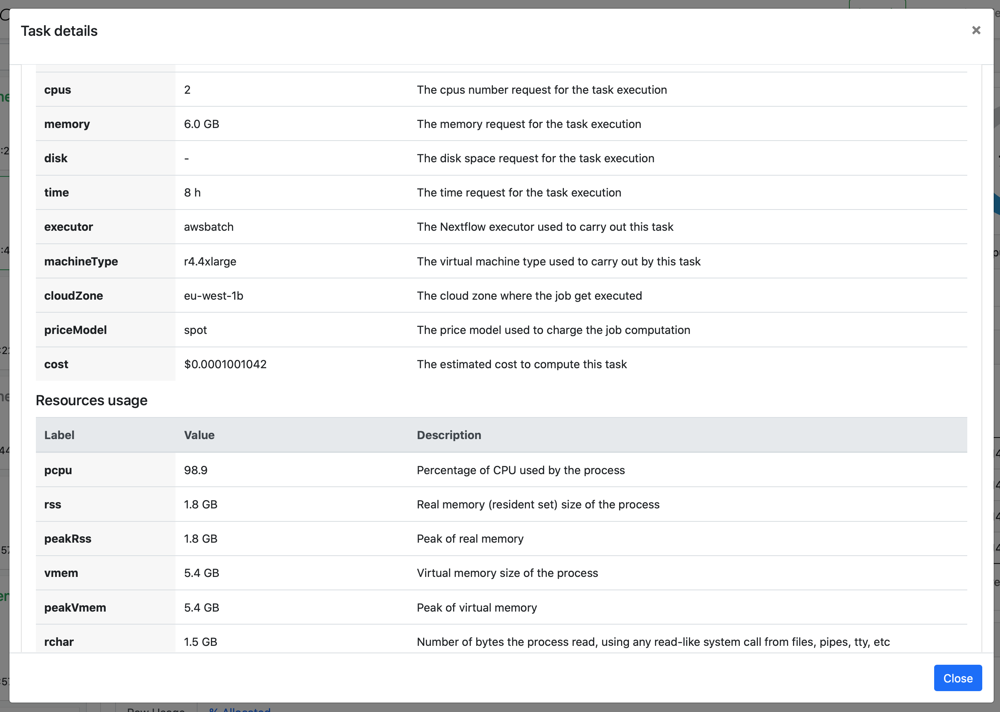
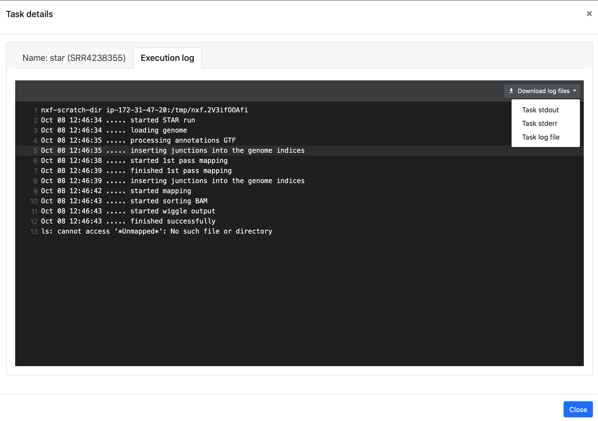
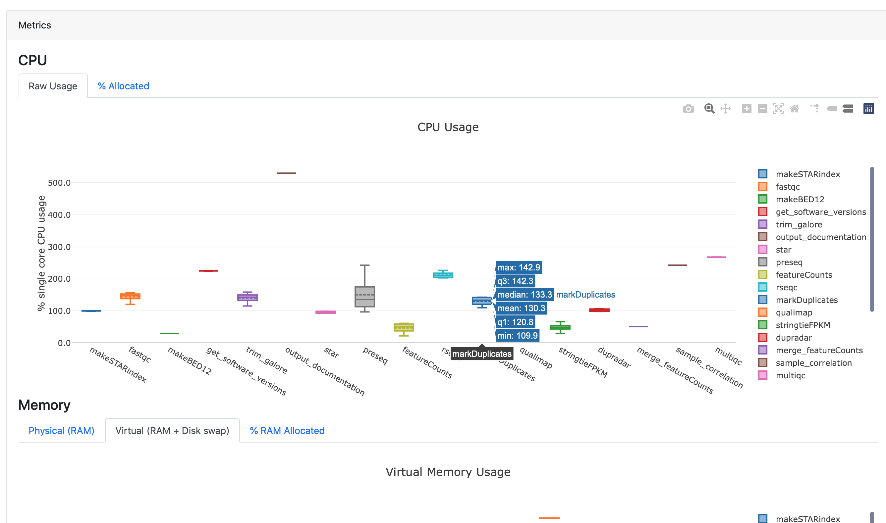

## Tasks

The **Tasks** panel shows all the tasks that were executed in a pipeline run.

### Searching and filtering

You can use the search bar to filter tasks by process name, tag, hash, status, etc.

Select a status in the **status** column to filter the task table by the selected status. For example, select the status of a cached task to display all cached tasks, as shown below.

Select a process in the **Processes** panel to filter the task table by the selected process.

### Task details

Select a task in the task table to open the **Task details** dialog. The dialog has two tabs, **About** and **Execution log**.

#### About

The **About** tab provides the following information:

- **Name**: Process name and tag

- **Command**: Task script as defined in the pipeline process

- **Status**: Exit code, task status, attempts

- **Work directory**: Directory in which the task was executed

- **Environment**: Environment variables that were supplied to the task

- **Execution time**: Metrics for when the task was submitted, started, and completed

- **Resources requested**: Metrics for the resources requested by the task

- **Resources used**: Metrics for the resources used by the task

#### Execution log

The **Execution log** tab provides a realtime log of the selected task. It can be very useful for troubleshooting. If the log is still available in your compute environment, you can download it, as well as other logs such as the task `stdout` and `stderr`.

## Metrics

The **Metrics** panel displays interactive plots for CPU usage, memory usage, task duration, and I/O usage, grouped by process. Use these plots to quickly inspect a pipeline run to ensure that an appropriate amount of resources were requested and used for each process.

:::tip
Hover the cursor over each box plot to show more details.
:::

