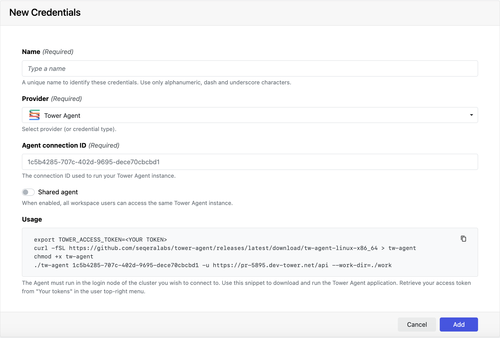

[Tower Agent](../supported_software/agent/overview) enables Seqera Platform to launch pipelines on HPC clusters that do not allow direct access through an SSH client. Tower Agent authenticates a secure connection with Seqera using a Tower Agent credential.

## Tower Agent sharing

You can share a single Tower Agent instance with all members of a workspace. Create a Tower Agent credential, with **Shared agent** enabled, in the relevant workspace. All workspace members can then use this credential (Connection ID + Seqera access token) to use the same Tower Agent instance.

## Create a Tower Agent credential

- From an organization workspace: Go to the **Credentials > Add Credentials**.
- From your personal workspace: From the user menu, go to **Your credentials > Add credentials**.

| Property            | Description                                                                                                                                                           | Example                                |
| ------------------- | --------------------------------------------------------------------------------------------------------------------------------------------------------------------- | -------------------------------------- |
| Name                | A unique name for the credentials using alphanumeric characters, dashes, or underscores.                                                                              | `my-agent-creds`                       |
| Provider            | Credential type                                                                                                                                                       | Tower Agent                            |
| Agent connection ID | The connection ID used to run your Tower Agent instance. Must match the connection ID used when running the Agent (see **Usage** below).                              | `5429d66d-7712-xxxx-xxxx-xxxxxxxxxxxx` |
| Shared agent        | Enables Tower Agent sharing for all workspace members.                                                                                                                |                                        |
| Usage               | Populates a code snippet for Tower Agent download with your connection ID. Replace `<YOUR TOKEN>` with your [Seqera access token](../api/overview#authentication). |                                        |

When you've completed all the form fields, select **Add**. The new credential is now listed under the **Credentials** tab.
