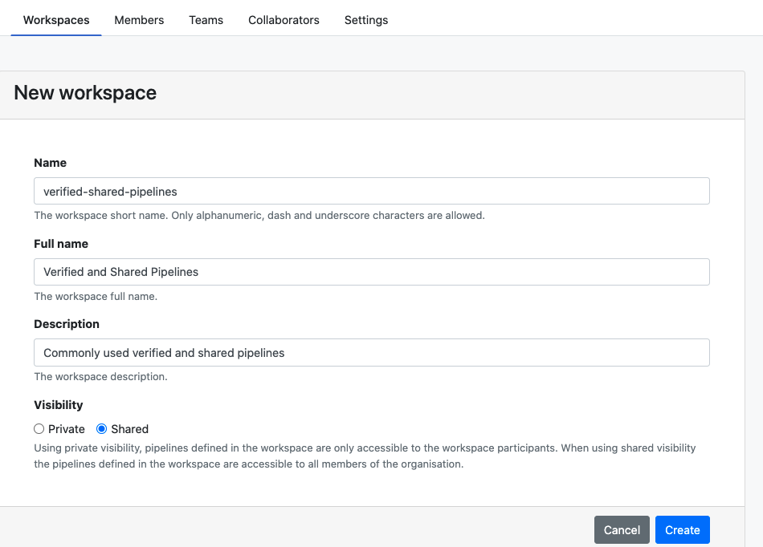

Seqera Platform introduces the concept of shared workspaces as a solution for synchronization and resource sharing within an organization. A shared workspace enables the creation of pipelines in a centralized location, making them accessible to all members of an organization.

The benefits of using a shared workspace within an organization include:

- **Define once and share everywhere**: Set up shared resources once and automatically share them across the organization.
- **Centralize the management of key resources**: Organization administrators can ensure the correct pipeline configuration is used in all areas of an organization without needing to replicate pipelines across multiple workspaces.
- **Immediate update adoption**: Updated parameters for a shared pipeline become immediately available across the entire organization, reducing the risk of pipeline discrepancies.
- **Computational resource provision**: Pipelines in shared workflows can be shared along with the required computational resources. This eliminates the need to duplicate resource setup in individual workspaces across the organization. Shared workspaces centralize and simplify resource sharing within an organization.

### Create a shared workspace

Creating a shared workspace is similar to the creation of a private workspace, with the exception of the **Visibility** option, which must be set to **Shared**.

### Create a shared pipeline

When you create a pipeline within a shared workspace, associating it with a [compute environment](../compute-envs/overview) is optional.

If a compute environment from the shared workspace is associated with the pipeline, it will be available to users in other workspaces who can launch the shared pipeline using the provided environment by default.

### Use shared pipelines from a private workspace

Once a pipeline is set up in a shared workspace and associated with a compute environment within that shared workspace, any user can launch the pipeline from a private workspace using the shared workspace's compute environment. This eliminates the need for users to replicate shared compute environments in their private workspaces.

:::note
The shared compute environment will not be available to launch other pipelines limited to that specific private workspace.
:::

If a pipeline from a shared workspace is shared **without** an associated compute environment, users from other workspaces can run it from their local workspaces. By default, the **primary** compute environment of the local workspace will be selected.

### Make shared pipelines visible in a private workspace

To view pipelines from shared workspaces, go to the [Launchpad](../launch/launchpad) and set the **Filter > Pipelines from** option to **This and shared workspaces**.

:::note
Currently, the pipelines from _all_ shared workspaces are visible when the visibility is set to **Shared workspaces**.
:::
