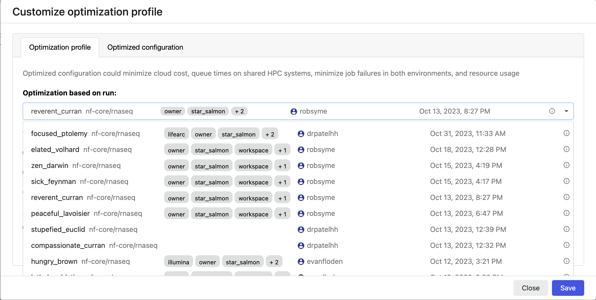

**Available from version 23.3.0**

Pipeline resource optimization takes the resource usage information from previous workflow runs to optimize subsequent runs.

When a run completes successfully, an _optimized profile_ is created. This profile consists of Nextflow configuration settings for each process and each resource directive (where applicable): `cpus`, `memory`, and `time`. The optimized setting for a given process and resource directive is based on the maximum use of that resource across all tasks in that process.

:::caution
While pipeline resource optimization has been tested extensively in Seqera Cloud, it's a beta feature in Seqera Enterprise. Due to the variability of production pipeline data inputs, optimization results may vary per run. The optimization profile can be updated or removed from your pipeline if you experience unexpected results. Contact [support](https://support.seqera.io) for further assistance.
:::

## Optimize a pipeline

On the **Launchpad**, you'll see a lightbulb icon on each pipeline that can be optimized. Any pipeline with at least one successful run can be optimized.

1. Select the lightbulb icon to open the pipeline resource optimization configuration menu.

2. Select a previous run from the dropdown. You can select any successful run.

3. Select which **Targets** to optimize.

4. Enable **Retry with dynamic resources** for failed tasks to be retried with increased resources. This option is useful if an optimized setting is too low and causes a task to fail.

5. Select the **Optimized configuration** tab to preview your configuration.

6. Select **Save** to save the optimized configuration and enable it for the pipeline. All subsequent launches of the pipeline will use the optimized configuration.

You can also toggle the optimized profile from the pipeline detail page.

**Verify the optimized configuration**

You can verify the optimized configuration of a given run by inspecting the resource usage plots for that run and these fields in the run's task table:

- CPU usage: `pcpu`
- Memory usage: `peakRss`
- Runtime: `start` and `complete`

**Override the optimized configuration**

While the optimized configuration is applied after the base configuration of the pipeline, it can be overridden by the **Nextflow config file** text box. Ensure there are no conflicting settings in this text box, unless you explicitly want to override some optimization settings.

**Handle large variations in resource usage**

Each optimized profile is calibrated to a specific run, so it can only be used safely for "similar" runs. Whether a new run is "similar" is subjective, but in general, an optimized profile should only be used for runs that use the same [**compute environment**](../compute-envs/overview) and have similar task-level resource requirements.

However, it's common for a pipeline to process input files that vary widely in size. In this case, the task-level resource requirements may vary widely for a given process, and the optimized profile may not be accurate or efficient.

The best way to handle this variation is to create multiple optimized profiles for specific ranges of input sizes. Here is an example strategy:

1. Separate your input files into "bins" based on their size, e.g., _small_, _medium_, and _large_. Duplicate your pipeline in the **Launchpad** for each bin.

2. For each bin, run the pipeline with a few representative samples from that bin. When the run completes, Seqera automatically creates an optimized profile for it.

3. Configure and enable the optimized profile for each pipeline.

You now have multiple optimized profiles to handle a variety of input sizes. Although this example uses three bins, you can use as many or as few bins as you need to handle the variation of your input data.
