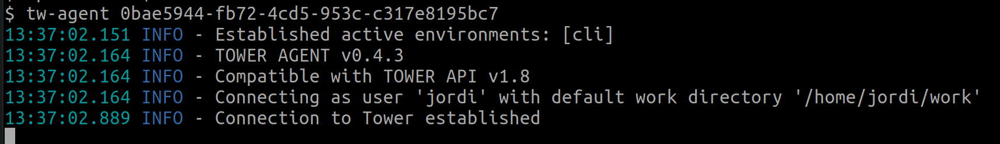

Tower Agent enables Seqera Platform to launch pipelines on HPC clusters that don't allow direct access through an SSH client.

Tower Agent is a standalone process that runs on a node that can submit jobs to the cluster (e.g., a login node). It establishes an authenticated secure reverse connection with Seqera, allowing Seqera to submit and monitor new jobs. The jobs are submitted on behalf of the user running the agent.

### Installation

Tower Agent is distributed as a single executable file to simply download and execute.

1. Download the latest release from [GitHub](https://github.com/seqeralabs/tower-agent) and make the file executable:

   ```bash
   curl -fSL https://github.com/seqeralabs/tower-agent/releases/latest/download/tw-agent-linux-x86_64 > tw-agent
   chmod +x ./tw-agent
   ```

2. (Optional) Move it to a folder that's in your $PATH.

### Quickstart

Before running the Agent:

1. Create a [**personal access token**](../../api/overview.mdx#authentication).

2. Create [Tower Agent credentials](../../credentials/agent_credentials.mdx) in a Seqera Platform workspace.

:::note
To share a single Tower Agent instance with all members of a workspace, create a Tower Agent credential with **Shared agent** enabled.
:::

When you create the credentials, you receive an _Agent Connection ID_. You can use the default ID or enter a custom ID. The connection ID in the workspace credentials must match the ID entered when you run the agent.


The agent should always be running in order to accept incoming requests from Seqera. We recommend that you use a terminal multiplexer like [tmux](https://github.com/tmux/tmux) or [GNU Screen](https://www.gnu.org/software/screen/), so that it keeps running even if you close your SSH session.

```bash
export TOWER_ACCESS_TOKEN=<YOUR TOKEN>
./tw-agent <YOUR CONNECTION ID>
```



### Tips

- If you're using the agent with Seqera Platform Enterprise (on-prem), you can set the API URL using the `TOWER_API_ENDPOINT` environment variable or the `--url` option.
- By default, the Agent uses the folder `${HOME}/work` as the Nextflow work directory. You can change this using the `--work-dir` option.
- The work directory _must_ exist before running the agent.
- You can also change the work directory in Seqera when you create a compute environment or launch a pipeline.

### Usage

```bash
Usage: tw-agent [OPTIONS] AGENT_CONNECTION_ID

Nextflow Tower Agent

Parameters:
*     AGENT_CONNECTION_ID    Agent connection ID to identify this agent.

Options:
* -t, --access-token=<token> Tower personal access token. If not provided, the TOWER_ACCESS_TOKEN variable will be used.
  -u, --url=<url>            Tower server API endpoint URL. If not provided TOWER_API_ENDPOINT variable will be used [default: https://api.cloud.seqera.io].
  -w, --work-dir=<workDir>   Default path where the pipeline scratch data is stored. It can be changed when launching a pipeline from Tower [default: ~/work].
  -h, --help                 Show this help message and exit.
  -V, --version              Print version information and exit.
```
