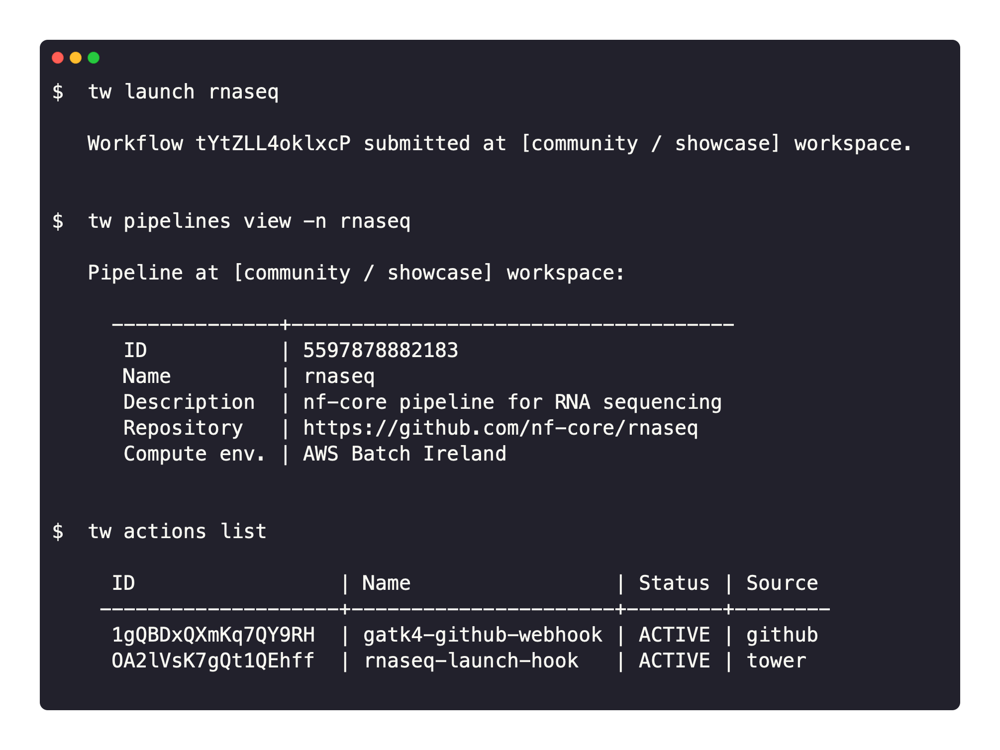

import Tabs from '@theme/Tabs';
import TabItem from '@theme/TabItem';

Seqera Platform CLI brings concepts like pipelines and compute environments to the terminal.

The CLI interacts with Platform to provide an interface to launch pipelines, manage cloud resources, and administer your analysis.

## Key features

- **A Nextflow-like experience**: tw CLI provides a developer-friendly environment. Pipelines can be launched with the CLI similarly to Nextflow but with the Platform benefits of monitoring, logging, resource provisioning, dataset management, and collaborative sharing.

- **Infrastructure as Code**: All Platform resources, including pipelines and compute environments, can be described in a declarative manner. This enables a complete definition of an analysis environment that can be versioned and treated as code. It greatly simplifies configuration sharing and routine administration.

- **Built on OpenAPI**: tw CLI interacts with Platform via the [Seqera Platform API](https://cloud.seqera.io/openapi/index.html) which uses the OpenAPI 3.0 specification. The CLI provides full control of the Platform application, allowing users to get maximum insights into pipeline submissions and execution environments.

## Availability

The CLI can be installed on macOS, Windows, and Linux. It is compatible with [Seqera Platform Cloud](https://cloud.seqera.io/) and Enterprise versions 21.08 and later.

See [Installation](./installation) to get started.
