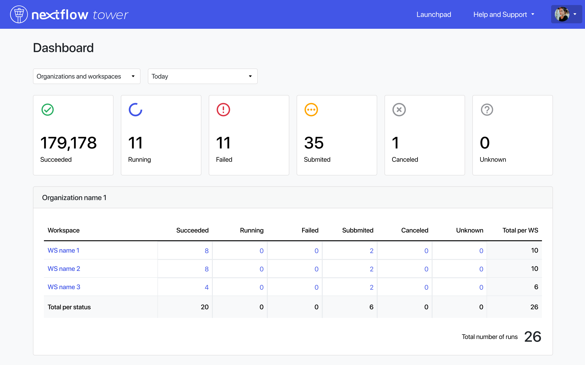

# Release notes for version 22.3.x

## New features

### Resource labels

Tower now supports applying [resource labels](../../resource-labels/overview.mdx) to compute environments and other Tower elements. This offers a flexible tagging system for annotation and tracking of the cloud services consumed by a run.

Resource labels are sent to the service provider for each cloud compute environment in `key=value` format. They can be created, edited, and applied by a workspace admin or owner.

**Note**: Resource labels modified on your cloud provider platform do not update in Tower automatically.

### Dashboard

Tower 22.3 introduces a [dashboard](../../monitoring/dashboard.mdx) interface to view total runs and run status, filtered by organization or user workspace. This facilitates overall run status monitoring and early detection of execution issues.

Select **Dashboard** from the user menu in the Tower web UI.

### Google Batch support

Tower now supports [Google Cloud Batch](../../compute-envs/google-cloud-batch.mdx) compute environments. Google Cloud Batch is a comprehensive cloud service suitable for multiple use cases, including HPC, AI/ML, and data processing. Tower now provides an integration with your existing Google Cloud account via the Batch API. While it is similar to the Google Cloud Life Sciences API, Google Cloud Batch offers a broader set of capabilities.

Google Cloud Batch automatically provisions resources, manages capacity, and allows batch workloads to run at scale. The API has built-in support for data ingestion from Google Cloud Storage buckets. This makes data ingestion and sharing datasets efficient and reliable.

This is a Beta Tower feature — more capability will be added as [Nextflow Google Cloud Batch support](https://www.nextflow.io/blog/2022/deploy-nextflow-pipelines-with-google-cloud-batch.html) evolves.

### Admin panel enhancements

The Tower [admin panel](../../administration/overview.mdx) now provides additional user and organization management features.

- From the **Users** tab, admins can view all users, assign or remove users, and change user roles within an organization.
- From the **Organizations** tab, admins can view organizations, assign or remove users, and manage the user roles within an organization.

### Resource optimization (technology preview)

Tower Cloud now supports cloud resource optimization when running pipelines. Using the extensive resource usage data which Tower already collects for each pipeline run, a set of per-process resource recommendations is generated and can be applied to subsequent runs. This feature is geared to optimize resource use significantly, while being conservative enough to ensure that pipelines run reliably.

This feature is currently only available on Tower Cloud (tower.nf). For more information about this optional feature, [contact us](mailto:support@seqera.io).

### Wave containers (technology preview)

Tower now supports the Nextflow [Wave](https://www.nextflow.io/docs/latest/wave.html) container provisioning and augmentation service. When a pipeline is run in Nextflow using Wave, the Wave service uses a Dockerfile stored in the process directory to build a container in the target registry. When the container to be used for process execution is returned, the Wave service can add functional layers and data on-the-fly before it is returned to Nextflow for actual process execution.

Wave also enables the use of private container registries in Nextflow — [registry credentials](../../credentials/overview.mdx) stored in Tower are used to authenticate to private container registries with the Wave service.

The [Wave container provisioning service](https://seqera.io/wave/) is available free of charge as a technology preview to all Nextflow and Tower users. During the preview period, anonymous users can build up to 10 container images per day and pull 100 containers per hour. Tower authenticated users can build 100 container images per hour and pull 1000 containers per minute. After the preview period, we plan to make the Wave service available free of charge to academic users and open-source software (OSS) projects.

See [here](https://www.nextflow.io/blog/2022/rethinking-containers-for-cloud-native-pipelines.html) for an introductory overview of Wave containers on the Nextflow blog, and [here](https://youtu.be/PTbiCVq0-sE?t=661) for a live demo and introduction of Wave from the Nextflow 2022 Summit, by Seqera Labs co-founder and CTO Paolo di Tommaso.

This feature is currently only available on Tower Cloud (tower.nf). For more information about this optional feature, [contact us](mailto:support@seqera.io).

### Fusion file system (technology preview)

Fusion is a virtual distributed file system which allows data hosted in AWS S3 buckets to be accessed directly by the file system interface used by pipeline tools. This means that Nextflow pipelines can use an S3 bucket as the work directory and pipeline tasks can access the S3 bucket natively as a local file system path.

Fusion, as used by the Wave container provisioning service, is available free of charge as a technology preview to all Nextflow and Tower users. After the preview period, we plan to make the service available free of charge to academic users and open-source software (OSS) projects.

This feature is currently only available on Tower Cloud (tower.nf). For more information about this optional feature, [contact us](mailto:support@seqera.io).

### Other enhancements

- Owners have full permissions for all workspaces in their organization
- Navigation restyling
- Launch/relaunch form allows head node resource customization
- Runs page supports task name search in Tasks table
- Expand boot EBS volume size
- Label and resource label APIs are now exposed
- The amount of usable datasets (and dataset versions) per organization has been raised to 100 records by default
- Customize head node resources from the launch/relaunch form
  - As a user (with maintainer permissions) it is now possible to launch a pipeline in a Tower cloud environment, specifying the head node resources (memory and CPU) from the launch form. This allows you to properly dimension resources and avoid pipeline crashes. This feature is available for AWS, Google Life Sciences, and Kubernetes Compute Environments
- The **Revision** field in the launch form has been extended to allow a maximum length of 100 characters
- Improve SSH connector resilience + UGE qstat

## Fixes

- `BitBucketServer` Git provider
- Container registry name
- Missing file existence check for Google Life Sciences
- Resume functionality on Google Life Sciences
- Improved error traceability when an exception occurs in the prerun script block
- Fixed a bug that prevented a run to be resumed for users with launch permissions
- Saving status for a job fails when a DB exception occurs
- Escape qstat command for Altair PBS batch scheduler

## Breaking changes and warnings

### Breaking changes

- In previous versions, some assets required by Batch Forge were downloaded from S3 bucket named `nf-xpack.s3.eu-west-1.amazonaws.com`. As of version 22.3.x, those assets are now downloaded from `[https://nf-xpack.seqera.io](https://nf-xpack.seqera.io/)`. Make sure your network policy allows access to the seqera.io domain.

- Use of the resource labels feature with AWS Batch requires an update of the IAM policy used by the account running Tower. The required changes can be found [here](https://github.com/seqeralabs/nf-tower-aws/commit/65b4659d93c0639ea95cc96369865b328a17bb15).

- In previous versions, if Tower was configured to [authenticate to AWS via instance role](https://install.tower.nf/22.3/advanced-topics/use-iam-role/), Batch Forge would assign this same IAM Role as the [Head Job role and Compute Job role](https://docs.seqera.io/platform-cloud/23.3.0/compute-envs/aws-batch/#advanced-options) of the AWS Batch compute environment it created. As of version 22.3.1, you must explicitly assign these job roles during the AWs Batch compute environment creation process.

### Warnings

1.  This version requires all database connections to use the following configuration value: `TOWER_DB_DRIVER=org.mariadb.jdbc.Driver`.
    Please update your configuration if you are upgrading. All other database configuration values should remain unchanged.
2.  This version expects the use of HTTPS by default for all browser client connections.
    If your Tower installation requires the use of unsecured HTTP, set the following environment variable in the infrastructure hosting the Tower application: `TOWER_ENABLE_UNSAFE_MODE=true`.
3.  If you are upgrading from a version of Tower prior to `21.04.x`, please update your implementation to `21.04.x` before installing this release.

## Database schema

This Tower version requires a database schema update. Follow these steps to update your DB instance and the Tower installation.

1. Make a backup of the Tower database.
2. Download and update your container versions.
3. Redeploy the Tower application:

    **docker compose**:

       - Restart the application with `docker compose restart`. This will automatically migrate the database schema.

    **kubernetes**:

       - Update the cron service with `kubectl apply -f tower-cron.yml`. This will automatically migrate the database schema.
       - Update the frontend and backend services with `kubectl apply -f tower-srv.yml`.

    **custom deployment**:

       - Run the `/migrate-db.sh` script provided in the `backend` container. This will migrate the database schema.
       - Deploy Tower following your usual procedures.

## Nextflow launcher image

If you must host your nf-launcher container image on a private image registry, copy the [nf-launcher image](https://quay.io/repository/seqeralabs/nf-launcher?tab=tags) to your private registry. Then update your `tower.env` with the following environment variable:

    `TOWER_LAUNCH_CONTAINER=<FULL_PATH_TO_YOUR_PRIVATE_IMAGE>`

!!! warning
If you're using AWS Batch, you will need to [configure a custom job-definition](../advanced-topics/custom-launch-container.mdx) and populate the `TOWER_LAUNCH_CONTAINER` with the job-definition name instead.

## New compute environments

New [compute environment options](../configuration/overview.mdx#compute-environments) are available:

- `googlebatch-platform`: Google Batch cloud compute service

## Changelog

For a detailed list of all changes, please consult the Nextflow Tower [Changelog](../../cloud/changelog.mdx).

## Sharing feedback

You can share your feedback via **https://support.seqera.io**.
