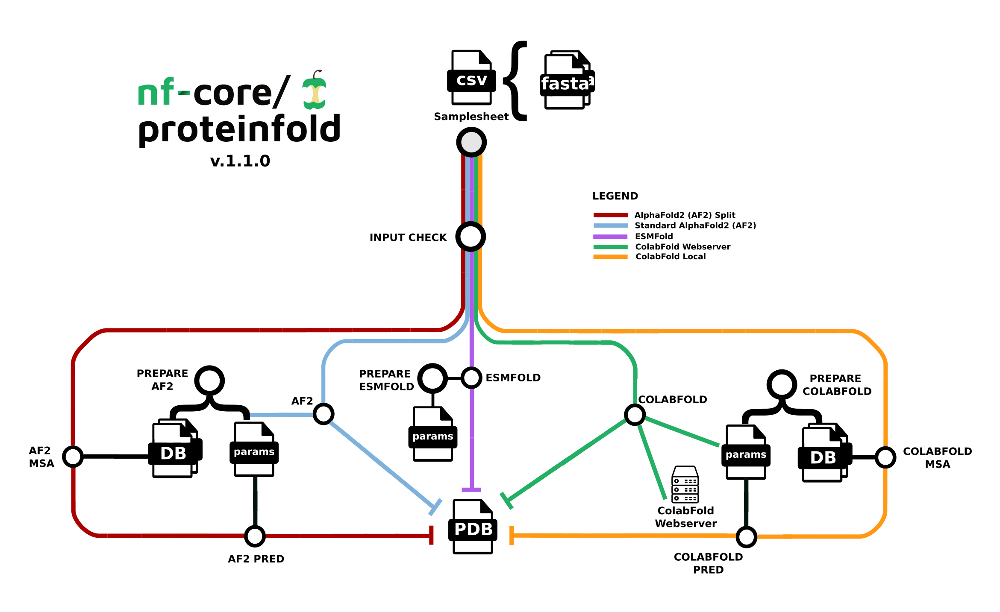

import Tabs from '@theme/Tabs';
import TabItem from '@theme/TabItem';

This guide details how to perform best-practice analysis for protein 3D structure prediction on an AWS Batch compute environment in Platform. It includes: 

- Creating AWS Batch compute environments to run your pipeline and downstream analysis
- Adding the nf-core/proteinfold pipeline to your workspace 
- Importing your pipeline input data
- Launching the pipeline and monitoring execution from your workspace
- Setting up a custom analysis environment with Data Studios

:::info[**Prerequisites**]
You will need the following to get started:

- [Admin](../orgs-and-teams/roles) permissions in an existing organization workspace. See [Set up your workspace](./workspace-setup) to create an organization and workspace from scratch.
- An existing AWS cloud account with access to the AWS Batch service.
- Existing access credentials with permissions to create and manage resources in your AWS account. See [IAM](../compute-envs/aws-batch#iam) for guidance to set up IAM permissions for Platform. 
:::

## Compute environment

The compute and storage requirements for protein structure prediction depend on the number and length of protein sequences being analyzed and the size of the database used for prediction by the deep learning models, such as AlphaFold2 and ColabFold. Input sequences typically range from a few kilobytes for single proteins to several megabytes for large datasets, and reference databases can be extremely large, from 100 GB to several TB. Protein folding pipelines generate intermediate files during execution, such as for alignments and feature representations, the sizes of which vary based on the number of sequences and the complexity of the analysis.

Given the data sizes and computational intensity, production pipelines perform best with NVIDIA A10 or larger GPUs and low-latency, high-throughput cloud storage file handling.

### GPUs

The nf-core/proteinfold pipeline performs protein folding prediction using one of three deep learning models: AlphaFold2, ColabFold, or ESMFold. The computationally intensive tasks for protein structure prediction perform better on GPUs due to their ability to handle large matrix operations efficiently and perform parallel computations. GPUs can dramatically reduce the time required for protein structure predictions, making it feasible to analyze larger datasets or perform more complex simulations.

Platform supports the allocation of both CPUs and GPUs in the same compute environment. For example, specify `m6id`, `c6id`, `r6id`, `g5`, `p3` instance families in the **Instance types** field when creating your AWS Batch compute environment. See [Create compute environment](#create-compute-environment) below. 

When you launch nf-core/proteinfold in Platform, enable **use_gpu** to instruct Nextflow to run GPU-compatible pipeline processes on GPU instances. See [Launch pipeline](#launch-pipeline) below. 

### Fusion file system

The [Fusion](../supported_software/fusion/overview) file system enables seamless read and write operations to cloud object stores, leading to
simpler pipeline logic and faster, more efficient execution. While Fusion is not required to run nf-core/proteinfold, it significantly enhances I/O-intensive tasks and eliminates the need for intermediate data copies, which is particularly beneficial when working with the large databases used by deep learning models for prediction. 

Fusion works best with AWS NVMe instances (fast instance storage) as this delivers the fastest performance when compared to environments using only AWS EBS (Elastic Block Store). Batch Forge selects instances automatically based on your compute environment configuration, but you can optionally specify instance types. To enable fast instance storage, you must select EC2 instances with NVMe SSD storage (`g4dn`, `g5`, or `P3` families or greater). 

:::note 
Fusion requires a license for use in Seqera Platform compute environments or directly in Nextflow. Fusion can be trialed at no cost. [Contact Seqera](https://seqera.io/contact-us/) for more details.
:::

### Create compute environment

:::info
The same compute environment can be used for pipeline execution and running your Data Studios notebook environment, but Data Studios does not support AWS Fargate. To use this compute environment for both nf-core/proteinfold execution and your data studio, leave **Enable Fargate for head job** disabled and include a CPU-based EC2 instance family (`c6id`, `r6id`, etc.) in your **Instance types**. 

Alternatively, create a second basic AWS Batch compute environment and a data studio with at least 2 CPUs and 8192 MB of RAM.
:::

From the **Compute Environments** tab in your organization workspace, select **Add compute environment** and complete the following fields:

| **Field**                             | **Description**                                            |
|---------------------------------------|------------------------------------------------------------|
| **Name**                              | A unique name for the compute environment.                 |
| **Platform**                          | AWS Batch                                                  |
| **Credentials**                       | Select existing credentials, or **+** to create new credentials.|
| **Access Key**                        | AWS access key ID.                                         |
| **Secret Key**                        | AWS secret access key.                                     |
| **Region**                            | The target execution region.                               |
| **Pipeline work directory**           | An S3 bucket path in the same execution region.            |
| **Enable Wave Containers**            | Use the Wave containers service to provision containers.   |
| **Enable Fusion v2**                  | Access your S3-hosted data via the Fusion v2 file system.  |
| **Enable fast instance storage**      | Use NVMe instance storage to speed up I/O and disk access. Requires Fusion v2.|
| **Config Mode**                       | Batch Forge                                                |
| **Provisioning Model**                | Choose between Spot and On-Demand instances.               |
| **Max CPUs**                          | Sensible values for production use range between 2000 and 5000.|
| **Enable Fargate for head job**       | Run the Nextflow head job using the Fargate container service to speed up pipeline launch. Requires Fusion v2. Do not enable for Data Studios compute environments. |
| **Use Amazon-recommended GPU-optimized ECS AMI**  | When enabled, Batch Forge specifies the most current AWS-recommended GPU-optimized ECS AMI as the EC2 fleet AMI when creating the compute environment. |
| **Allowed S3 buckets**                | Additional S3 buckets or paths to be granted read-write permission for this compute environment. For the purposes of this guide, add `s3://proteinfold-dataset` to grant compute environment access to the DB and params used for prediction by AlphaFold2 and ColabFold. |
| **Instance types**                    | Specify the instance types to be used for computation. You must include GPU-enabled instance types (`g4dn`, `g5`) when the Amazon-recommended GPU-optimized ECS AMI is in use. Include CPU-based instance families for Data Studios compute environments. | 
| **Resource labels**                   | `name=value` pairs to tag the AWS resources created by this compute environment.|


## Add pipeline to Platform

:::info
The [nf-core/proteinfold](https://github.com/nf-core/proteinfold) pipeline is a bioinformatics best-practice analysis pipeline for Protein 3D structure prediction.


:::

[Seqera Pipelines](https://seqera.io/pipelines) is a curated collection of quality open source pipelines that can be imported directly to your workspace Launchpad in Platform. Each pipeline includes a curated test dataset to use in a test run to confirm compute environment compatibility in just a few steps.

To use Seqera Pipelines to import the `nf-core/proteinfold` pipeline to your workspace:


1. Search for `nf-core/proteinfold` and select **Launch** next to the pipeline name in the list. In the **Add pipeline** tab, select **Cloud** or **Enterprise** depending on your Platform account type, then provide the information needed for Seqera Pipelines to access your Platform instance:
    - **Seqera Cloud**: Paste your Platform **Access token** and select **Next**.  
    - **Seqera Enterprise**: Specify the **Seqera Platform URL** (hostname) and **Base API URL** for your Enterprise instance, then paste your Platform **Access token** and select **Next**.
    :::tip
    If you do not have a Platform access token, select **Get your access token from Seqera Platform** to open the Access tokens page in a new browser tab.
    :::
1. Select your Platform **Organization**, **Workspace**, and **Compute environment** for the imported pipeline. 
1. (Optional) Customize the **Pipeline Name** and **Pipeline Description**.
1. Select **Add Pipeline**. 

:::info
To add a custom pipeline not listed in Seqera Pipelines to your Platform workspace, see [Add pipelines](./quickstart-demo/add-pipelines#) for manual Launchpad instructions. 
:::

## Pipeline input data

The [nf-core/proteinfold](https://github.com/nf-core/proteinfold) pipeline works with input datasets (samplesheets) containing sequence names and FASTA file locations (paths to FASTA files in cloud or local storage). The pipeline includes an example samplesheet that looks like this:

<details>
  <summary>**nf-core/proteinfold example samplesheet**</summary>
    
  | sequence | fasta |
  | -------- | ----- |
  | T1024 | https://raw.githubusercontent.com/nf-core/test-datasets/proteinfold/testdata/sequences/T1024.fasta |
  | T1026 | https://raw.githubusercontent.com/nf-core/test-datasets/proteinfold/testdata/sequences/T1026.fasta |

</details>

In Platform, samplesheets and other data can be made easily accessible in one of two ways: 
- Use **Data Explorer** to browse and interact with remote data from AWS S3, Azure Blob Storage, and Google Cloud Storage repositories, directly in your organization workspace.
- Use **Datasets** to upload structured data to your workspace in CSV (Comma-Separated Values) or TSV (Tab-Separated Values) format.

<details>
  <summary>**Add a cloud bucket via Data Explorer**</summary> 

  Private cloud storage buckets accessible with the credentials in your workspace are added to Data Explorer automatically by default. However, you can also add custom directory paths within buckets to your workspace to simplify direct access.

  For example, to add the proteinfold open database to your workspace:

  

  1. From the **Data Explorer** tab, select **Add cloud bucket**. 
  1. Specify the bucket details:
      - The cloud **Provider**: AWS
      - An existing cloud **Bucket path**: `s3://proteinfold-dataset`
      - A unique **Name** for the bucket: "proteinfold-dataset"
      - The **Credentials** used to access the bucket: select **Public**.
      - An optional bucket **Description**.
  1. Select **Add**.

  You can now select data directly from this bucket as input when launching your pipeline, without the need to interact with cloud consoles or CLI tools. 

</details>

<details>
  <summary>**Add a dataset**</summary>

  From the **Datasets** tab, select **Add Dataset**.

  

  Specify the following dataset details:

  - A **Name** for the dataset, such as `proteinfold_samplesheet`.
  - A **Description** for the dataset.
  - Select the **First row as header** option to prevent Platform from parsing the header row of the samplesheet as sample data.
  - Select **Upload file** and browse to your CSV or TSV samplesheet file in local storage, or simply drag and drop it into the box.

  The dataset is now listed in your organization workspace datasets and can be selected as input when launching your pipeline. 

  :::info
  Platform does not store the data used for analysis in pipelines. The dataset must specify the locations of data stored on your own infrastructure.
  :::

</details>

## Launch pipeline

:::note
This guide is based on [version 1.1.1](https://nf-co.re/proteinfold/1.1.1) of the nf-core/proteinfold pipeline. Launch form parameters and tools may differ in other versions. 
:::

With your compute environment created, nf-core/proteinfold added to your workspace Launchpad, and your samplesheet accessible in Platform, you are ready to launch your pipeline. Navigate to the Launchpad and select **Launch** next to `nf-core-proteinfold` to open the launch form.

The launch form consists of **General config**, **Run parameters**, and **Advanced options** sections to specify your run parameters before execution, and an execution summary. Use section headings or select the **Previous** and **Next** buttons at the bottom of the page to navigate between sections. 

### General config 

- **Pipeline to launch**: The pipeline Git repository name or URL: `https://github.com/nf-core/proteinfold`. For saved pipelines, this is prefilled and cannot be edited.
- **Revision number**: A valid repository commit ID, tag, or branch name: `1.1.1`. For saved pipelines, this is prefilled and cannot be edited.
- **Config profiles**: One or more [configuration profile](https://www.nextflow.io/docs/latest/config.html#config-profiles) names to use for the execution. Config profiles must be defined in the `nextflow.config` file in the pipeline repository. Benchmarking runs for this guide used nf-core profiles with included test datasets — `test_full_alphafold2_multimer` for Alphafold2 and `test_full_alphafold2_multimer` for Colabfold.  
- **Workflow run name**: An identifier for the run, pre-filled with a random name. This can be customized.
- **Labels**: Assign new or existing [labels](../labels/overview) to the run.
- **Compute environment**: Your AWS Batch compute environment. 
- **Work directory**: The cloud storage path where pipeline scratch data is stored. Platform will create a scratch sub-folder if only a cloud bucket location is specified.
    :::note
    The credentials associated with the compute environment must have access to the work directory.
    :::


### Run parameters 

There are three ways to enter **Run parameters** prior to launch:

- The **Input form view** displays form fields to enter text or select attributes from lists, and browse input and output locations with [Data Explorer](../data/data-explorer).
- The **Params file view** displays a raw schema that you can edit directly. Select JSON or YAML format from the **View as** list.
- **Upload params file** allows you to upload a JSON or YAML file with run parameters.

Platform uses the `nextflow_schema.json` file in the root of the pipeline repository to dynamically create a form with the necessary pipeline parameters. 


Specify your pipeline input and output and modify other pipeline parameters as needed. 

<details>
  <summary>**input**</summary>

  Use **Browse** to select your pipeline input data: 

  - In the **Data Explorer** tab, select the existing cloud bucket that contains your samplesheet, browse or search for the samplesheet file, and select the chain icon to copy the file path before closing the data selection window and pasting the file path in the input field.
  - In the **Datasets** tab, search for and select your existing dataset.

</details>
<details>
  <summary>**outdir**</summary>

  Use the `outdir` parameter to specify where the pipeline outputs are published. `outdir` must be unique for each pipeline run. Otherwise, your results will be overwritten. 

  **Browse** and copy cloud storage directory paths using Data Explorer, or enter a path manually.

</details>

- The **mode** menu allows you to select the deep learning model used for structure prediction (`alphafold2`, `colabfold`, or `esmfold`). 
- Enable **use_gpu** to run GPU-compatible tasks on GPUs. This requires **Use Amazon-recommended GPU-optimized ECS AMI** to be enabled and GPU-enabled instances to be specified under **Instance types** in your compute environment. 


:::info
For the purposes of this guide, run the pipeline in both `alphafold2` and `colabfold` modes. Specify unique directory paths for the `outdir` parameter (such as "Alphafold2" and "ColabFold") to ensure output data is kept separate and not overwritten. Predicted protein structures for each model will be visualized side-by-side in the [Interactive analysis](#interactive-analysis-with-data-studios) section.
::: 

### Advanced settings 

- Use [resource labels](../resource-labels/overview) to tag the computing resources created during the workflow execution. While resource labels for the run are inherited from the compute environment and pipeline, workspace admins can override them from the launch form. Applied resource label names must be unique. 
- [Pipeline secrets](../secrets/overview) store keys and tokens used by workflow tasks to interact with external systems. Enter the names of any stored user or workspace secrets required for the workflow execution.
- See [Advanced options](../launch/advanced) for more details.

After you have filled the necessary launch details, select **Launch**. The **Runs** tab shows your new run in a **submitted** status at the top of the list. Select the run name to navigate to the [**View Workflow Run**](../monitoring/overview) page and view the configuration, parameters, status of individual tasks, and run report.

<details>
  <summary>**Run monitoring**</summary>

  Select your new run from the **Runs** tab list to view the run details.

  #### Run details page

  As the pipeline runs, run details will populate with the following tabs:

  - **Command-line**: The Nextflow command invocation used to run the pipeline. This includes details about the pipeline version (`-r` flag) and profile, if specified (`-profile` flag).
  - **Parameters**: The exact set of parameters used in the execution. This is helpful for reproducing the results of a previous run.
  - **Resolved Nextflow configuration**: The full Nextflow configuration settings used for the run. This includes parameters, but also settings specific to task execution (such as memory, CPUs, and output directory).
  - **Execution Log**: A summarized Nextflow log providing information about the pipeline and the status of the run.
  - **Datasets**: Link to datasets, if any were used in the run.
  - **Reports**: View pipeline outputs directly in the Platform.

  

  #### View reports

  Most Nextflow pipelines generate reports or output files which are useful to inspect at the end of the pipeline execution. Reports can contain quality control (QC) metrics that are important to assess the integrity of the results.

  The paths to report files point to a location in cloud storage (in the `outdir` directory specified during launch), but you can view the contents directly and download each file without navigating to the cloud or a remote filesystem.

  :::info
  See [Reports](../reports/overview) for more information. 
  :::

  #### View general information

  The run details page includes general information about who executed the run, when it was executed, the Git commit ID and/or tag used, and additional details about the compute environment and Nextflow version used.

  

  #### View details for a task

  Scroll down the page to view:

  - The progress of individual pipeline **Processes**
  - **Aggregated stats** for the run (total walltime, CPU hours)
  - **Workflow metrics** (CPU efficiency, memory efficiency)
  - A **Task details** table for every task in the workflow

  The task details table provides further information on every step in the pipeline, including task statuses and metrics.

  #### Task details

  Select a task in the task table to open the **Task details** dialog. The dialog has three tabs:

  - The **About** tab contains extensive task execution details. 
  - The **Execution log** tab provides a real-time log of the selected task's execution. Task execution and other logs (such as stdout and stderr) are available for download from here, if still available in your compute environment.
  - The **Data Explorer** tab allows you to view the task working directory directly in Platform.  

  

  Nextflow hash-addresses each task of the pipeline and creates unique directories based on these hashes. Data Explorer allows you to view the log files and output files generated for each task in its working directory, directly within Platform. You can view, download, and retrieve the link for these intermediate files in cloud storage from the **Data Explorer** tab to simplify troubleshooting.

</details>

## Interactive analysis with Data Studios

[Data Studios](../data_studios/index) streamlines the process of creating interactive analysis environments for Platform users. With built-in templates for platforms like Jupyter Notebook, RStudio, and VSCode, creating a data studio is as simple as adding and sharing pipelines or datasets. The data studio URL can also be shared with any user with the [Connect role](../orgs-and-teams/roles) for real-time access and collaboration.

For the purposes of this guide, a Jupyter notebook environment will be used for interactive visualization of the predicted protein structures, optionally comparing AlphaFold2 and Colabfold structures for the same sequence data. 

### Create a Jupyter notebook data studio

From the **Data Studios** tab, select **Add a data studio** and complete the following:
- In the **Compute & Data** tab:
    - Select your AWS Batch compute environment. 
        :::info
        The same compute environment can be used for pipeline execution and running your Data Studios notebook environment, but Data Studios does not support AWS Fargate and data studio sessions must run on CPUs. To use one compute environment for both nf-core/proteinfold execution and your data studio, leave **Enable Fargate for head job** disabled and include at least one CPU-based EC2 instance family (`c6id`, `r6id`, etc.) in your **Instance types**. 

        Alternatively, create a second basic AWS Batch compute environment with at least 2 CPUs and 8192 MB of RAM for your data studio.
        :::
    - Optional: Enter CPU and memory allocations. The default values are 2 CPUs and 8192 MB memory (RAM).
        :::note
        Data studios compete for computing resources when sharing compute environments. Ensure your compute environment has sufficient resources to run both your pipelines and data studio sessions. 
        :::
    - Mount data using Data Explorer: Mount the S3 bucket or directory path that contains the pipeline work directory of your Proteinfold run. 
- In the **General config** tab:
    - Select the latest **Jupyter** container image template from the list.
    - Optional: Enter a unique name and description for the data studio. 
    - Check **Install Conda packages** and paste the following Conda environment YAML snippet:

    ```yaml 
    channels:
      - bioconda
      - conda-forge
    dependencies:
      - python=3.10
      - conda-forge::biopython=1.84
      - conda-forge::nglview=3.1.2
      - conda-forge::ipywidgets=8.1.5
    ```

- Confirm the data studio details in the **Summary** tab
- Select **Add** and choose whether to add and start the studio immediately.
- When the data studio is created and in a running state, **Connect** to it. 


### Visualize protein structures

The Jupyter environment can be configured with the packages and scripts you need for interactive analysis. For the purposes of this guide, run the following scripts in individual code cells to install the necessary packages and perform visualization:

1. Import libraries and check versions:

    ```python 
    import sys
    import jupyter_core
    import nglview
    import ipywidgets
    import Bio

    print(f"Python version: {sys.version}")
    print(f"Jupyter version: {jupyter_core.__version__}")
    print(f"nglview version: {nglview.__version__}")
    print(f"ipywidgets version: {ipywidgets.__version__}")
    print(f"Biopython version: {Bio.__version__}")
    print(f"Operating system: {sys.platform}")
    print("All required libraries imported successfully.")
    ```

1. Define visualization functions:

    ```python 
    import os
    import ipywidgets as widgets
    from IPython.display import display, HTML

    def visualize_protein(pdb_file, width='400px', height='400px'):
        view = nglview.show_structure_file(pdb_file)
        view.add_representation('cartoon', selection='protein', color='residueindex')
        view.add_representation('ball+stick', selection='hetero')
        view._remote_call('setSize', target='Widget', args=[width, height])
        
        # Set initial view
        view._remote_call('autoView')
        view._remote_call('centerView')
        
        # Adjust zoom level (you may need to adjust this value)
        view._remote_call('zoom', target='stage', args=[0.8])
        
        return view

    def compare_proteins(pdb_files):
        views = []
        for method, file_path in pdb_files.items():
            if os.path.exists(file_path):
                view = visualize_protein(file_path)
                label = widgets.Label(method)
                views.append(widgets.VBox([label, view]))
        return widgets.HBox(views, layout=widgets.Layout(width='100%'))

    print("Visualization functions defined successfully.")
    ```

1. Set up file paths and create file dictionary:

    ```python 
    # Replace with the actual paths to your AlphaFold2 and ColabFold PDB files
    alphafold_pdb = "data/path/to/your/alphafold/output.pdb"
    colabfold_pdb = "data/path/to/your/colabfold/output.pdb"

    # Create a dictionary of files
    pdb_files = {
        "AlphaFold": alphafold_pdb,
        "ColabFold": colabfold_pdb
    }

    print("File paths set up successfully.")
    ```

1. Display file information:

    ```python
    display(HTML("<h3>Protein Structure Prediction Output Files:</h3>"))
    for method, file_path in pdb_files.items():
        if os.path.exists(file_path):
            display(HTML(f"<p><strong>{method}:</strong> {file_path}</p>"))
        else:
            display(HTML(f"<p><strong>{method}:</strong> File not found at {file_path}</p>"))
    ```

1. Visualize structures:

    ```python
    valid_pdb_files = {method: file_path for method, file_path in pdb_files.items() if os.path.exists(file_path)}

    if valid_pdb_files:
        display(HTML("<h3>Protein Structure Visualization:</h3>"))
        comparison = compare_proteins(valid_pdb_files)
        display(comparison)
    else:
        display(HTML("<p>No valid PDB files found. Please check the file paths and ensure that the files exist.</p>"))
    ```

1. Add interactive elements:

    ```python
    if valid_pdb_files:
        method_dropdown = widgets.Dropdown(
            options=[method for method, file in valid_pdb_files.items()],
            description='Select method:',
            disabled=False,
        )
        
        info_output = widgets.Output()
        
        def on_change(change):
            with info_output:
                info_output.clear_output()
                selected_method = change['new']
                selected_file = valid_pdb_files[selected_method]
                print(f"Selected method: {selected_method}")
                print(f"File path: {selected_file}")
                print(f"File size: {os.path.getsize(selected_file) / 1024:.2f} KB")
        
        method_dropdown.observe(on_change, names='value')
        
        display(HTML("<h3>Structure Information:</h3>"))
        display(widgets.VBox([method_dropdown, info_output]))
    ```

1. Display usage instructions:

    ```python
    display(HTML("""
    <h3>How to use this visualization:</h3>
    <ul>
        <li>The protein structures from AlphaFold and ColabFold are shown side-by-side above.</li>
        <li>You can interact with each structure independently:</li>
        <ul>
            <li>Click and drag to rotate the structure.</li>
            <li>Scroll to zoom in and out.</li>
            <li>Right-click and drag to translate the structure.</li>
        </ul>
        <li>Use the dropdown menu to select a specific method and view its file information.</li>
    </ul>
    """))
    ```


