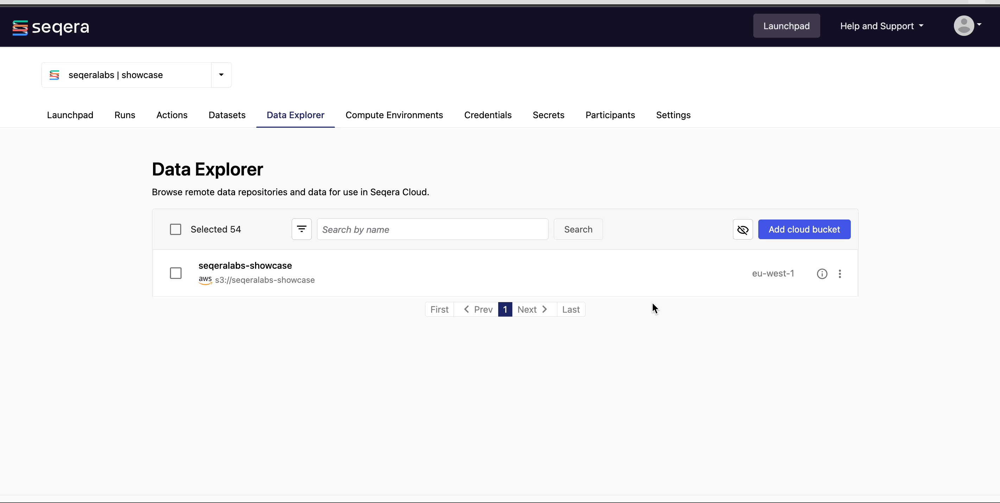
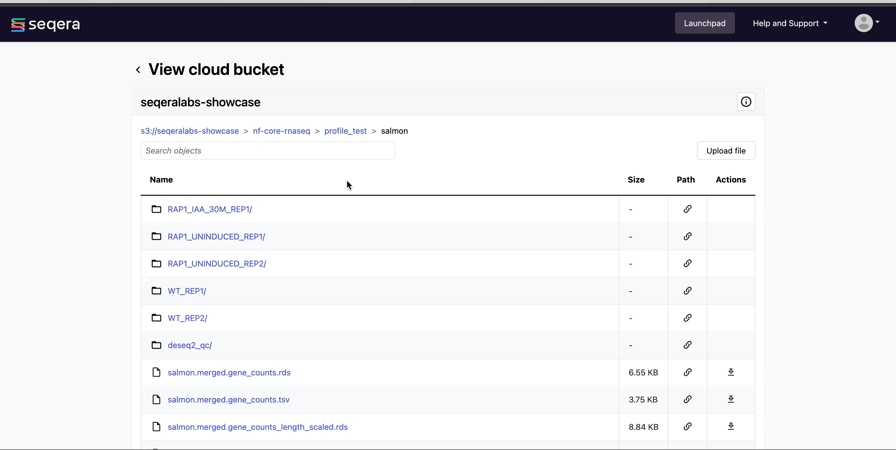

Most bioinformatics pipelines require an input of some sort. This is typically a samplesheet where each row consists of a sample, the location of files for that sample (such as FASTQ files), and other sample details. Reliable shared access to pipeline input data is crucial to simplify data management, minimize user data-input errors, and facilitate reproducible workflows.

In Platform, samplesheets and other data can be made easily accessible in one of two ways: 
- Use **Data Explorer** to browse and interact with remote data from AWS S3, Azure Blob Storage, and Google Cloud Storage repositories, directly in your organization workspace.
- Use **Datasets** to upload structured data to your workspace in CSV (Comma-Separated Values) or TSV (Tab-Separated Values) format. 

## Data Explorer 

For pipeline runs in the cloud, users typically need access to buckets or blob storage to upload files (such as samplesheets and reference data) for analysis and to view pipeline results. Managing credentials and permissions for multiple users and training users to navigate cloud consoles and CLIs can be complicated. Data Explorer provides the simplified alternative of viewing your data directly in Platform.

### Add a cloud bucket

Private cloud storage buckets accessible by the [credentials](../../credentials/overview) in your workspace are added to Data Explorer automatically by default. However, you can also add custom directory paths within buckets to your workspace to simplify direct access.

To add individual buckets (or directory paths within buckets):

1. From the **Data Explorer** tab, select **Add cloud bucket**. 
1. Specify the bucket details:
    - The cloud **Provider**.
    - An existing cloud **Bucket path**.
    - A unique **Name** for the bucket.
    - The **Credentials** used to access the bucket. For public cloud buckets, select **Public** from the dropdown menu.
    - An optional bucket **Description**.
1. Select **Add**.

  

You can now use this data in your analysis without the need to interact with cloud consoles or CLI tools. 

#### Public data sources

Select **Public** from the credentials dropdown menu to add public cloud storage buckets from resources such as:

- [The Cancer Genome Atlas (TCGA)](https://registry.opendata.aws/tcga/)
- [1000 Genomes Project](https://registry.opendata.aws/1000-genomes/)
- [NCBI SRA](https://registry.opendata.aws/ncbi-sra/)
- [Genome in a Bottle Consortium](https://docs.opendata.aws/giab/readme.html)
- [MSSNG Database](https://cloud.google.com/life-sciences/docs/resources/public-datasets/mssng)
- [Genome Aggregation Database (gnomAD)](https://cloud.google.com/life-sciences/docs/resources/public-datasets/gnomad) 

### View pipeline outputs

In Data Explorer, you can:

  - **View bucket details**:
    Select the information icon next to a bucket in the list to view the cloud provider, bucket address, and credentials.

    

  - **View bucket contents**:
    Select a bucket name from the list to view the bucket contents. The file type, size, and path of objects are displayed in columns next to the object name. For example, view the outputs of your [nf-core/rnaseq](./comm-showcase#launch-the-nf-corernaseq-pipeline) run:

    

   - **Preview files**: 
    Select a file to open a preview window that includes a **Download** button. For example, view the resultant gene counts of the salmon quantification step of your [nf-core/rnaseq](./comm-showcase#launch-the-nf-corernaseq-pipeline) run:

    

## Datasets

Datasets in Platform are CSV (comma-separated values) and TSV (tab-separated values) files stored in a workspace. You can select stored datasets as input data when launching a pipeline. 

  
**Example: nf-core/rnaseq test samplesheet**

  The [nf-core/rnaseq](https://github.com/nf-core/rnaseq) pipeline works with input datasets (samplesheets) containing sample names, FASTQ file locations, and indications of strandedness. The Seqera Community Showcase sample dataset for nf-core/rnaseq specifies the paths to 7 small sub-sampled FASTQ files from a yeast RNAseq dataset:

  **Example nf-core/rnaseq dataset**

  | sample              | fastq_1                              | fastq_2                              | strandedness |
  | ------------------- | ------------------------------------ | ------------------------------------ | ------------ |
  | WT_REP1             | s3://nf-core-awsmegatests/rnaseq/... | s3://nf-core-awsmegatests/rnaseq/... | reverse      |
  | WT_REP1             | s3://nf-core-awsmegatests/rnaseq/... | s3://nf-core-awsmegatests/rnaseq/... | reverse      |
  | WT_REP2             | s3://nf-core-awsmegatests/rnaseq/... | s3://nf-core-awsmegatests/rnaseq/... | reverse      |
  | RAP1_UNINDUCED_REP1 | s3://nf-core-awsmegatests/rnaseq/... |                                      | reverse      |
  | RAP1_UNINDUCED_REP2 | s3://nf-core-awsmegatests/rnaseq/... |                                      | reverse      |
  | RAP1_UNINDUCED_REP2 | s3://nf-core-awsmegatests/rnaseq/... |                                      | reverse      |
  | RAP1_IAA_30M_REP1   | s3://nf-core-awsmegatests/rnaseq/... | s3://nf-core-awsmegatests/rnaseq/... | reverse      |

Download the nf-core/rnaseq [samplesheet_test.csv](samplesheet_test.csv).

### Add a dataset

From the **Datasets** tab, select **Add Dataset**.

Specify the following dataset details:

- A **Name** for the dataset, such as `nf-core-rnaseq-test-dataset`.
- A **Description** for the dataset.
- Select the **First row as header** option to prevent Platform from parsing the header row of the samplesheet as sample data.
- Select **Upload file** and browse to your CSV or TSV file in local storage, or simply drag and drop it into the box.

Notice the location of the files in the nf-core/rnaseq example dataset point to a path on S3. This could also be a path to a shared filesystem, if using an HPC compute environment. Nextflow will use these paths to stage the files into the task working directory. 

:::info
Platform does not store the data used for analysis in pipelines. The datasets must provide the locations of data that is stored on your own infrastructure.
:::