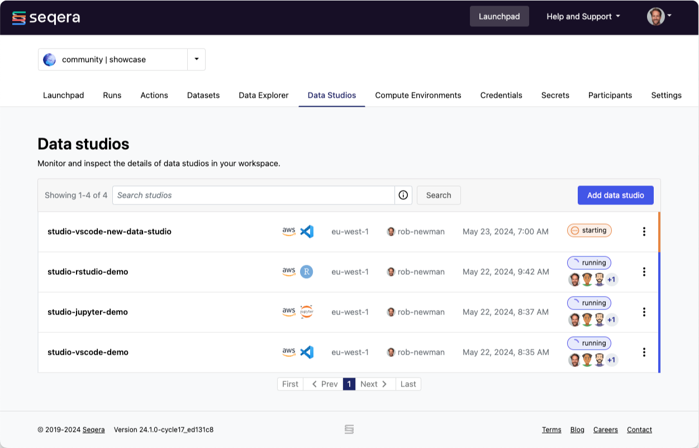

Select the **Studios** tab in Platform to view all Studio sessions. The list includes the name, cloud provider, analysis template, region, author, creation date, and status of each session. In this view, you can add a new Studio and start, stop, or connect to an existing session. Dynamically filter the list of Studios using the search bar to search by name (default), author username, or compute environment name. Select a Studio to open a detailed view that displays configuration information.

## Add a Studio

This functionality is available to users with the **Maintain** role and above.

To add a new Studio, select the **Studios** tab in your workspace then select **Add Studio**.

### Compute and Data

   1. Customize the following fields:
      - **Select compute environment**: Only AWS Batch (without Fargate enabled) is supported.
      - **Define resource labels**: Any [resource label](../labels/overview) already defined for the compute environment is added by default. Additional custom resource labels can be added or removed as needed.
      - **CPUs allocated**: The default allocation is 2 CPUs.
      - **GPUs allocated**: Available only if the selected compute environment has GPU support enabled. For more information about GPUs on AWS, see [Amazon ECS task definitions for GPU workloads][aws-gpu]. The default allocation is 0 GPUs.
      - **Maximum memory allocated**: The default allocation is 8192 MiB of memory.
   1. Select **Mount data**, and then from the **Mount data** modal, select data to mount. Select **Mount data** to confirm your selection.

        :::tip
        Datasets are mounted using the [Fusion file system](https://docs.seqera.io/fusion) and are available at `/workspace/data/<dataset>`. Mounted data doesn't need to match the compute environment or region of the cloud provider of the Studio. However, this might cause increased costs or errors.
        :::

   1. Select **Next**.

### General config

   - To use one of the Seqera-provided container templates, complete the following steps:

     1. Customize the following fields:
        - **Container template**: Select a template from the dropdown list.
        - **Studio name**
        - Optional: **Description**
     1. Optional: Select **Install Conda packages** to enter or upload a list of Conda packages to include with the Studio. For more information on the syntax for specifying Conda packages, see [Conda package syntax][conda-syntax].
     1. **Collaboration**: By default, all Studios are collaborative. This means all workspace users with the launch role and above can connect to the session. You can toggle **Private** on which means that only the workspace user who created the Studio can connect to it. When **Private** is on, workspace administrators can still start, stop, and delete sessions but cannot connect to them.
     1. **Session lifespan**: Depending on your workspace settings, you may be able to choose between the following options.
          -  **Stop the session automatically after a predefined period of time.**
               - If there is an existing defined session lifespan workspace setting, you won't be able to edit this. If no workspace setting is defined, you can edit this field. The minimum value is 1 hour and the maximum is 120 hours. The default value is 8 hours. 
               - If you change the default value, the change applies only to that session. Once you've stopped the session, the value returns to default.
          -  **Keep the session running until it's manually stopped or encounters an error which ends the session.**
     1. Select **Next**.

   - To use a custom container template image that you supply, complete the following steps:

     1. Customize the following fields:
        - **Container template**: Select **Prebuilt container image** from the list. For information about providing your own template, see [Custom container template image][custom-image].

          :::tip
          If you select the **Prebuilt container image** template, you cannot select **Install Conda packages** as these options are mutually exclusive.
          :::

        - **Studio name**
        - Optional: **Description**
     1. Select **Next**.

### Summary

   1. Ensure that the specified configuration is correct.
   1. Save your configuration:
      - To not immediately start the session, select **Add only**.
      - If you want to save and immediately start the Studio, select **Add and start**.

You'll be returned to the Studios landing page that displays the list of Studio sessions in your workspace. Select a Studio to inspect its configuration details. The Studio you created will be listed with a status of either **stopped** or **starting**, based on whether you elected to **Add** it or to **Add and start** a session as well.

:::note
By default, sessions only have read permissions to mounted data paths. Write permissions can be added for specific cloud storage buckets during the compute environment configuration by defining additional **Allowed S3 Buckets**. This means that data can be written from the session back to the cloud storage path(s) mounted. If a new file is uploaded to the cloud storage bucket path while a session is running, the file may not be available to the session immediately.
:::

## Start a Studio session

This functionality is available to users with the **Maintain** role and above.

A Studio session needs to be started before you can connect to it. Select the three dots next to the status message for the Studio you want to start, then select **Start**. You can optionally change the configuration of the Studio, then select **Start in new tab**. A new browser tab will open that displays the startup state of the session. Once the session is running, you can connect to it. A session will run until it is stopped manually or it encounters a technical issue.

:::note
A session consumes resources until it's **stopped**.
:::

Once a Studio session is in a **running** state, you can connect to it, obtain a public link to the session to share with collaborators inside your workspace, and stop it.

## Start an existing Studio as a new session

This functionality is available to users with the **Maintain** role and above.

You can use any existing Studio as the foundation for adding a new session. This functionality creates a clone of the session, including its checkpoint history, preserving any modifications made to the original Studio. When you create a session in this way, future changes are isolated from the original session.

When adding a new session from an existing session or checkpoint, the following fields cannot be changed:

- **Studio template**
- **Original Studio session and checkpoint**
- **Compute environment**
- **Installed Conda packages**
- **Session duration**

To add a new session from an existing **stopped** session, complete the steps described in [Add a Studio](#add-a-studio).

Additionally, you can add a new session from any existing Studio checkpoint except the currently running checkpoint. From the detail page, select the **Checkpoints** tab and in the **Actions** column, select **Add as new Studio**. This is useful for interactive analysis experimentation without impacting the state of the original Studio.

## Connect to a Studio

This functionality is available to all user roles excluding the **View** role.

To connect to a running session, select the three dots next to the status message and choose **Connect**.

:::warning
An active connection to a session will not prevent administrative actions that might disrupt that connection. For example, a session can be stopped by another workspace user while you are active in the session, the underlying credentials can be changed, or the compute environment can be deleted. These are independent actions and the user in the session won't be alerted to any changes - the only alert will be a server connection error in the active session browser tab.
:::

Once connected, the session will display the status of **running** in the list, and any connected user's avatar will be displayed under the status in both the list of Studios and in each Studio's detail page.

## Collaborate in a Studio session

This functionality is available to all user roles excluding the **View** role.

To share a link to a running session with collaborators inside your workspace, select the three dots next to the status message for the session you want to share, then select **Copy Studio URL**. Using this link, other authenticated users can access the session directly.

:::note
Collaborators need valid workspace permissions to connect to the running Studio.
:::

## Stop a Studio session

This functionality is available to users with the **Maintain** role and above.

To stop a running session, select the three dots next to the status message and then select **Stop**. The status will change from **running** to **stopped**. When a session is stopped, the compute resources it's using are deallocated. You can stop a session at any time, except when it is **starting**.

Stopping a running session creates a new checkpoint.

## Restart a stopped session

This functionality is available to users with the **Maintain** role and above. When you restart a stopped session, the session uses the most recent checkpoint.

## Start a new session from a checkpoint

This functionality is available to users with the **Maintain** role and above.

You can start a new session from an existing stopped session. This will inherit the history of the parent checkpoint state. From the list of **stopped** Studios in your workspace, select the three dots next to the status message for the Studio you want to start and select **Add as new**. Alternatively, select the **Checkpoints** tab on the detail page, select the three dots in the **Actions** column, and then select **Add as new Studio** to start a new session.

## Delete a Studio

This functionality is available to users with the **Maintain** role and above.

You can only delete a Studio when it's **stopped**. Select the three dots next to the status message and then select **Delete**. The Studio is deleted immediately and can't be recovered.

## Limit Studio access to a specific cloud bucket subdirectory {#cloud-bucket-subdirectory}

For a cloud bucket that is writeable, as enabled by including the bucket in a compute environment's **Allowed S3 bucket** list, you can limit write access to that bucket from within a Studio session.

To limit read-write access to a specific subdirectory, complete the following steps:

1. From your Seqera instance, select the **Data Explorer** tab.
1. Select **Add cloud bucket**.
1. Complete the following fields:
   - **Provider**: Select your cloud provider.
   - **Bucket path**: Enter the full path to the subdirectory of the bucket that you want to use with your Studio, such as `s3://1000genomes/data`.
   - **Name**: Enter a name for this cloud bucket, such as *1000-genomes-data-dir*, to indicate the bucket name and subdirectory path.
   - **Credentials**: Select your provider credentials.
   - Optional: **Description**: Enter a description for this cloud bucket.
1. Select **Add** to create a custom data link to a subdirectory in the cloud bucket.

When defining a new Studio, you can configure the **Mounted data** by selecting the custom data link created by the previous steps.

## Migrate a Studio from an earlier container image template

As Studios matures and new versions of JupyterLab, RStudio Server, Visual Studio Code, and Xpra are released, new Seqera-provided image templates will be periodically released including updated versions of Seqera Connect. The most recent container template images will be tagged `recommended` and earlier template images will be tagged `deprecated`.

:::tip
Always use the `recommended` tagged template image for new Studios. Only two earlier minor versions of [Seqera Connect][connect] are supported by Seqera.
:::

To migrate a Studio to a more recent container version and Seqera Connect:

1. Select the Studio that you wish to migrate from the list of Studios.
1. Select **Add as new**. By default this selects the latest session checkpoint.
1. In the **General config** section, change the image template selection in the dropdown list to use the `recommended` tagged version of the same interactive environment.
1. Review the **Summary** and ensure that the specified configuration is correct.
1. Immediately start the new, duplicated Studio session by selecting **Add and start**.
1. **Connect** to the new running Studio session.
   1. Make a note of any package or environment errors displayed.
1. **Stop** the running Studio session.
1. Go back to the original Studio:
   1. **Start** the session.
   1. **Connect** to the session.
   1. Uninstall any packages related to the errors:
      1. JupyterLab: Execute `!pip uninstall <packagename>` or `apt remove <packagename>` to uninstall system-level packages.
      1. RStudio Server: Execute `uninstall.packages("<packagename>")` to uninstall R packages or `apt remove <packagename>` to uninstall system-level packages.
      1. Visual Studio Code: Select the **Manage** gear button at the right of an extension entry and then choose **Uninstall** from the dropdown menu.
      1. Xpra: Use `apt remove <packagename>` to uninstall system-level packages.
   1. **Stop** the running Studio session. A new checkpoint is created.
1. Repeat Step 1 **Add as new** using the new, most recently created checkpoint from the steps above.

:::warning
Due to the nature of fully customizable, containerized applications, users can modify environments leading to a variety of configurations and outcomes. This is therefore a best effort to support Studio migrations and a successful outcome is not guaranteed.
:::

{/* links */}
[aws-gpu]: https://docs.aws.amazon.com/AmazonECS/latest/developerguide/ecs-gpu.html
[conda-syntax]: ./custom-envs.mdx#conda-package-syntax
[custom-image]: ./custom-envs.mdx#custom-containers
[connect]: ./index.mdx#container-image-templates
