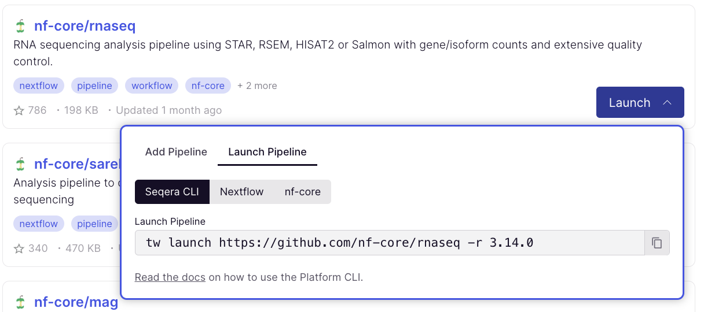

import Tabs from '@theme/Tabs';
import TabItem from '@theme/TabItem';

The Launchpad lists the preconfigured Nextflow pipelines that can be executed on the [compute environments](../../compute-envs/overview) in your workspace. 

Platform offers two methods to import pipelines to your workspace Launchpad — directly from Seqera Pipelines or manually via **Add pipeline** in Platform.

### Import from Seqera Pipelines

[Seqera Pipelines](https://seqera.io/pipelines) is a curated collection of quality open-source pipelines that can be imported directly to your workspace Launchpad in Platform. Each pipeline includes a dataset to use in a test run to confirm compute environment compatibility in just a few steps.

To import a pipeline:
1. Select **Launch** next to the pipeline name in the list. In the **Add pipeline** tab, select **Cloud** or **Enterprise** depending on your Platform account type, then provide the information needed for Seqera Pipelines to access your Platform instance:
    - **Seqera Cloud**: Paste your Platform **Access token** and select **Next**.  
    - **Seqera Enterprise**: Specify the **Seqera Platform URL** (hostname) and **Base API URL** for your Enterprise instance, then paste your Platform **Access token** and select **Next**.
    :::note
    If you do not have a Platform access token, select **Get your access token from Seqera Platform** to open the Access tokens page in a new browser window.
    :::
1. Select the Platform **Organization**, **Workspace**, and **Compute environment** for the imported pipeline. 
1. (Optional) Customize the **Pipeline Name** and **Pipeline Description**.
    :::note
    Pipeline names must be unique per workspace.
    :::
1. Select **Add Pipeline**. 

:::tip
To launch pipelines directly with CLI tools, select the **Launch Pipeline** tab to grab commands for [Seqera Platform CLI](./automation#platform-cli), Nextflow, and [nf-core/tools](https://nf-co.re/docs/nf-core-tools):

:::

### Add from the Launchpad 

From your workspace Launchpad, select **Add Pipeline** and specify the following pipeline details:

- (*Optional*) **Image**: Select the **Edit** icon on the pipeline image to open the **Edit image** window. From here, select **Upload file** to browse for an image file, or drag and drop the image file directly. Images must be in JPG or PNG format, with a maximum file size of 200 KB.
    :::note
    You can upload custom icons when adding or updating a pipeline. If no user-uploaded icon is defined, Platform will retrieve and attach a pipeline icon in the following order of precedence:
      1. A valid icon `key:value` pair defined in the `manifest` object of the `nextflow.config` file.
      2. The GitHub organization avatar (if the repository is hosted on GitHub).
    If none of the above are defined, Platform auto-generates and attaches a pipeline icon.
    :::
- **Name**: A custom name of your choice. Pipeline names must be unique per workspace. 
- Optional: **Description**: A summary of the pipeline or any information that may be useful to workspace participants when selecting a pipeline to launch. 
- Optional: **Labels**: Categorize the pipeline according to arbitrary criteria (such research group or reference genome version) that may help workspace participants to select the appropriate pipeline for their analysis.
- **Compute environment**: Select an existing workspace [compute environment](../../compute-envs/overview).
- **Pipeline to launch**: The URL of any public or private Git repository that contains Nextflow source code.
- **Revision number**: Platform will search all of the available tags and branches in the provided pipeline repository and render a dropdown to select the appropriate version. 
    :::tip
    Selecting a specific pipeline version is important for reproducibility as this ensures that each run with the same input data will generate the same results.
    :::
- (*Optional*) **Config profiles**: Select a predefined profile for the Nextflow pipeline. 
    :::info 
    nf-core pipelines include a `test` profile that is associated with a minimal test dataset. This profile runs the pipeline with heavily sub-sampled input data for the purposes of [CI/CD](https://resources.github.com/devops/ci-cd/) and to quickly confirm that the pipeline runs on your infrastructure.
    :::
- (*Optional*) **Pipeline parameters**: Set any custom pipeline parameters that will be prepopulated when users launch the pipeline from the Launchpad. For example, set the path to local reference genomes so users don't have to worry about locating these files when launching the pipeline.
    
- (*Optional*) **Pre-run script**: Define Bash code that executes before the pipeline launches in the same environment where Nextflow runs. 
    :::info 
    Pre-run scripts are useful for defining executor settings, troubleshooting, and defining a specific version of Nextflow with the `NXF_VER` environment variable.

     
    :::

:::note
Pre-filled pipeline settings (such as compute environment, config profiles, and pipeline parameters) can be overridden during pipeline launch by workspace participants with the necessary [permissions](../../orgs-and-teams/roles).
::: 

After you have populated the appropriate fields, select **Add**. Your pipeline is now available for workspace participants to launch in the preconfigured compute environment.

