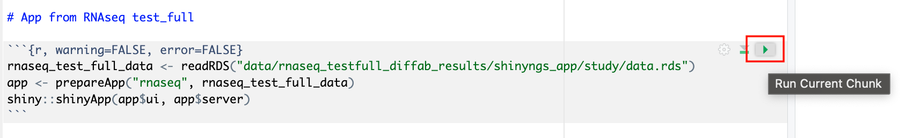

:::info
This guide provides an introduction to Studios using a demo Studio in the Community Showcase workspace. See [Studios](../../studios/overview) to learn how to create Studios in your own workspace. 
:::

Interactive analysis of pipeline results is often performed in platforms like Jupyter Notebook or RStudio. Setting up the infrastructure for these platforms, including accessing pipeline data and the necessary bioinformatics packages, can be complex and time-consuming.

Studios streamlines the process of creating interactive analysis environments for Platform users. With built-in templates, creating a Studio is as simple as adding and sharing pipelines or datasets. Platform manages all the details, enabling you to easily select your preferred interactive tool and analyze your data.

In the **Studios** tab, you can monitor and see the details of the Studios in the Community Showcase workspace.

Select the options menu next to a Studio to:
- See Studio details
- Start or stop the Studio, and connect to a running Studio session
- Copy the Studio URL to share it with collaborators

### Analyze RNAseq data in Studios

Studios is used to perform bespoke analysis on the results of upstream workflows. For example, in the Community Showcase workspace we have run the *nf-core/rnaseq* workflow to quantify gene expression, followed by *nf-core/differentialabundance* to derive differential expression statistics. The workspace contains a Studio with these results from cloud storage mounted into the Studio to perform further analysis. One of these outputs is an RShiny application, which can be deployed for interactive analysis.

### Open the RNAseq analysis Studio 

Select the *rnaseq_to_differentialabundance* Studio. This Studio consists of an RStudio environment that uses an existing compute environment available in the showcase workspace. The Studio also contains mounted data generated from the *nf-core/rnaseq* and subsequent *nf-core/differentialabundance* pipeline runs, directly from AWS S3. 

:::info
Studios allows you to specify the resources each Studio will use. When [creating your own Studios](../../studios/overview) with shared compute environment resources, you must allocate sufficient resources to the compute environment to prevent Studio or pipeline run interruptions. 
:::

### Connect to the Studio

This Studio will start an RStudio environment which already contains the necessary R packages for deploying an RShiny application to interact with various visualizations of the RNAseq data. The Studio also contains an R Markdown document with the commands in place to generate the application.

Deploy the RShiny app in the Studio by selecting the play button on the last chunk of the R script:

### Explore results in the RShiny app

The RShiny app will deploy in a separate browser window, providing a data interface. Here you can view information about your sample data, perform QC or exploratory analysis, and view the differential expression analyses.

#### Sample clustering with PCA plots

In the **QC/Exploratory** tab, select the PCA (Principal Component Analysis) plot to visualize how the samples group together based on their gene expression profiles.

In this example, we used RNA sequencing data from the publicly-available ENCODE project, which includes samples from four different cell lines: 

- **GM12878** — a lymphoblastoid cell line
- **K562** — a chronic myelogenous leukemia cell line
- **MCF-7** — a breast cancer cell line
- **H1-hESC** — a human embryonic stem cell line

What to look for in the PCA plot:

- **Replicate clustering**: Ideally, replicates of the same cell type should cluster closely together. For example, replicates of the MCF-7 cells group together. This indicates consistent gene expression profiles among replicates.
- **Cell type separation**: Different cell types should form distinct clusters. For instance, GM12878, K562, MCF-7, and H1-hESC cells should each form their own separate clusters, reflecting their unique gene expression patterns.

From this PCA plot, you can gain insights into the consistency and quality of your sequencing data, identify any potential issues, and understand the major sources of variation among your samples - all directly in Platform.

#### Gene expression changes with Volcano plots 

In the **Differential** tab, select **Volcano plots** to compare genes with significant changes in expression between two samples. For example, filter for `Type: H1 vs MCF-7` to view the differences in expression between these two cell lines.

1. **Identify upregulated and downregulated genes**: The x-axis of the volcano plot represents the log2 fold change in gene expression between the H1 and MCF-7 cell lines, while the y-axis represents the statistical significance of the changes.

    - **Upregulated genes in MCF-7**: Genes on the left side of the plot (negative fold change) are upregulated in the MCF-7 samples compared to H1. For example, the _SHH_ gene, which is known to be upregulated in cancer cell lines, prominently appears here.

2. **Filtering for specific genes**: If you are interested in specific genes, use the filter function. For example, filter for the _SHH_ gene in the table below the plot. This allows you to quickly locate and examine this gene in more detail.

3. **Gene expression bar plot**: After filtering for the _SHH_ gene, select it to navigate to a gene expression bar plot. This plot will show you the expression levels of _SHH_ across all samples, allowing you to see in which samples it is most highly expressed.

    - Here, _SHH_ is most highly expressed in MCF-7, which aligns with its known role in cancer cell proliferation.

Using the volcano plot, you can effectively identify and explore the genes with the most significant changes in expression between your samples, providing a deeper understanding of the molecular differences.

### Collaborate in the Studio

To share the results of your RNAseq analysis or allow colleagues to perform exploratory analysis, share a link to the Studio by selecting the options menu for the Studio you want to share, then select **Copy Studio URL**. With this link, other authenticated users with the **Connect** [role](../../orgs-and-teams/roles) (or greater) can access the session directly.
