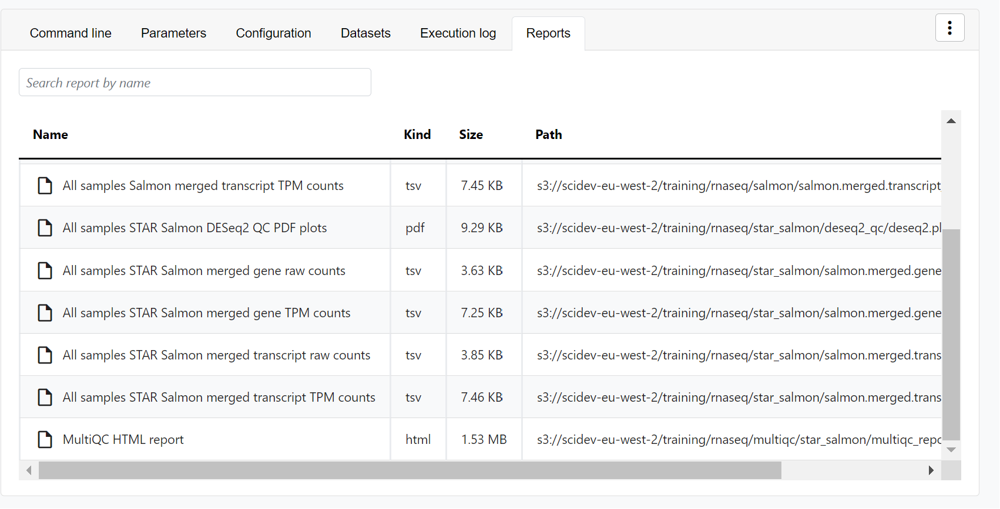
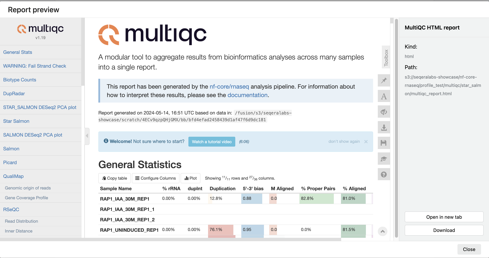

When you launch a pipeline, you are directed to the **Runs** tab which contains all executed workflows, with your submitted run at the top of the list. 

Each new or resumed run is given a random name, which can be customized prior to launch. Each row corresponds to a specific run. As a job executes, it can transition through the following states:

- **submitted**: Pending execution
- **running**: Running
- **succeeded**: Completed successfully
- **failed**: Successfully executed, where at least one task failed with a terminate error strategy
- **cancelled**: Stopped forceably during execution
- **unknown**: Indeterminate status


### View run details for *nf-core/rnaseq*

The pipeline launched [previously](./launch-pipelines) is listed on the **Runs** tab. Select it from the list to view the run details.

#### Run details page

As the pipeline runs, run details will populate with the following tabs:

- **Command-line**: The Nextflow command invocation used to run the pipeline. This contains details about the pipeline version (`-r 3.14.0` flag) and profile, if specified (`-profile test` flag).
- **Parameters**: The exact set of parameters used in the execution. This is helpful for reproducing the results of a previous run.
- **Configuration**: The full Nextflow configuration settings used for the run. This includes parameters, but also settings specific to task execution (such as memory, CPUs, and output directory).
- **Datasets**: Link to datasets, if any were used in the run.
- **Execution Log**: A summarized Nextflow log providing information about the pipeline and the status of the run.
- **Reports**: View pipeline outputs directly in the Platform.


### View reports

Most Nextflow pipelines generate reports or output files which are useful to inspect at the end of the pipeline execution. Reports can contain quality control (QC) metrics that are important to assess the integrity of the results.



For example, for the *nf-core/rnaseq* pipeline, view the [MultiQC](https://docs.seqera.io/multiqc) report generated. MultiQC is a helpful reporting tool to generate aggregate statistics and summaries from bioinformatics tools.



The paths to report files point to a location in cloud storage (in the `outdir` directory specified during launch), but you can view the contents directly and download each file without navigating to the cloud or a remote filesystem.

#### Specify outputs in reports

To customize and instruct Platform where to find reports generated by the pipeline, a [tower.yml](https://github.com/nf-core/rnaseq/blob/master/tower.yml) file that contains the locations of the generated reports must be included in the pipeline repository. 

In the *nf-core/rnaseq* pipeline, the `MULTIQC` process step generates a MultiQC report file in HTML format:

```yaml
reports:
  multiqc_report.html:
    display: "MultiQC HTML report"
```

:::info
See [Reports](../../reports/overview) to configure reports for pipeline runs in your own workspace. 
:::

### View general information

The run details page includes general information about who executed the run and when, the Git hash and tag used, and additional details about the compute environment and Nextflow version used.


The **General** panel displays top-level information about a pipeline run:

- Unique workflow run ID
- Workflow run name
- Timestamp of pipeline start (the time displayed is based on your local timezone defined in your device's system settings)
- Pipeline version and Git commit ID
- Nextflow session ID
- Username of the launcher
- Work directory path

### View details for a task

Scroll down the page to view:

- The progress of individual pipeline **Processes**
- **Aggregated stats** for the run (total walltime, CPU hours)
- A **Task details** table for every task in the workflow
- **Workflow metrics** (CPU efficiency, memory efficiency)

The task details table provides further information on every step in the pipeline, including task statuses and metrics.

### Task details

Select a task in the task table to open the **Task details** dialog. The dialog has three tabs: **About**, **Execution log**, and **Data Explorer**.

#### About

The **About** tab includes:

1. **Name**: Process name and tag
2. **Command**: Task script, defined in the pipeline process
3. **Status**: Exit code, task status, and number of attempts
4. **Work directory**: Directory where the task was executed
5. **Environment**: Environment variables that were supplied to the task
6. **Execution time**: Metrics for task submission, start, and completion time (the time displayed is based on your local timezone defined in your device's system settings)
7. **Resources requested**: Metrics for the resources requested by the task
8. **Resources used**: Metrics for the resources used by the task


#### Execution log

The **Execution log** tab provides a real-time log of the selected task's execution. Task execution and other logs (such as stdout and stderr) are available for download from here, if still available in your compute environment.

### Task work directory in Data Explorer

If a task fails, a good place to begin troubleshooting is the task's work directory.

Nextflow hash-addresses each task of the pipeline and creates unique directories based on these hashes. Instead of navigating through a bucket on the cloud console or filesystem to find the contents of this directory, use the **Data Explorer** tab in the Task window to view the work directory.

Data Explorer allows you to view the log files and output files generated for each task in its working directory, directly within Platform. You can view, download, and retrieve the link for these intermediate files in cloud storage from the **Data Explorer** tab to simplify troubleshooting.


### Resume a pipeline

Platform uses [Nextflow resume](../../launch/cache-resume) to resume a failed or cancelled workflow run with the same parameters, using the cached results of previously completed tasks and only executing failed and pending tasks.


:::info 
To resume a run in your own workspace:

- Select **Resume** from the options menu next to the run.
- Edit the parameters before launch, if needed.
- If you have the appropriate [permissions](../../orgs-and-teams/roles), you may edit the compute environment if needed.
:::
