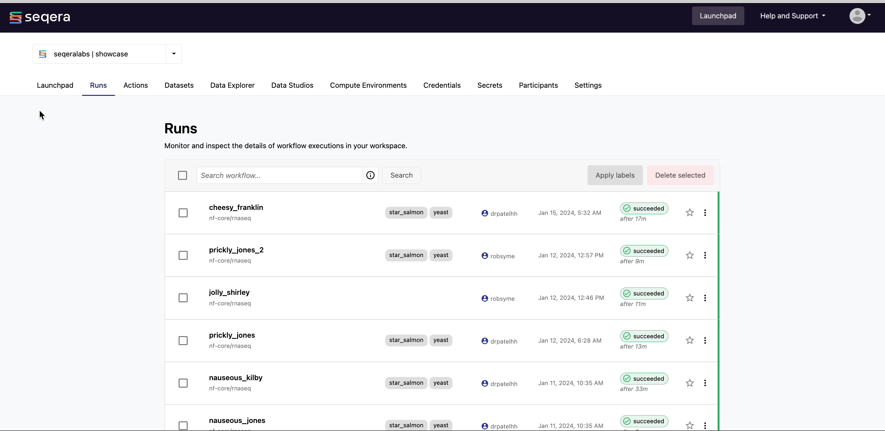

There are several ways to monitor pipeline runs in Seqera Platform:

### Workspace view

Access a full history of all runs in a given workspace via the **Runs** tab.
    


### All runs view

Access the **All runs** page from the user menu. This page provides a comprehensive overview of the runs across the entire Platform instance. The default view includes all organizations and workspaces accessible to the user. However, you can select visible workspaces from the dropdown next to **View**, and filter for a particular set of runs using any of the following fields:

- `status`
- `label`
- `workflowId`
- `runName`
- `username`
- `projectName`
- `after: YYYY-MM-DD`
- `before: YYYY-MM-DD`
- `sessionId`
- `is:starred`

For example:

```
rnaseq username:johndoe status:succeeded after:2024-01-01
```


### Dashboard view

Access the **Dashboard** from the user menu. This page provides an overview of the total runs across the Platform instance, grouped by run status. The default view includes all organizations and workspaces accessible to the user. Select visible workspaces from the dropdown next to **View** and filter by time, including a custom date range up to 12 months. Select **Export data** to download a CSV file with the available export data.

