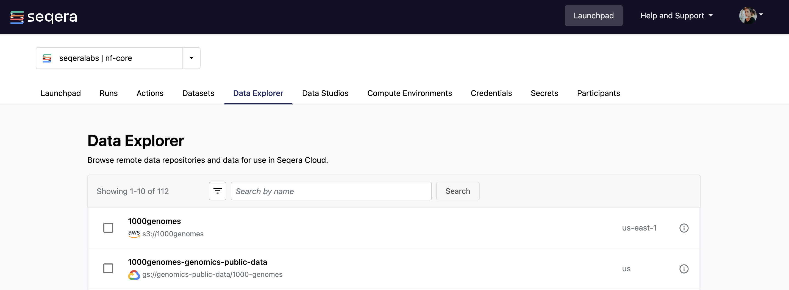

With Data Explorer, you can browse and interact with remote data repositories from organization workspaces in Seqera Platform. It supports AWS S3, Azure Blob Storage, Google Cloud Storage, and Amazon S3-compatible API storage (for example, but not limited to, Cloudflare R2, MinIO, and Oracle Cloud).

Access the **Data Explorer** tab from any workspace to view and manage all available data repositories. It is also integrated with the pipeline launch form and run detail pages and Studios, which allow you to select input data files and output directories or quickly view the output files of a run and directly use files in object storage for interactive analysis.

If you use Seqera Cloud and want to disable Data Explorer, [contact](https://seqera.io/contact-us/) your Seqera account executive.

## Participant roles

The role assigned to a workspace user affects what functionality is available in Data Explorer. These permissions are listed in the [Participant roles][roles].

- **View**: Can only view contents of cloud storage buckets. Cannot download, upload, or preview. Cannot hide or add buckets.
- **Launch**: Can only view contents of cloud storage buckets. Cannot download, upload, or preview. Cannot hide or add buckets.
- **Connect**: Can only view contents of cloud storage buckets. Cannot download, upload, or preview. Cannot hide or add buckets.
- **Maintain**: Can view download, upload, and preview contents of cloud storage buckets. Can hide and add buckets.
- **Admin**: Can view, download, upload, and preview contents of cloud storage buckets. Can hide and add buckets.
- **Owner**: Can view, download, upload, and preview contents of cloud storage buckets. Can hide and add buckets.

For more information on roles in Seqera Platform, see [Participant roles][roles].

## Add data repository links

Data Explorer lists public and private data repositories. Repositories accessible to your workspace credentials are retrieved automatically; workspace maintainers can also configure repositories manually.

- **Retrieve data repositories with workspace credentials**

  Private data repositories accessible to the credentials defined in your workspace are listed in Data Explorer automatically. The permissions required for your [AWS](../compute-envs/aws-batch#iam), [Google Cloud](../compute-envs/google-cloud-batch#iam), [Azure Batch](../compute-envs/azure-batch#storage-account), or HPC compute environment credentials allow full Data Explorer functionality.

- **Configure individual data repositories manually**

  Select **Add data repository** from the Data Explorer tab to add a link to an individual repository (or prefix within a cloud bucket). Specify the **Provider**, **Path**, **Name**, **Credentials**, and **Description**, then select **Add**. For public cloud buckets, select **Public** from the **Credentials** drop-down menu.

## Browse data repositories



- **View data repository details**

  To view details such as the cloud provider, address, and credentials, select the information icon next to a data-link in the Data Explorer list.

- **Search and filter data repositories**

  Search for repositories by name and region (e.g., `region:eu-west-2`) in the search field, and filter by provider.

- **Hide data repositories from list view**

  Using checkboxes, choose one or more data repositories, then select the **Hide** icon in the Data Explorer toolbar. To hide repositories individually, select **Hide** from the three dots options menu of a repository in the list.

  The Data Explorer list filter defaults to **Only visible**. Select **Only hidden** or **All** from the filtering menu to view hidden data repositories in the list. You can unhide a data repository by selecting **Show** from the three dots options menu in the list view.

- **View data repository contents**

  Select a data-link from the Data Explorer list to view the contents of that data repository. From the **View data repository** page, you can browse directories and search for objects by name in a particular directory. The size and path of an object is displayed in columns to the right of the object name. To view data repository details such as the provider, address, and credentials, select the information icon.

- **Preview and download files**

  From the **View data repository** page, you can preview and download files. Select the download icon in the **Actions** column to download a file directly from the list view. Select a file to open a preview window that includes a **Download** button.

  File preview is supported for these object types:

  Seqera Enterprise users can increase the default 25 MB file size download limit with `tower.content.max-file-size` in the `tower.yml` [configuration](https://docs.seqera.io/platform-enterprise/enterprise/configuration/overview#data-features) file. Note that increasing this value may degrade Platform performance.
  :::

- **Copy object paths**

  Select the **Path** of an object on the **View data repository** page to copy its absolute path to the clipboard. Use these object paths to specify input data locations during [pipeline launch](../launch/launchpad), add them to a [dataset](../data/datasets) for pipeline input, or when mounting data during Studio creation.

### Isolate view, read, and write permissions to specific data repository paths

To isolate pipeline or Studios view, read, and write permissions to a specific **data repository path**, workspace maintainers can optionally create **custom data-links** by manually configuring an individual data repository plus path to a specific folder/directory. This is supported to any level of the data repository path hierarchy, provided it is a folder (also known as a **prefix**). You can optionally choose to **Hide** or **Show** either the base data repository and/or any related custom data-links on demand in Data Explorer using the **Show/Hide** toggle and the **Show data repositories** filter options:

- Only visible (default)
- Only hidden
This customized Data Explorer view will be displayed by default to all workspace users, until the filter is updated or removed by a workspace maintainer.
:::

## Upload files to private data repositories 

Data Explorer supports single or bulk file uploads to your private data repositories. From the **View data repositories** page, select **Upload** and choose either the **Upload files* or **Upload folder** option. You can also drag and drop files and folders directly into Data Explorer. You can upload up to 300 files at a time via the Platform interface. The file size upload limits reflect the size limitations of the relevant cloud storage provider or data repository integration.

Currently, these limits are (for cloud providers):

- [AWS](https://docs.aws.amazon.com/AmazonS3/latest/userguide/qfacts.html)
  - Single `PUT` upload: 5 GiB
  - Multi-part upload: 5 TiB

- [Azure](https://learn.microsoft.com/en-us/rest/api/storageservices/put-blob?tabs=microsoft-entra-id#remarks)
  - Single `PUT` upload: 5 GiB
  - Multi-part upload: 4.77 TiB

- [Cloudflare R2](https://developers.cloudflare.com/r2/platform/limits/)
  - Single `PUT` upload: 4.995 GiB
  - Multi-part upload: 50 TiB

- [GCP](https://cloud.google.com/storage/quotas#objects):
  - Single `PUT` upload: 5 TiB
  - Multi-part upload: 5 TiB

- [MinIO](https://docs.min.io/enterprise/aistor-object-store/reference/aistor-server/thresholds/)
  - Single `PUT` upload: 5 TiB
  - Multi-part upload: 50 TiB

- [Oracle Cloud](https://docs.oracle.com/en-us/iaas/Content/Object/Tasks/managingobjects_topic-To_upload_objects_to_a_bucket.htm)
  - Single `PUT` upload: 64 MiB
  - Multi-part upload: 50 GiB

To cancel an upload, select **X** in the upload window. Any files not uploaded will display as **Failed**. Files that were successfully uploaded will not be removed. 

:::note
You must configure cross-origin resource sharing (CORS) for your data repository provider to allow file uploads from Platform. CORS configuration differs for each provider.
:::

## Download multiple files

You can download up to a maximum of 1,000 files using the browser interface, or an unlimited number of files with the auto-generated download script that uses your data repositor provider's CLI and credentials.

:::note
If you use a non-Chromium based browser, such as Safari or Firefox, file paths are concatenated with an underscore (`_`) character and the data repository directory structure is not reproduced locally. For example, the file `s3://example-us-east-1/path/to/files/my-file-1.txt` is saved as `path_to_files_my-file-1.txt`.
:::

Open the data repository and navigate to the folder that you'd like to download files and folders from. By default, you can download the contents of the current directory by choosing **Download current directory**. Alternatively, use checkboxes to select specific files and folders, and select the **Download** button. You can **Download files** via the browser or **Download using code**.

The code snippet provided is specific to the data repository provider you've configured. You may be prompted to authenticate during the download process. Refer to your data repository provider's documentation for troubleshooting credential-related issues:

- [GCP](https://cloud.google.com/sdk/gcloud/reference/storage)
- [AWS](https://docs.aws.amazon.com/cli/latest/reference/s3/)
- [Azure](https://learn.microsoft.com/en-us/cli/azure/storage?view=azure-cli-latest)

## CORS configurations for cloud providers

Each cloud provider has a specific way to allow Cross-Origin Resource Sharing (CORS) for both uploads and multi-file downloads.

### Amazon S3 CORS configuration

Apply a [CORS configuration](https://docs.aws.amazon.com/AmazonS3/latest/userguide/ManageCorsUsing.html) to enable file uploads and folder downloads from the Seqera Platform to and from specific S3 buckets. The CORS configuration is a JSON file that defines the origins, headers, and methods allowed for resource sharing requests to a bucket. Follow [these AWS instructions](https://docs.aws.amazon.com/AmazonS3/latest/userguide/enabling-cors-examples.html) to apply the CORS configuration below to each bucket you wish to enable file uploads and folder downloads for:

**Seqera Cloud S3 CORS configuration**

```json
[
  {
    "AllowedHeaders": ["*"],
    "AllowedMethods": ["PUT", "POST", "DELETE", "GET"],
    "AllowedOrigins": ["https://cloud.seqera.io"],
    "ExposeHeaders": ["ETag"]
  }
]
```

**Seqera Enterprise S3 CORS configuration**

Replace `<your-seqera-instance.url>` with your Seqera Enterprise server URL:

```json
[
  {
    "AllowedHeaders": ["*"],
    "AllowedMethods": ["PUT", "POST", "DELETE", "GET"],
    "AllowedOrigins": ["https://<your-seqera-instance.url>"],
    "ExposeHeaders": ["ETag"]
  }
]
```

### Azure Blob Storage CORS configuration

:::note
CORS configuration in Azure Blob Storage is set at the account level. This means that CORS rules for your account apply to every blob in the account.
:::

Apply a [CORS configuration](https://learn.microsoft.com/en-us/rest/api/storageservices/cross-origin-resource-sharing--cors--support-for-the-azure-storage-services#enabling-cors-for-azure-storage) to enable file uploads and folder downloads from the Seqera Platform to and from your Azure Blob Storage account.

**Seqera Cloud Azure CORS configuration**

1. From the [Azure portal](https://portal.azure.com), go to the **Storage account** you wish to configure.
2. Under **Settings** in the left navigation menu, select **Resource sharing (CORS)**.
3. Add a new entry under **Blob service**:

   - **Allowed origins**: `https://cloud.seqera.io`
   - **Allowed methods**: `GET,POST,PUT,DELETE,HEAD`
   - **Allowed headers**: `x-ms-blob-type,content-type`
   - **Exposed headers**: `x-ms-blob-type`

4. Select **Save** to apply the CORS configuration.

**Seqera Enterprise Azure CORS configuration**

1. From the [Azure portal](https://portal.azure.com), go to the Storage account you wish to configure.
2. Under **Settings** in the left navigation menu, select **Resource sharing (CORS)**.
3. Add a new entry under **Blob service**:

   - **Allowed origins**: `https://<your_seqera_instance_url>`
   - **Allowed methods**: `GET,POST,PUT,DELETE,HEAD`
   - **Allowed headers**: `x-ms-blob-type,content-type`
   - **Exposed headers**: `x-ms-blob-type`

4. Select **Save** to apply the CORS configuration.

### Google Cloud Storage CORS configuration

Apply a [CORS configuration](https://cloud.google.com/storage/docs/cross-origin#cors-components) to enable file uploads from Seqera to specific GCS buckets. The CORS configuration is a JSON file that defines the origins, headers, and methods allowed for resource sharing requests to a bucket. Follow [these Google instructions](https://cloud.google.com/storage/docs/using-cors#command-line) to apply the CORS configuration below to each bucket you wish to enable file uploads for.

:::note
Google Cloud Storage only supports CORS configuration via gcloud CLI.
:::

**Seqera Cloud GCS CORS configuration**

```json
{
  "origin": ["https://cloud.seqera.io"],
  "method": ["GET", "POST", "PUT", "DELETE", "HEAD"],
  "responseHeader": ["Content-Type", "Content-Range"],
  "maxAgeSeconds": 3600
}
```

**Seqera Enterprise GCS CORS configuration**

```json
{
  "origin": ["https://<your_seqera_instance_url>"],
  "method": ["GET", "POST", "PUT", "DELETE", "HEAD"],
  "responseHeader": ["Content-Type", "Content-Range"],
  "maxAgeSeconds": 3600
}
```

[roles]: ../orgs-and-teams/roles
