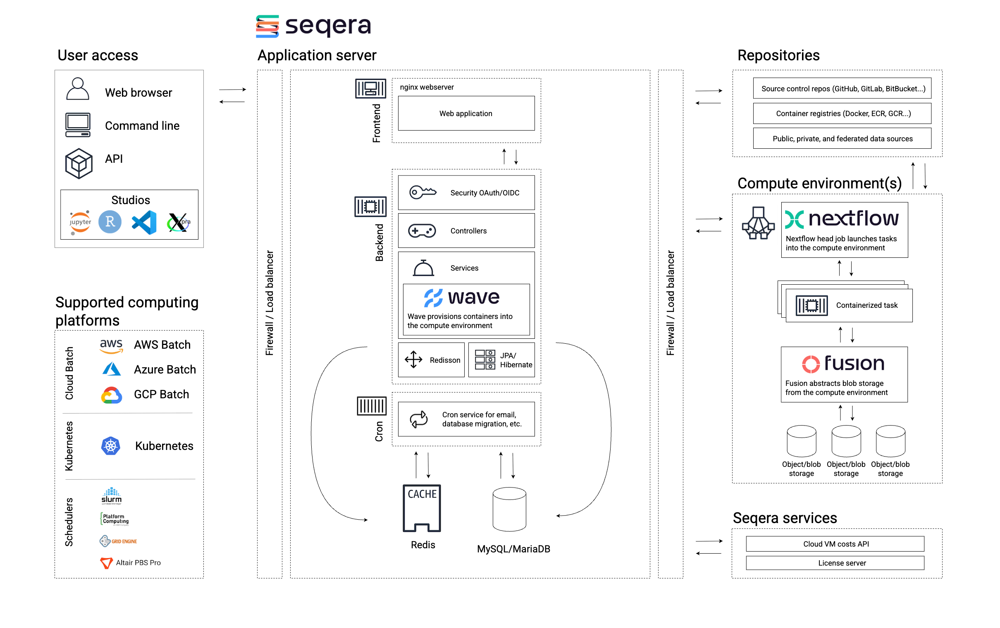
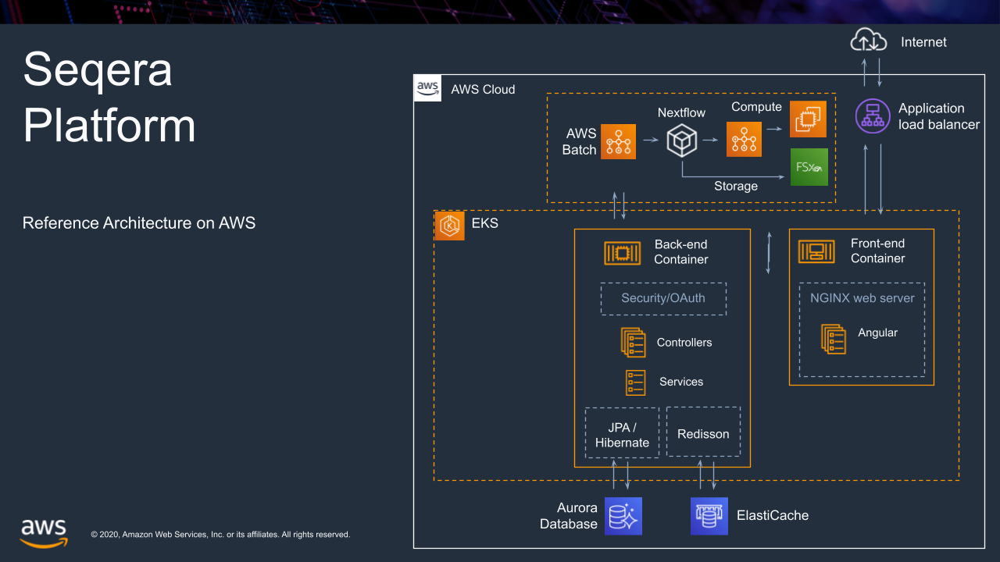

:::tip
Seqera Enterprise requires a license. If you have not already purchased a license, [contact us](https://seqera.io/contact-us/) for more information.
:::

Seqera Platform Enterprise is a web application with a microservice-oriented architecture that is designed to maximize portability, scalability, and security. It's composed of several modules that are configured and deployed according to your organizational requirements. Seqera provides these modules as Docker container images that are securely hosted on a private container registry.

## Architecture



### Platform backend

The Seqera backend is a JVM-based web application based on the [Micronaut](https://micronaut.io/) framework, which provides a modern and secure backbone for the application. The backend implements the main application logic, which is exposed via a REST API and defined with an OpenAPI schema. The backend uses JPA, Hibernate, and JDBC API industry standards to interact with the underlying relational database.

The backend can be run standalone or as multiple replicas for scalability when deployed in high-availability mode. It should run on port `8080`.

### Platform cron

Cron is an auxiliary backend service that executes regularly-occurring activities, such as sending email notifications and cleaning up stale data. The cron service also performs database migrations at startup.

### Platform frontend

The Seqera frontend is an NGINX web server that serves the [Angular](https://angular.io/) application and reverse-proxies HTTP traffic to the backend. The frontend should run on port `80` within the container and should be the only service that accepts incoming HTTP traffic. The frontend can also be exposed via HTTPS or a load balancer.

### Redis database

Seqera Enterprise requires a Redis database for caching purposes.

### SQL database

Seqera requires a SQL database to persist user activities and state. The application has been tested against MySQL 8.0. [Contact Seqera support](https://support.seqera.io) if you need to use a different JDBC-compliant SQL database.

### SMTP service

Seqera requires an SMTP relay to send email messages and user notifications.

### Authentication service (optional)

Seqera supports enterprise authentication mechanisms such as OAuth and OpenID. Third-party identity providers and custom single sign-on flows can be developed according to specific customer requirements.

## Deployment options

Seqera can be deployed to a single node, either with [Docker Compose](./docker-compose) or natively, or to a [Kubernetes](./kubernetes) cluster. This documentation includes instructions for both options across multiple platforms, including Amazon AWS, Microsoft Azure, Google Cloud, and on-prem infrastructure.

### Single-node

The minimal Seqera Enterprise deployment requires only the frontend, backend, and database services. These services can be deployed as Docker containers or as native services.

### Kubernetes

Kubernetes is emerging as the technology of choice for deploying applications that require high-availability, scalability, and security. Seqera Enterprise includes configuration manifests for Kubernetes deployment.


_Reference architecture diagram of Seqera Platform Enterprise on AWS using Elastic Kubernetes Service (EKS)_

## Application container images

Seqera Enterprise is distributed as a collection of Docker containers available through the Seqera container registry [`cr.seqera.io`](https://cr.seqera.io). Contact [support](https://support.seqera.io) to get your container access credentials. When you've received your credentials, retrieve the application container images with these steps:

1. Retrieve the `name` and `secret` values from the JSON file you received from Seqera support.
2. Authenticate to the registry by using the `name` and `secret` values copied in the previous step:

   ```bash
   docker login -u '<NAME>' -p '<SECRET>' cr.seqera.io
   ```

3. Pull the application container images:

   ```bash
   docker pull cr.seqera.io/private/nf-tower-enterprise/backend:v25.3

   docker pull cr.seqera.io/private/nf-tower-enterprise/frontend:v25.3
   ```

## Support

For further information, [contact Seqera support](https://support.seqera.io).
