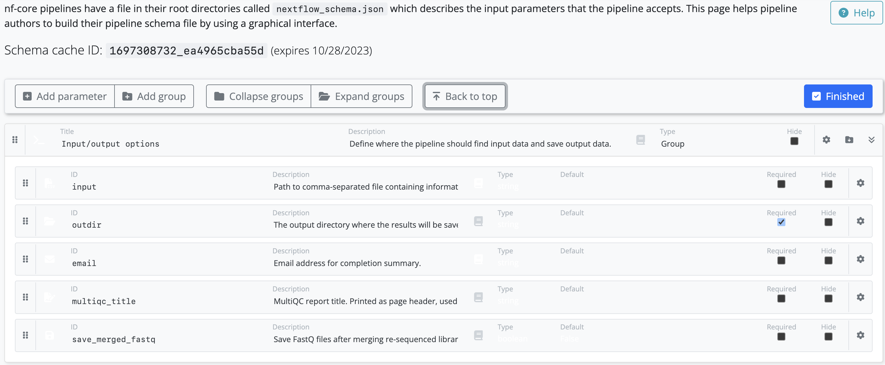

Pipeline schema files describe the structure and validation constraints of your workflow parameters. They are used to validate parameters before launch to prevent software or pipelines from failing in unexpected ways at runtime.

You can populate the parameters in the pipeline by uploading a YAML or JSON file, or in the Seqera Platform interface. The platform uses your pipeline schema to build a bespoke launchpad parameters form.

See [nf-core/rnaseq](https://github.com/nf-core/rnaseq/blob/e049f51f0214b2aef7624b9dd496a404a7c34d14/nextflow_schema.json) as an example of the pipeline parameters that can be represented by a JSON schema file.

### Define pipeline schema

When adding or editing a pipeline, you can select one of three schema options to control parameter validation and the launch form:

1. **Repository default**: Use the default schema provided by the Pipeline git repository.
2. **Repository path**: Use a schema at a specific path in the repository.
3. **Seqera Platform schema**: Use a Nextflow JSON schema stored in Seqera Platform (overrides repository).

The selected schema controls which pipeline parameters are exposed in the launch form. This allows you to restrict the parameters visible to launch users, simplifying the launch experience and preventing modification of parameters that should remain fixed.

#### Seqera Platform schema

Users with [Maintain or higher](../orgs-and-teams/roles.md) permissions can upload a custom `nextflow_schema.json` file directly to Seqera Platform. When you upload a Platform schema:

- The schema content is validated to ensure it's a valid JSON schema
- The Platform schema controls which parameters appear in the pipeline launch form
- Changes to the Platform schema trigger a new draft version of the pipeline
- The Platform schema is applied to all launches using that pipeline version

To add or update a Seqera Platform schema:

1. Navigate to **Add pipeline** or select **Edit** for an existing pipeline
2. Select **Seqera Platform schema** from the schema options
3. In the **Seqera Platform schema** field, paste your custom Nextflow schema JSON
4. The schema is validated automatically as you enter it
5. Select **Add** or **Save** to create a new draft version with the Platform schema

:::note
The schema `id` field must be unique. If you're pasting pipeline schema contents from an existing pipeline schema file, ensure you update the `id` field to a unique value.
:::

### Building pipeline schema files

The pipeline schema is based on [json-schema.org](https://json-schema.org/) syntax, with some additional conventions. While you can create your pipeline schema manually, we highly recommend using [nf-core tools](https://nf-co.re/tools/#pipeline-schema), a toolset for developing Nextflow pipelines built by the nf-core community.

When you run the `nf-core schema build` command in your pipeline root directory, the tool collects your pipeline parameters and gives you interactive prompts about missing or unexpected parameters. If no existing schema file is found, the tool creates one for you. The `schema build` commands include the option to validate and lint your schema file according to best practice guidelines from the nf-core community.

:::note
The nf-core community creates the schema builder but it can be used with any Nextflow pipeline.
:::

### Customize pipeline schema

When the skeleton pipeline schema file has been built with `nf-core schema build`, the command line tool will prompt you to open a [graphical schema editor](https://nf-co.re/pipeline_schema_builder) on the nf-core website.

Leave the command line tool running in the background as it checks the status of your schema on the website. When you select **Finished** on the schema editor page, your changes are saved to the schema file locally.

:::note
Your pipeline schema contains a `mimetype` field that specifies the accepted file type for input [datasets](../data/datasets). When you launch a pipeline from the [Launchpad](../launch/launchpad), the input field drop-down will only show datasets that match the required file type (either `text/csv` or `text/tsv`).
:::
