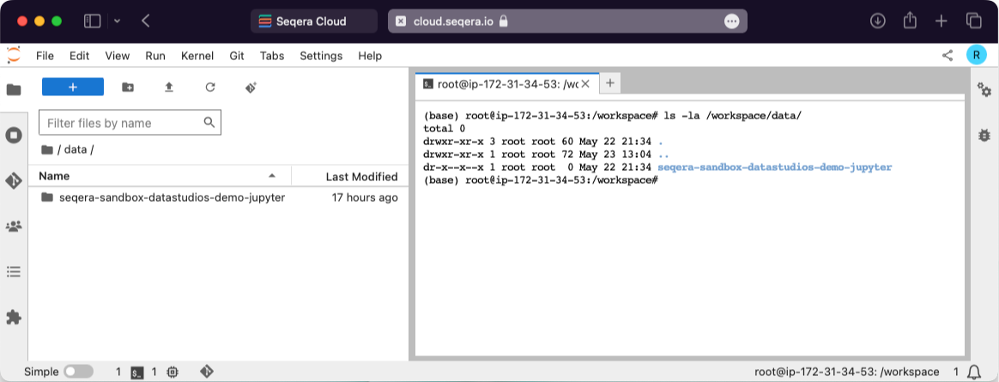

## View all mounted datasets

In your interactive analysis environment, open a new terminal and type `ls -la /workspace/data`. This displays all the mounted datasets available in the current session.



## Enabling AI coding assistants in Studios

VS Code, RStudio, and Jupyter environments natively integrate with [GitHub Copilot][gh-copilot]. Enabling it requires a GitHub Account and an active Copilot subscription.

- **VS Code:** To enable GitHub Copilot in your VS Code session, install the extension and then sign in with your GitHub account. [Learn more][vscode-blog].
- **RStudio:** To enable GitHub Copilot in your RStudio session requires RStudio configuration changes. By default, the Studio session user has root permissions, so configuration changes are possible. You will need to restart the RStudio once the required changes have been made. [Learn more][posit-ghcopilot-guide].
- **Jupyter:** [Notebook Intelligence (NBI)][nbi] is an AI coding assistant and extensible AI framework for Jupyter. It can use GitHub Copilot or AI models from any other LLM Provider. [Learn more][nbi-blog].

## Session size limited by compute environment advanced options: Head job CPUs and Head job memory

When adding a compute environment, setting the Advanced options **Head job CPUs** and **Head job memory** for Nextflow **also applies** to any Studio session created in the compute environment. This is because Studio sessions are managed by the Nextflow runner job. To avoid artifically constraining the resources of your Studio sessions, **do not define these optional compute environment settings**.

## Rebuild of a failed custom Studios environment: rebuilding from cache

Occasionally, building a custom Studios image using the Wave service will fail. This is typically due to conflicting libraries. When attempting to rebuild the image, if it reuses the same name and tag, Studios and Wave will use the cached version (if available). Changing the version number and/or tag will ensure that the custom image is freshly pulled again.

This is determined by the configuration of the Elastic Container Service (ECS) agent defined by the `ECS_IMAGE_PULL_BEHAVIOR` environment variable. In the case of the Seqera Platform Cloud, when creating the compute environment this is set to the value **once**. Enterprise installations of Seqera Platform may be configured differently. Contact your organization's administrator to learn more.

## Session is stuck in **starting**

If your Studio session doesn't advance from **starting** status to **running** status within 30 minutes, and you are a **Maintain** role or higher, select the three dots next to the status message for the Studio you want to stop, then select **Stop**.

If you are not a **Maintain** or higher user but you have access to the AWS Console for your organization, check that the AWS Batch compute environment associated with the session is in the **ENABLED** state with a **VALID** status. You can also check the **Compute resources** settings. Contact your organization's AWS administrator if you don't have access to the AWS Console.

If there are not sufficient compute environment available, **Stop** the session and any others that may be running before trying again. If you have access to the AWS Console for your organization, you can terminate a specific session from the AWS Batch Jobs page (filtering by compute environment queue).

## Session status is **errored**

The **errored** status is generally related to issues encountered when creating the Studio session resources in the compute environment (e.g., invalid credentials, insufficient permissions, network issues). It can also be related to insufficient compute resources, which are set in your compute environment configuration. Contact your organization's AWS administrator if you don't have access to the AWS Console. Also contact your Seqera account executive so we can investigate the issue.

## Session can't be **stopped**

If you're not able to stop a session, it's usually because the Batch job running the session failed for some reason. In this case, and if you have access to the AWS Console for your organization, you can stop the session from the compute environment screen. Contact your organization's AWS administrator if you don't have access to the AWS Console. Also contact your Seqera account executive so we can investigate the issue.

## Session performance is poor

A slow or unresponsive session may be due to its AWS Batch compute environment being utilized for other jobs, such as running Nextflow pipelines. The compute environment is responsible for scheduling jobs to the available compute resources. Sessions compete for resources with the Nextflow pipeline head job and Seqera does not currently have an established pattern of precedence.

If you have access to the AWS Console for your organization, check the jobs associated with the AWS Batch compute environment and compare the resources allocated with its **Compute resources** settings.

## Memory allocation of the session is exceeded

The running container in the AWS Batch compute environment inherits the memory limits specified by the session configuration when adding or starting the session. The kernel then handles the memory as if running natively on Linux. Linux can overcommit memory, leading to possible out-of-memory errors in a container environment. The kernel has protections in place to prevent this, but it can happen, and in this case, the process is killed. This can manifest as a performance lag, killed subprocesses, or at worst, a killed session.

Running sessions have automated snapshots created every five minutes, so if the running container is killed only those changes made after the prior snapshot creation will be lost.

## All datasets are read-only

By default, AWS Batch compute environments that are created with Batch Forge restrict access to S3 to the working directory only, unless additional **Allowed S3 Buckets** are specified. If the compute environment does not have write access to the mounted dataset, it will be mounted as read-only.

## My session with GPU isn't starting

Check whether the instance type you selected [supports GPU](https://aws.amazon.com/ec2/instance-types/). If you specify multiple GPUs make sure that multi-GPU instances can be launched by your compute environment and are not limited by the maximum CPU config that you've set.

## R-IDE session initializes with error

Connecting to a running R-IDE session with R version 4.4.1 (2024-06-14) -- "Race for Your Life" returns a `[rsession-root]` error similar to the following:

```
ERROR system error 2 (No such file or directory) [path:/sys/fs/cgroup/memory/memory.limit_in_bytes]; OCCURRED AT rstudio::core::Error rstudio::core::FilePath::openForRead(std::shared_ptr<std::basic_istream<char> >&)
...
```

This is displayed because logging is set to `stderr` by default to ensure all logs are shown during the session, and can safely be ignored.

## Running session does not show new data in object storage

By default, Fusion does not resync objects from remotely mounted data-link(s) after initial mounting.

If you have a running session with data mounted and the underlying storage is updated, the data will not be resynced to the Studio session.

You can change this behavior when you are [adding a Studio session](../studios/add-studio) by defining the `FUSION_REFRESH_TIMEOUT` environment variable to a specified number of seconds (e.g., `30`). This will force Fusion to refresh the view of the mounted data-link(s) at the specified interval.

:::note
Setting the environment variable _inside_ an already running Studio session by executing the command `export FUSION_REFRESH_TIMEOUT=30` won't change the behavior of the outer Fusion session. The environment variable should be set in the "General config" section durion Studio creation.
:::

:::warning
This is an experimental feature and may cause consistency issues in the Fusion namespace, resulting in data loss.
:::

## Container template image security scan false positives

### VS Code

When running an SCA security scan (e.g., with Trivy) on the latest Seqera-provided VS Code image [container template](../studios/custom-envs), you may encounter multiple false-positive findings. This issue is due to how VS Code defines extensions, which can cause certain security scanners to incorrectly identify them as `npm` packages.

This is a known limitation and has been discussed in the Trivy community [here(https://github.com/aquasecurity/trivy/discussions/6112)].

These are the false positive confirmed findings:

| Component        | Vulnerability id⁠    |
| :--------------- | :------------------- |
| handlebars:1.0.0 | CVE-2021-23383⁠      |
| handlebars:1.0.0 | CVE-2021-23369⁠      |
| handlebars:1.0.0 | CVE-2019-19919⁠      |
| handlebars:1.0.0 | GHSA-q42p-pg8m-cqh6  |
| handlebars:1.0.0 | GHSA-q2c6-c6pm-g3gh⁠ |
| handlebars:1.0.0 | GHSA-g9r4-xpmj-mj65⁠ |
| handlebars:1.0.0 | GHSA-2cf5-4w76-r9qv⁠ |
| handlebars:1.0.0 | CVE-2019-20920⁠      |
| handlebars:1.0.0 | CVE-2015-8861⁠       |
| handlebars:1.0.0 | GMS-2015-33⁠         |
| npm:1.0.1        | CVE-2019-16777⁠      |
| npm:1.0.1        | CVE-2019-16776⁠      |
| npm:1.0.1        | CVE-2019-16775⁠      |
| npm:1.0.1        | CVE-2018-7408⁠       |
| npm:1.0.1        | CVE-2016-3956⁠       |
| npm:1.0.1        | CVE-2020-15095⁠      |
| npm:1.0.1        | CVE-2013-4116⁠       |
| npm:1.0.1        | GMS-2016-23⁠         |
| grunt:1.0.0      | CVE-2022-1537⁠       |
| grunt:1.0.0      | CVE-2020-7729⁠       |
| grunt:1.0.0      | CVE-2022-0436⁠       |
| pug:1.0.0        | CVE-2021-21353⁠      |
| pug:1.0.0        | CVE-2024-36361⁠      |
| json:1.0.0       | CVE-2020-7712⁠       |
| ini:1.0.0        | CVE-2020-7788⁠       |
| diff:1.0.0       | GHSA-h6ch-v84p-w6p9⁠ |

## SSH connections

### SSH Connection toggle not available

If the **SSH Connection** toggle doesn't appear when adding a Studio, or SSH-related options are missing, your Platform version doesn't support SSH access to Studios. Contact your administrator to verify the Platform version. SSH access requires:

- **Seqera Platform Enterprise v25.3.3 or later**
- **connect-server/proxy v0.10.0 or later**
- **connect-client v0.10.0 or later**

If your Platform meets these requirements but SSH is still unavailable, verify your administrator configured the required environment variables during deployment. See [Studios Kubernetes deployment - SSH connection](../enterprise/studios-kubernetes#ssh-connection).

### Host key verification failed

```
@@@@@@@@@@@@@@@@@@@@@@@@@@@@@@@@@@@@@@@@@@@@@@@@@@@@@@@@@@@
@ WARNING: REMOTE HOST IDENTIFICATION HAS CHANGED!     @
@@@@@@@@@@@@@@@@@@@@@@@@@@@@@@@@@@@@@@@@@@@@@@@@@@@@@@@@@@@
Host key verification failed.
```

This error occurs when multiple proxy pods are using different SSH keys. Ensure all proxy pods share the same SSH key. If the issue persists, edit your `~/.ssh/known_hosts` file and remove the line that contains the connect-proxy address.

### Permission denied (publickey)

```bash
ssh user@studio-session-id@connect.example.com
# user@studio-session-id@connect.example.com: Permission denied (publickey).
```

If you receive a permission denied error, there are several possible causes. First, verify the user has the correct role and permissions in the workspace, and check that the user's SSH public key is configured in their Seqera Platform user profile.

Additionally, ensure SSH was enabled when adding the Studio using the **SSH Connection** toggle. The SSH setting persists across stop/start but defaults to disabled for new Studios.

If the issue persists, verify your administrator configured the SSH environment variables during Studios deployment.

### Connection closed by remote host

```bash
ssh user@studio-session-id@connect.example.com
# Connection to connect.example.com closed by remote host.
```

This error indicates an SSH fingerprint mismatch when `TOWER_DATA_STUDIO_CONNECT_SSH_KEY_FINGERPRINT` is configured. Verify the fingerprint matches the proxy's SSH key:

```bash
ssh-keygen -lf /path/to/connect-proxy-key
```

Check Studio logs for:

```json
{
  "msg": "SSH fingerprint auth result",
  "authorized": false,
  "expected": "SHA256:NEu6MAPGJpImFJ3raQzv6+NubCPy/92hqR+CVyMjKvM",
  "incoming": "SHA256:NYu6MAPUJpImFQ3raQzv6+NubCPy/97hqR+CVyMjKvM"
}
```

The `authorized` field should be `true` and `expected` should equal `incoming`. If they differ, the proxy SSH key configuration is incorrect.

### VS Code Remote SSH not working

If VS Code fails to connect or shows errors when using the Remote SSH extension, disable local server mode in VS Code settings:

```json
{
  "remote.SSH.useLocalServer": false
}
```

VS Code's local server mode uses SSH multiplexing over SOCKS proxy, which is not supported. See [Connect to a Studio via SSH - VS Code Remote SSH](../studios/managing#vs-code-remote-ssh) for detailed setup instructions.

### SSH connection string format

**Correct format:**

```bash
ssh <username>@<studio-session-id>@<connect-domain> -p 2222
```

**Example:**

```bash
ssh alice@a01ac8894@connect.example.com -p 2222
```

Where:
- `<username>`: Your Seqera Platform username
- `<studio-session-id>`: The Studio session ID (8-character hex string visible in the Studios list)
- `<connect-domain>`: Your connect proxy domain
- Port: `2222` (default SSH proxy port)

### Debugging SSH connections

Enable debug logging for detailed SSH connection traces:

**Proxy logs:**

```bash
CONNECT_LOG_LEVEL=debug
```

**Client logs (in Studio):**

```bash
CONNECT_CLIENT_LOG_LEVEL=debug
```

Debug logs include SSH handshake details, authentication attempts, channel lifecycle, and data transfer errors.

{/* links */}

[gh-copilot]: https://github.com/features/copilot
[vscode-blog]: https://code.visualstudio.com/docs/copilot/setup-simplified
[posit-ghcopilot-guide]: https://docs.posit.co/ide/user/ide/guide/tools/copilot.html
[nbi]: https://github.com/notebook-intelligence/notebook-intelligence
[nbi-blog]: https://blog.jupyter.org/introducing-notebook-intelligence-3648c306b91a
[contact]: https://seqera.io/contact-us/
